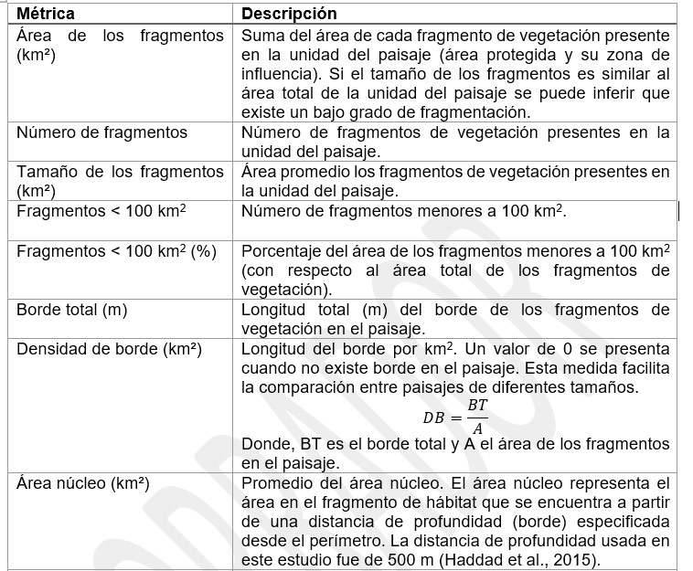
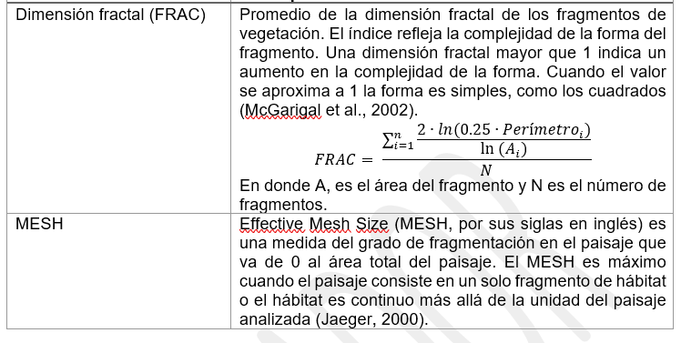

# Estadísticas de fragmentación del paisaje

Exploraremos la función **`MK_Fragmentation()`** para caracterizar la composición y la configuración espacial de los parches en nuestro paisaje.

La función calcula **ocho métricas a nivel de nodo** (como el área de nodo, el porcentaje de borde y la dimensión fractal) y **13 estadísticas de fragmentación a nivel de paisaje** (como el número de nodos, el tamaño medio, la densidad de borde y el tamaño efectivo de la malla).

Las entradas incluyen un **objeto vectorial** que representa los nodos del paisaje y un parámetro que define la distancia o profundidad de la influencia del borde (es decir, la distancia al borde del nodo).

Los resultados consisten en un **archivo vectorial tipo poligonal** que contiene métricas a nivel de nodo y **una tabla** que detalla las métricas a nivel de paisaje.

## Inputs

Usaremos la librerias sf, para trabajar con un shapefile que contiene 404 parches de vegetación con la menor alteración o signos de degradación en un estado de México llamado Michoacán. Tambien cargaremos el paisaje de estudio donde se encuentran los parches y que fue delimitado usando el limite politico del estado y la región fisiográfica denominada Eje Neovolcánico.

El shapefile lo pueden encontrar en la siguiente carpeta del drive:

<https://drive.google.com/drive/folders/1yJcxk2JsEfVjqBx7QM6SV5sIbq7YD1iX?usp=sharing>


```
#> Cargando paquete requerido: igraph
#> 
#> Adjuntando el paquete: 'igraph'
#> The following objects are masked from 'package:stats':
#> 
#>     decompose, spectrum
#> The following object is masked from 'package:base':
#> 
#>     union
#> Cargando paquete requerido: cppRouting
#> Linking to GEOS 3.13.0, GDAL 3.10.1, PROJ 9.5.1;
#> sf_use_s2() is TRUE
#> [1] 404
```


``` r
library(Makurhini)
library(sf)

habitat_nodes <- read_sf("C:/Users/habitat_nodes.shp")
nrow(habitat_nodes)
paisaje <- read_sf("C:/Users/paisaje.shp")

```


Para gráficarlo necesitamos ggplot2, favor de instalarlo si no lo tiene entre sus paquetes.


``` r
install.packages("ggplot2"), dependencies = TRUE)
install.packages("RColorBrewer"), dependencies = TRUE)

```


``` r
library(ggplot2)
library(RColorBrewer)
ggplot() +  
  geom_sf(data = paisaje, aes(color = "Study area"), fill = NA, color = "black") +
  geom_sf(data = habitat_nodes, aes(color = "Parches"), fill = "forestgreen", linewidth = 0.5) +
  scale_color_manual(name = "", values = "black")+
  theme_minimal() +
  theme(axis.title.x = element_blank(),
        axis.title.y = element_blank())
```

<!-- -->

En caso de necesitar abrir otro vector (e.g., .shp, .gpkg) necesitan usar la fución `read_sf()` del paquete `sf`, la función `shapefile()` del paquete `raster`, o la funcion `vect()` del paquete `terra`.

Para abrirlo solo necesitan colocar la dirección de su archivo, el nombre y la extensión, ejemplo:

-   `vegetation_patches <- sf::read_sf("D:/Datos/vegetation_patches.shp")`

-   `vegetation_patches <- raster::shapefile("D:/Datos/vegetation_patches.shp")`

-   `vegetation_patches <- terra::vect("D:/Datos/vegetation_patches.shp")`

Para definir el borde usaremos una distancia de 500 m a partir del límite de los parches (Haddad et al. 2015).

{width="503"}

## Funcion


``` r
MK_Fragmentation(
  nodes = NULL,
  edge_distance = 500,
  min_node_area = 100,
  landscape_area = NULL,
  area_unit = "ha",
  perimeter_unit = "km",
  plot = FALSE,
  write = NULL
)
```


Los argumento de la función que usaremos son:

-   *nodes* = objeto con los parches,
-   *edge_distance* = profundidad del efecto de borde.
-   *min_node_area* = Área mínima del nodo utilizada para calcular el número de nodos con un área menor a la proporcionada. Por defecto igual a 100 km² (Haddad et al. 2015).
-   *landscape_area* = Área total del paisaje de estudio (opcional). Si se deja como NULL, se utilizará el área total de los nodos. La unidad de área debe ser igual a la seleccionada en el párametro *area_unit*.
-   *area_unit* = Puedes establecer una unidad de área (por ejemplo, "km2", "cm2", "m2", "ha"; ver unit_convert). Por defecto es kilómetros cuadrados "km2".
-   *perimeter_unit* = Puedes establecer una unidad de perímetro (por ejemplo, "km", "cm", "m", "ha"; ver unit_convert). Por defecto es kilómetros "km".
-   *plot* = Genera histogramas básicos y un mapa de área núcleo - borde.
-   *write* = Guarda la tabla (estadísticas del paisaje), el objeto sf (estadísticas de parches/nodos) y las gráficas. Es necesario especificar la ruta y el prefijo. Por ejemplo, para guardar en la ruta "C:/Folder" con el prefijo "Fragmentation": "C:/Folder/Fragmentation"


``` r
MK_Fragmentation()
```

## Ejercicio 1

Estimamos el área del paisaje de estudio.


``` r
area_paisaje <- st_area(paisaje) 
area_paisaje <- unit_convert(area_paisaje, "m2", "ha") 

```

Aplicamos la función.


``` r
Fragmentacion <- MK_Fragmentation(nodes = habitat_nodes, 
                                  edge_distance = 500,
                                  min_node_area = 100,
                                  landscape_area = area_paisaje,
                                  area_unit = "ha",
                                  perimeter_unit = "km",
                                  plot = TRUE)
```

<!-- --><!-- -->

### Estadisticos a nivel de parche

El primer resultado "Patch statistics shapefile" es un shapefile con estadísticos de fragmentación a nivel de parche.


``` r
Fragmentacion$`Patch statistics shapefile`
#> Simple feature collection with 404 features and 9 fields
#> Geometry type: POLYGON
#> Dimension:     XY
#> Bounding box:  xmin: -108954 ymin: 2025032 xmax: 202330.2 ymax: 2198936
#> Projected CRS: NAD_1927_Albers
#> First 10 features:
#>    Id       Area        CA CAPercent Perimeter EdgePercent
#> 1   1    85.8368     0.000    0.0000     5.989    100.0000
#> 2   2   220.2168     0.000    0.0000    11.346    100.0000
#> 3   3 11019.9668  5337.795   48.4375   184.969     51.5625
#> 4   4   121.0018     0.000    0.0000     6.974    100.0000
#> 5   5   184.7226     0.000    0.0000    14.452    100.0000
#> 6   6    26.3052     0.000    0.0000     4.685    100.0000
#> 7   7    43.4931     0.000    0.0000     6.066    100.0000
#> 8   8    57.5414     0.000    0.0000     8.119    100.0000
#> 9   9   203.4670     0.000    0.0000    14.309    100.0000
#> 10 10 29440.4346 12326.275   41.8685   444.203     58.1315
#>       PARA ShapeIndex   FRAC                       geometry
#> 1  14.3324     0.1824 0.8040 POLYGON ((54911.05 2035815,...
#> 2  19.4092     0.2157 0.9005 POLYGON ((44591.28 2042209,...
#> 3  59.5774     0.4971 1.1217 POLYGON ((46491.11 2042467,...
#> 4  17.3504     0.1788 0.8100 POLYGON ((54944.49 2048163,...
#> 5  12.7818     0.3000 1.0235 POLYGON ((80094.28 2064140,...
#> 6   5.6148     0.2577 0.9446 POLYGON ((69205.24 2066394,...
#> 7   7.1700     0.2595 0.9557 POLYGON ((68554.2 2066632, ...
#> 8   7.0873     0.3019 1.0335 POLYGON ((69995.53 2066880,...
#> 9  14.2195     0.2830 1.0012 POLYGON ((79368.68 2067324,...
#> 10 66.2770     0.7303 1.1849 POLYGON ((23378.32 2067554,...
```

Son espacialmente explicitos y podemos visualizarlos con librerias como ggplot2

-   \% de área núcleo:


``` r
ggplot() +  
  geom_sf(data = paisaje, aes(color = "Study area"), fill = NA, color = "black") +
  geom_sf(data = Fragmentacion$`Patch statistics shapefile`, aes(fill = CAPercent), color = "black", size = 0.1) +
  scale_fill_distiller(
    palette = "RdYlGn",
    direction = 1, 
    name = "% Área Núcleo"
  ) +
  theme_minimal() +
  labs(
    title = "Fragmentación a nivel de parche",
    fill = "% Área Núcleo"
  ) +
  theme(
    legend.position = "right",
    plot.title = element_text(hjust = 0.5)
  )
```

<!-- -->

-   \% de borde


``` r
ggplot() +  
  geom_sf(data = paisaje, aes(color = "Study area"), fill = NA, color = "black") +
  geom_sf(data = Fragmentacion$`Patch statistics shapefile`, aes(fill = EdgePercent), color = "black", size = 0.1) +
  scale_fill_distiller(
    palette = "RdYlGn",
    direction = -1, 
    name = "% Borde"
  ) +
  theme_minimal() +
  labs(
    title = "Fragmentación a nivel de parche",
    fill = "% Borde"
  ) +
  theme(
    legend.position = "right",
    plot.title = element_text(hjust = 0.5)
  )
```

<!-- -->

-   Perimeter


``` r
ggplot() +  
  geom_sf(data = paisaje, aes(color = "Study area"), fill = NA, color = "black") +
  geom_sf(data = Fragmentacion$`Patch statistics shapefile`, aes(fill = Perimeter), color = "black", size = 0.1) +
  scale_fill_distiller(
    palette = "RdYlGn",
    direction = -1, 
    name = "Perímetro"
  ) +
  theme_minimal() +
  labs(
    title = "Fragmentación a nivel de parche",
    fill = "Perímetro"
  ) +
  theme(
    legend.position = "right",
    plot.title = element_text(hjust = 0.5)
  )
```

<!-- -->

-   Perimeter-Area Ratio


``` r
ggplot() +  
  geom_sf(data = paisaje, aes(color = "Study area"), fill = NA, color = "black") +
  geom_sf(data = Fragmentacion$`Patch statistics shapefile`, aes(fill = PARA), color = "black", size = 0.1) +
  scale_fill_distiller(
    palette = "RdYlGn",
    direction = -1, 
    name = "PARA"
  ) +
  theme_minimal() +
  labs(
    title = "Fragmentación a nivel de parche",
    fill = "PARA"
  ) +
  theme(
    legend.position = "right",
    plot.title = element_text(hjust = 0.5)
  )
```

<!-- -->

-   Shape Index


``` r
ggplot() +  
  geom_sf(data = paisaje, aes(color = "Study area"), fill = NA, color = "black") +
  geom_sf(data = Fragmentacion$`Patch statistics shapefile`, aes(fill = ShapeIndex), color = "black", size = 0.1) +
  scale_fill_distiller(
    palette = "PiYG",
    direction = -1, 
    name = "Shape Index"
  ) +
  theme_minimal() +
  labs(
    title = "Fragmentación a nivel de parche",
    fill = "Shape Index"
  ) +
  theme(
    legend.position = "right",
    plot.title = element_text(hjust = 0.5)
  )
```

<!-- -->

-   Fractal Dimension Index


``` r
ggplot() +  
  geom_sf(data = paisaje, aes(color = "Study area"), fill = NA, color = "black") +
  geom_sf(data = Fragmentacion$`Patch statistics shapefile`, aes(fill = FRAC), color = "black", size = 0.1) +
  scale_fill_distiller(
    palette = "PiYG",
    direction = -1, 
    name = "FRAC"
  ) +
  theme_minimal() +
  labs(
    title = "Fragmentación a nivel de parche",
    fill = "FRAC"
  ) +
  theme(
    legend.position = "right",
    plot.title = element_text(hjust = 0.5)
  )
```

<!-- -->

### Estadísticos a nivel de paisaje

Los resultados se presentan a manera de una lista, el primer resultado se llama "Summary landscape metrics (Viewer Panel)" y tiene estadisticos de fragmentación a nivel de paisaje.


``` r
class(Fragmentacion)
#> [1] "list"
Fragmentacion$`Summary landscape metrics (Viewer Panel)`
```


<table class="table table-condensed">
 <thead>
  <tr>
   <th style="text-align:left;"> Metric </th>
   <th style="text-align:center;"> Value </th>
  </tr>
 </thead>
<tbody>
  <tr>
   <td style="text-align:left;"> Patch area (ha) </td>
   <td style="text-align:center;"> 1273573.9249 </td>
  </tr>
  <tr>
   <td style="text-align:left;"> Number of patches </td>
   <td style="text-align:center;"> 404.0000 </td>
  </tr>
  <tr>
   <td style="text-align:left;"> Size (mean) </td>
   <td style="text-align:center;"> 3152.4107 </td>
  </tr>
  <tr>
   <td style="text-align:left;"> Patches < minimum patch area </td>
   <td style="text-align:center;"> 40.0000 </td>
  </tr>
  <tr>
   <td style="text-align:left;"> Patches < minimum patch area (%) </td>
   <td style="text-align:center;"> 0.1992 </td>
  </tr>
  <tr>
   <td style="text-align:left;"> Total edge </td>
   <td style="text-align:center;"> 17920.4740 </td>
  </tr>
  <tr>
   <td style="text-align:left;"> Edge density </td>
   <td style="text-align:center;"> 0.0141 </td>
  </tr>
  <tr>
   <td style="text-align:left;"> Patch density </td>
   <td style="text-align:center;"> 0.0146 </td>
  </tr>
  <tr>
   <td style="text-align:left;"> Total Core Area (ha) </td>
   <td style="text-align:center;"> 631595.3522 </td>
  </tr>
  <tr>
   <td style="text-align:left;"> Cority </td>
   <td style="text-align:center;"> 0.6064 </td>
  </tr>
  <tr>
   <td style="text-align:left;"> Shape Index (mean) </td>
   <td style="text-align:center;"> 0.2207 </td>
  </tr>
  <tr>
   <td style="text-align:left;"> FRAC (mean) </td>
   <td style="text-align:center;"> 0.8536 </td>
  </tr>
  <tr>
   <td style="text-align:left;"> MESH (ha) </td>
   <td style="text-align:center;"> 66572.5742 </td>
  </tr>
</tbody>
</table>


 

La densidad de malla efectiva (MESH) es una medida del grado en que el movimiento entre diferentes partes del paisaje se ve interrumpido por una Fragmentación. El índice MESH se ha popularizado debido a su facilidad de interpretación. Si conocemos el área de nuestro paisaje, entonces podemos estimar el porcentage de fragmentación:


``` r
mesh <- as.data.frame(Fragmentacion[[1]])
mesh <- mesh[13,2]
mesh_porcentage <-  (area_paisaje - mesh) * 100 / area_paisaje 
mesh_porcentage
#> [1] 97.58915
```

## Ejercicio 2

Hagamos un loop en donde exploramos distintas distancias de profundidad del efecto borde.


``` r
#Loop edge distance
library(purrr)
Fragmentacion.2 <- map_dfr(seq(100, 1000, 100), function(x){
  x.1 <- MK_Fragmentation(nodes = habitat_nodes, 
                          edge_distance = x, plot = FALSE)[[2]]
  CA <- mean(x.1$CAPercent)
  Edge <- mean(x.1$EdgePercent)
  x.2 <- rbind(data.frame('Edge distance' = x, Type = "Core Area", Percentage = CA),
                     data.frame('Edge distance' = x, Type = "Edge", Percentage = Edge))
  return(x.2)
}, .progress = TRUE)


Fragmentacion.2 
```


```
#>    Edge.distance      Type Percentage
#> 1            100 Core Area  65.761207
#> 2            100      Edge  34.238793
#> 3            200 Core Area  41.980654
#> 4            200      Edge  58.019346
#> 5            300 Core Area  26.853211
#> 6            300      Edge  73.146789
#> 7            400 Core Area  18.110913
#> 8            400      Edge  81.889087
#> 9            500 Core Area  12.863545
#> 10           500      Edge  87.136455
#> 11           600 Core Area   9.554117
#> 12           600      Edge  90.445883
#> 13           700 Core Area   7.347448
#> 14           700      Edge  92.652552
#> 15           800 Core Area   5.767296
#> 16           800      Edge  94.232704
#> 17           900 Core Area   4.564680
#> 18           900      Edge  95.435320
#> 19          1000 Core Area   3.633780
#> 20          1000      Edge  96.366220
```

El porcentaje promedio de área núcleo (ausencia de efecto de borde) para todos los parches disminuye en más del 70% cuando se considera un efecto de borde con una penetración de 1 km.

| Distancia de profundidad | %Área Núcleo |
|--------------------------|:------------:|
| 100                      |    65.76%    |
| 500                      |    12.86%    |
| 1000                     |    3.63%     |

Podemos gráficar el promedio del porcentaje de área npucleo de los parches y el porcentaje del borde de los parches (%área núcleo + % de borde = 100%).


``` r
library(ggplot2)
ggplot(Fragmentacion.2, aes(x=Edge.distance, y=Percentage, group=Type)) +
  geom_line(aes(color=Type))+
  geom_point(aes(color=Type))+ ylim(0,100)+
  scale_x_continuous("Distancia", labels = as.character(Fragmentacion.2$Edge.distance), breaks = Fragmentacion.2$Edge.distance)+
  scale_color_brewer(palette="Dark2")+
  theme_classic()
```

<!-- -->

## Ejercicio 3

Ahora probemos los alcances de la función estimando el índice MESH sobre un grid.

Grid de 40 km2


``` r
Grid_test <- make_grid(x = paisaje, hexagonal = FALSE,
                  cell_area = unit_convert(40, "km2", "m2"),
                  clip = TRUE)
plot(Grid_test)
```

<!-- -->

Estimar MESH usando un loop sencillo tipo `for()`


``` r
#Variable dummy
Grid_test$MESH <- 0

```


``` r

for(i in 1:nrow(Grid_test)){
  cat(paste0(i, " de ", nrow(Grid_test), "\r"))
  grid.i <- Grid_test[i,]
  nodes.i <- suppressWarnings(st_intersection(habitat_nodes, grid.i))
  
  if(nrow(nodes.i) > 0){
    area_paisaje.i <- st_area(grid.i)
    area_paisaje.i <- unit_convert(area_paisaje.i, "m2", "ha")
    Fragmentacion.i <- MK_Fragmentation(nodes = nodes.i, 
                                      edge_distance = 500,
                                      min_node_area = 100,
                                      landscape_area = ,
                                      area_unit = "ha",
                                      perimeter_unit = "km",
                                      plot = FALSE)
    mesh <- as.data.frame(Fragmentacion.i[[1]])
    mesh <- mesh[13,2]
    mesh_porcentage <-  (area_paisaje.i - mesh)*100/area_paisaje.i 
    Grid_test$MESH[i] <- mesh_porcentage
  } else {
    Grid_test$MESH[i] <- 100
  }
}

```


Lo podemos visualizar con `ggplot2`


``` r
ggplot() +  
  geom_sf(data = paisaje, aes(color = "Study area"), fill = NA, color = "black") +
  geom_sf(data = Grid_test, aes(fill = MESH), color = "black", size = 0.1) +
  scale_fill_distiller(
    palette = "RdYlGn",
    direction = -1, 
    name = "% Fragmentación"
  ) +
  theme_minimal() +
  labs(
    title = "GRID fragmentación (MESH)",
    fill = "% Fragmentación"
  ) +
  theme(
    legend.position = "right",
    plot.title = element_text(hjust = 0.5)
  )
```

<!-- -->
