# Kernel de dispersión

En Makurhini podemos simular las kernel dispersion usando distintas distancias asociadas a medianas de dispersión. Pare ello, usaremos la función `probability_distance()`. Esta función tiene tres parametros principales:

-   `probability`. Probabilidad de dispersión en el parámetro median_distance.
-   `median_distance`. Hasta cinco distancias máximas de dispersión en km.
-   `eval_distance`. Calcula la probabilidad de dispersión a una distancia mediana específica (km). Disponible cuando sólo se utiliza una distancia_mediana.


``` r
library(Makurhini)
#> Cargando paquete requerido: igraph
#> 
#> Adjuntando el paquete: 'igraph'
#> The following objects are masked from 'package:stats':
#> 
#>     decompose, spectrum
#> The following object is masked from 'package:base':
#> 
#>     union
#> Cargando paquete requerido: cppRouting
probability_distance(probability= 0.5, median_distance = c(1, 10, 30, 100))
```

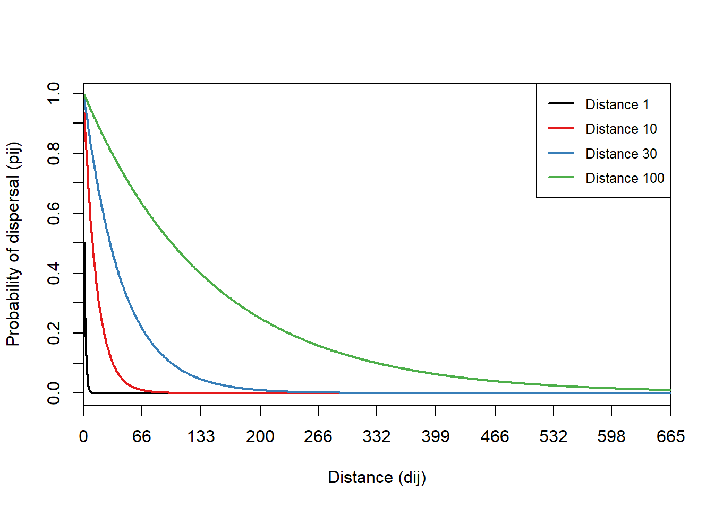


``` r
probability_distance(probability= 0.5, median_distance = 100, eval_distance = 100)
```

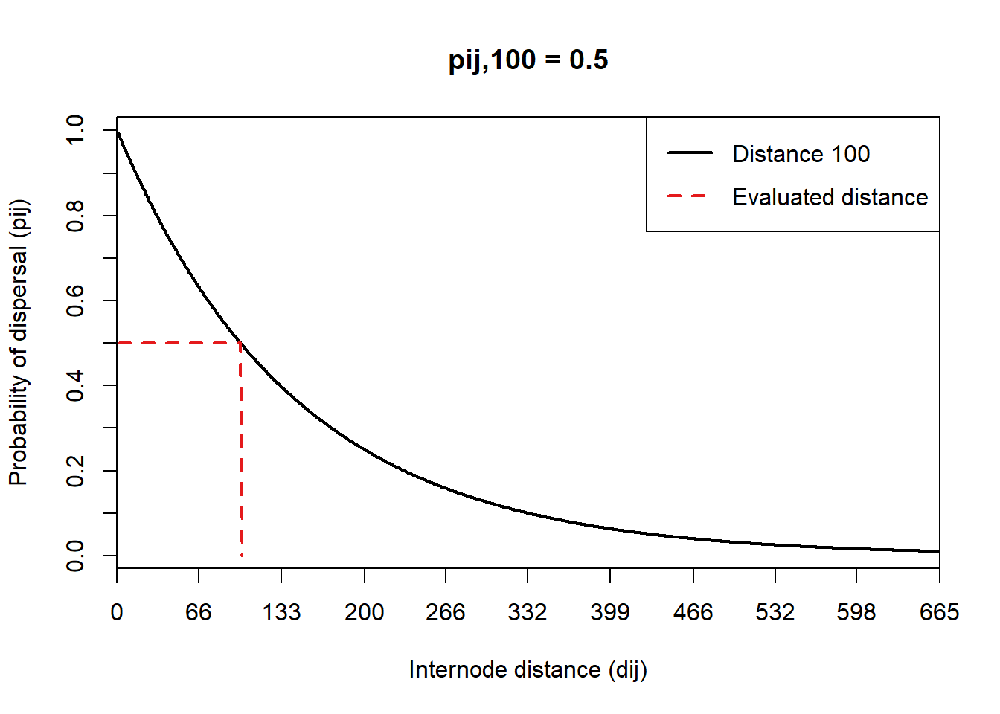

```
#> [1] 0.5
```


``` r
probability_distance(probability= 0.5, median_distance = 50, eval_distance = 25)
```

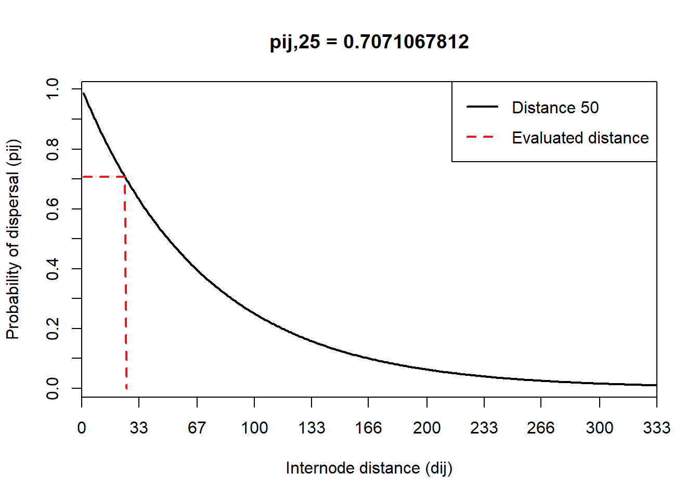

```
#> [1] 0.7071068
```

# índice integral de conectividad y Probabilidad de conectividad

## Insumos y paquetes

Seguimos trabajando con los mismos shapefiles de la sección anterior: habitat_nodes y paisaje.


``` r
library(ggplot2)
library(sf)
library(Makurhini)
library(RColorBrewer)
```


```
#> Linking to GEOS 3.14.1, GDAL 3.12.1, PROJ 9.7.1;
#> sf_use_s2() is TRUE
#> [1] 404
```


``` r
ggplot() +  
  geom_sf(data = paisaje, aes(color = "Study area"), fill = NA, color = "black") +
  geom_sf(data = habitat_nodes, aes(color = "Parches"), fill = "forestgreen", linewidth = 0.5) +
  scale_color_manual(name = "", values = "black")+
  theme_minimal() +
  theme(axis.title.x = element_blank(),
        axis.title.y = element_blank())
```

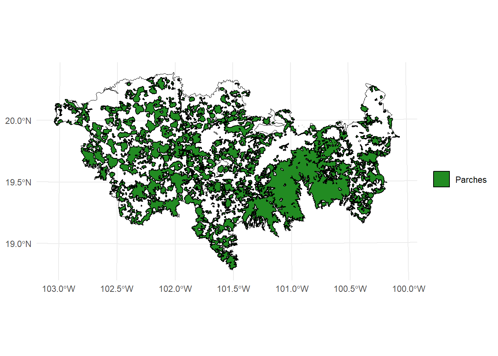

## MK_dPCIIC()

Esta función calcula tanto la conectividad global del paisaje como la importancia (contribución) de cada nodo (o parche de hábitat) para mantener la conectividad del paisaje. Utiliza los índices PC e IIC bajo uno o varios umbrales de distancia.

### La función (no correr)


``` r
MK_dPCIIC(
  nodes,
  attribute = NULL,
  weighted = FALSE,
  LA = NULL,
  area_unit = "m2",
  restoration = NULL,
  onlyrestor = FALSE,
  distance = list(type = "centroid", resistance = NULL),
  metric = c("IIC", "PC"),
  probability = NULL,
  distance_thresholds = NULL,
  threshold = NULL,
  overall = FALSE,
  onlyoverall = FALSE,
  parallel = NULL,
  parallel_mode = 1,
  write = NULL,
  id_sel = NULL,
  intern = TRUE
)
```

### Descripción de los argumentos de la función

| Argumento | Descripción |
|------------------------------------------|------------------------------|
| `nodes` | Objeto que contiene la información de los nodos (e.g., fragmentos de hábitat). Puede ser un `data.frame` (mínimo dos columnas: ID y atributo), un objeto espacial vectorial (`sf`, `SpatVector`) o un raster con valores enteros que representen los ID de cada nodo. Debe estar en un sistema de coordenadas proyectadas. |
| `attribute` | Nombre de la columna o vector numérico con el atributo de los nodos. Si es `NULL`, se utiliza el área como atributo. Si `nodes` es raster, debe ser un vector numérico de igual longitud al número de nodos. |
| `weighted` | Lógico. Si `TRUE` y `nodes` es raster, el atributo será ponderado por el área de cada nodo. |
| `LA` | Valor numérico (opcional). Atributo máximo del paisaje. Por ejemplo, el área total si el atributo es área. Se usa para calcular la conectividad global, no afecta la importancia relativa de nodos. |
| `area_unit` | Unidad de área (opcional, por defecto `"m2"`). Puede ser `"m2"`, `"km2"`, `"cm2"` o `"ha"`. |
| `restoration` | Vector o nombre de columna que indica si cada nodo es existente (1) o propuesto para restauración (0). Si es `NULL`, se considera que todos los nodos existen. |
| `onlyrestor` | Lógico. Si `TRUE`, solo se calcularán métricas relacionadas con restauración. |
| `distance` | Matriz o lista con parámetros para calcular distancia entre nodos. Puede ser matriz de distancias o una lista con parámetros como `type` (i.e., `"centroid"`, ``` "edge",``"least-cost",``"commute-time" ```) y `resistance` (raster de resistencia). |
| `metric` | Métrica de conectividad a usar: `"PC"` (probabilidad de conectividad) o `"IIC"` (índice integral de conectividad). |
| `probability` | Valor numérico que representa la probabilidad asociada a la distancia umbral (e.g., 0.5 si es la mediana de dispersión). Solo se usa con la métrica `"PC"`. |
| `distance_thresholds` | Distancia(s) de dispersión en metros. Si es `NULL`, se estima como la mediana de dispersión entre nodos. Puede usarse la función `dispersal_distance`. |
| `threshold` | Distancia máxima entre pares de nodos a considerar. Mejora eficiencia al eliminar pares lejanos. |
| `overall` | Lógico. Si `TRUE`, se calcula el índice de conectividad del paisaje completo (EC). El resultado será una lista. |
| `onlyoverall` | Lógico. Si `TRUE`, solo se calcularán métricas globales del paisaje. |
| `parallel` | Número de núcleos a usar en paralelización para estimar índices. Útil con más de 1000 nodos. |
| `parallel_mode` | Modo de paralelización: 1 (por defecto, recomendado \< 1000 nodos) o 2 (recomendado \> 1000 nodos). |
| `write` | Ruta y prefijo para guardar los resultados (e.g., `"C:/ejemplo/test_PC_"`). Se guardan archivos de importancia de nodos y conectividad general si `overall = TRUE`. |
| `id_sel` | Uso interno. No debe usarse por el usuario. |
| `intern` | Lógico. Muestra el progreso del proceso (`TRUE` por defecto). |

## Índice integral de conectividad (IIC)

## Ejemplo 1. Distancia euclidiana

-   **Sin usar LA**
-   **sin usar attribute**
-   **10 km de mediana de dispersión**
-   **Unidad de área en ha**
-   **Solo índice para todo el paisaje**


``` r
IIC <- MK_dPCIIC(nodes = habitat_nodes,
                attribute = NULL,
                area_unit = "ha",
                distance = list(type = "centroid"),
                LA = NULL,
                onlyoverall = TRUE,
                metric = "IIC",
                distance_thresholds = 10000,
                intern = TRUE) #10 km
#> Estimating IIC index. This may take several minutes depending on the number of nodes
#> 
#> Done!
IIC
#>          Index        Value
#> 1       IICnum 2.041991e+11
#> 2      EC(IIC) 4.518840e+05
#> 3  IICintra(%) 9.002574e+01
#> 4 IICdirect(%) 5.828033e-01
#> 5   IICstep(%) 9.391453e+00
```

## Ejemplo 2. Distancia euclidiana

-   **sin usar attribute**
-   **10 km de mediana de dispersión**
-   **Unidad de área en ha**
-   **Solo índice para todo el paisaje**


``` r
area_paisaje <- st_area(paisaje) 
area_paisaje <- unit_convert(area_paisaje, "m2", "ha") 

IIC <- MK_dPCIIC(nodes = habitat_nodes,
                attribute = NULL,
                area_unit = "ha",
                distance = list(type = "centroid"),
                LA = area_paisaje,
                onlyoverall = TRUE,
                metric = "IIC",
                distance_thresholds = 10000,
                intern = TRUE) #10 km
#> Estimating IIC index. This may take several minutes depending on the number of nodes
#> 
#> Done!
IIC
#>          Index        Value
#> 1       IICnum 2.041991e+11
#> 2      EC(IIC) 4.518840e+05
#> 3          IIC 2.677957e-02
#> 4  IICintra(%) 9.002574e+01
#> 5 IICdirect(%) 5.828033e-01
#> 6   IICstep(%) 9.391453e+00
```

## Ejemplo 3. Distancia euclidiana

-   **sin usar attribute**
-   **10 km de mediana de dispersión**
-   **Unidad de área en ha**
-   **Solo índice para todo el paisaje**


``` r
area_paisaje <- st_area(paisaje) 
area_paisaje <- unit_convert(area_paisaje, "m2", "ha") 

IIC <- MK_dPCIIC(nodes = habitat_nodes,
                attribute = NULL,
                area_unit = "ha",
                distance = list(type = "edge"),
                LA = area_paisaje,
                onlyoverall = TRUE,
                metric = "IIC",
                distance_thresholds = 10000,
                intern = TRUE) #10 km
#> Estimating IIC index. This may take several minutes depending on the number of nodes
#> 
#> Done!
IIC
#>          Index        Value
#> 1       IICnum 5.700691e+11
#> 2      EC(IIC) 7.550292e+05
#> 3          IIC 7.476136e-02
#> 4  IICintra(%) 3.224727e+01
#> 5 IICdirect(%) 1.741295e+01
#> 6   IICstep(%) 5.033977e+01
```


``` r
area_paisaje <- st_area(paisaje) 
area_paisaje <- unit_convert(area_paisaje, "m2", "ha") 

IIC <- MK_dPCIIC(nodes = habitat_nodes,
                attribute = NULL,
                area_unit = "ha",
                distance = list(type = "edge", keep = 0.1),
                LA = area_paisaje,
                onlyoverall = TRUE,
                metric = "IIC",
                distance_thresholds = 10000,
                intern = TRUE) #10 km
#> Estimating IIC index. This may take several minutes depending on the number of nodes
#> 
#> Done!
IIC
#>          Index        Value
#> 1       IICnum 5.693868e+11
#> 2      EC(IIC) 7.545772e+05
#> 3          IIC 7.467188e-02
#> 4  IICintra(%) 3.228592e+01
#> 5 IICdirect(%) 1.729524e+01
#> 6   IICstep(%) 5.041884e+01
```

## Ejemplo 4. Distancia euclidiana: fracciones

-   **sin usar attribute**
-   **10 km de mediana de dispersión**
-   **Unidad de área en ha**


``` r
area_paisaje <- st_area(paisaje) 
area_paisaje <- unit_convert(area_paisaje, "m2", "ha") 

IIC <- MK_dPCIIC(nodes = habitat_nodes,
                attribute = NULL,
                area_unit = "ha",
                distance = list(type = "edge", keep = 0.1),
                LA = area_paisaje,
                onlyoverall = FALSE,
                metric = "IIC",
                distance_thresholds = 10000,
                intern = TRUE) #10 km
#> Estimating IIC index. This may take several minutes depending on the number of nodes
#>  ■■■■                              11% |  ETA:  9s
#>  ■■■■■■■■■■■                       33% |  ETA:  8s
#>  ■■■■■■■■■■■■■■■■■■                58% |  ETA:  5s
#>  ■■■■■■■■■■■■■■■■■■■■■■■■■■        82% |  ETA:  2s
#>  ■■■■■■■■■■■■■■■■■■■■■■■■■■■■■■    98% |  ETA:  0s
#> 
#> Done!
IIC
#> Simple feature collection with 404 features and 5 fields
#> Geometry type: POLYGON
#> Dimension:     XY
#> Bounding box:  xmin: -108954 ymin: 2025032 xmax: 202330.2 ymax: 2198936
#> Projected CRS: NAD_1927_Albers
#> First 10 features:
#>    Id      dIIC dIICintra  dIICflux dIICconnector
#> 1   1 0.0067065 0.0000013 0.0067052   0.000000000
#> 2   2 0.0210320 0.0000085 0.0210235   0.000000000
#> 3   3 1.0591462 0.0213281 1.0312790   0.006539041
#> 4   4 0.0115557 0.0000026 0.0115531   0.000000000
#> 5   5 0.0254291 0.0000060 0.0254231   0.000000000
#> 6   6 0.0036214 0.0000001 0.0036212   0.000000000
#> 7   7 0.0059875 0.0000003 0.0059872   0.000000000
#> 8   8 0.0079222 0.0000006 0.0079216   0.000000000
#> 9   9 0.0280103 0.0000073 0.0280030   0.000000000
#> 10 10 4.5575494 0.1522233 3.3954709   1.009855242
#>                          geometry
#> 1  POLYGON ((54911.05 2035815,...
#> 2  POLYGON ((44591.28 2042209,...
#> 3  POLYGON ((46491.11 2042467,...
#> 4  POLYGON ((54944.49 2048163,...
#> 5  POLYGON ((80094.28 2064140,...
#> 6  POLYGON ((69205.24 2066394,...
#> 7  POLYGON ((68554.2 2066632, ...
#> 8  POLYGON ((69995.53 2066880,...
#> 9  POLYGON ((79368.68 2067324,...
#> 10 POLYGON ((23378.32 2067554,...
```

Exploremos un plot usando intervalos:

-   dIIC


``` r
library(classInt)
library(dplyr)
#> 
#> Adjuntando el paquete: 'dplyr'
#> The following objects are masked from 'package:igraph':
#> 
#>     as_data_frame, groups, union
#> The following objects are masked from 'package:stats':
#> 
#>     filter, lag
#> The following objects are masked from 'package:base':
#> 
#>     intersect, setdiff, setequal, union

# Calcular los intervalos de Jenks para strength
breaks <- classInt::classIntervals(IIC$dIIC, n = 9, style = "jenks")

# Crear una nueva variable categórica con los intervalos
IIC <- IIC %>%
  mutate(dIIC_q = cut(dIIC,
                          breaks = breaks$brks,
                          include.lowest = TRUE,
                          dig.lab = 5))  

# Graficar en ggplot2 usando las clases Jenks
ggplot() +  
  geom_sf(data = paisaje, fill = NA, color = "black") +
  geom_sf(data = IIC, aes(fill = dIIC_q), color = "black", size = 0.1) +
  scale_fill_brewer(palette = "RdYlGn", direction = 1, name = "dIIC (jenks)") +
  theme_minimal() +
  labs(
    title = "dIIC",
    fill = "dIIC"
  ) +
  theme(
    legend.position = "right",
    plot.title = element_text(hjust = 0.5)
  )
```


-   dIICIntra


``` r
# Calcular los intervalos de Jenks para strength
breaks <- classInt::classIntervals(IIC$dIICintra, n = 9, style = "jenks")

# Crear una nueva variable categórica con los intervalos
IIC <- IIC %>%
  mutate(dIIC_q = cut(dIICintra,
                          breaks = breaks$brks,
                          include.lowest = TRUE,
                          dig.lab = 5))  

# Graficar en ggplot2 usando las clases Jenks
ggplot() +  
  geom_sf(data = paisaje, fill = NA, color = "black") +
  geom_sf(data = IIC, aes(fill = dIIC_q), color = "black", size = 0.1) +
  scale_fill_brewer(palette = "RdYlGn", direction = 1, name = "dIICIntra (jenks)") +
  theme_minimal() +
  labs(
    title = "dIICIntra",
    fill = "dIICIntra"
  ) +
  theme(
    legend.position = "right",
    plot.title = element_text(hjust = 0.5)
  )
```

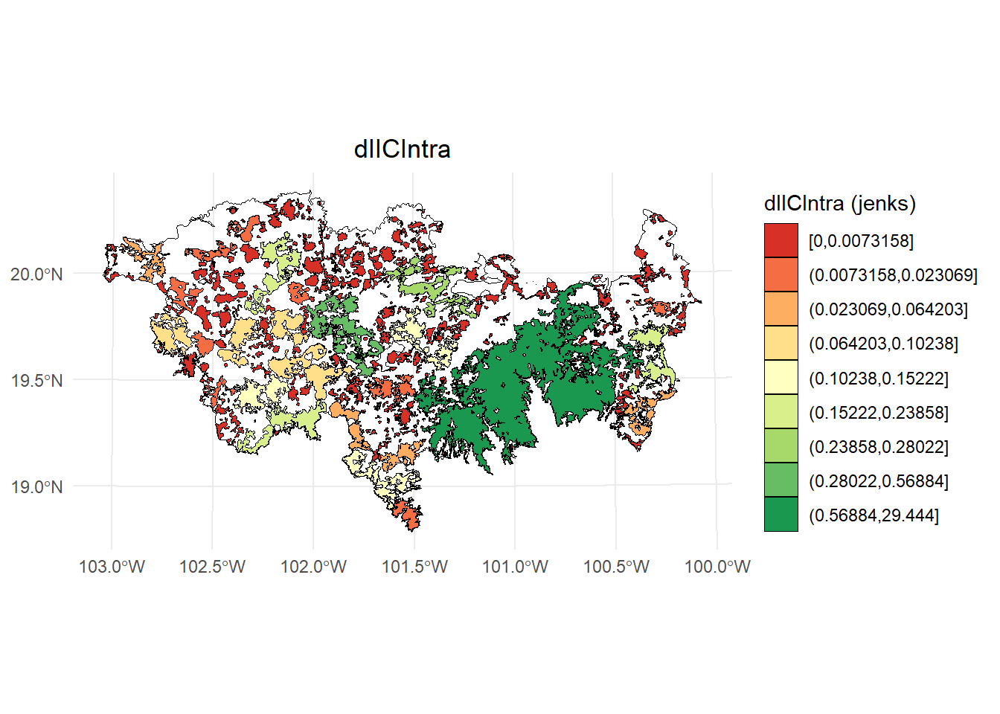

-   dIICflux


``` r
# Calcular los intervalos de Jenks para strength
breaks <- classInt::classIntervals(IIC$dIICflux, n = 9, style = "jenks")

# Crear una nueva variable categórica con los intervalos
IIC <- IIC %>%
  mutate(dIIC_q = cut(dIICflux,
                          breaks = breaks$brks,
                          include.lowest = TRUE,
                          dig.lab = 5))  

# Graficar en ggplot2 usando las clases Jenks
ggplot() +  
  geom_sf(data = paisaje, fill = NA, color = "black") +
  geom_sf(data = IIC, aes(fill = dIIC_q), color = "black", size = 0.1) +
  scale_fill_brewer(palette = "RdYlGn", direction = 1, name = "dIICFlux (jenks)") +
  theme_minimal() +
  labs(
    title = "dIICFlux",
    fill = "dIICFlux"
  ) +
  theme(
    legend.position = "right",
    plot.title = element_text(hjust = 0.5)
  )
```

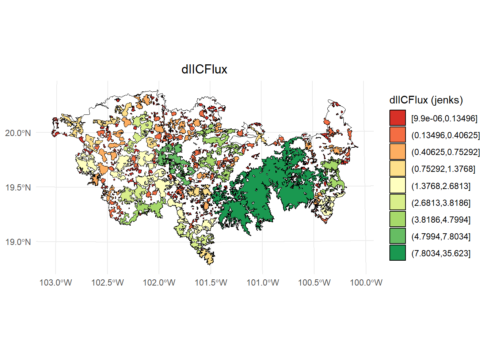

-   dIICconnector


``` r
# Calcular los intervalos de Jenks para strength
breaks <- classInt::classIntervals(IIC$dIICconnector, n = 9, style = "jenks")

# Crear una nueva variable categórica con los intervalos
IIC <- IIC %>%
  mutate(dIIC_q = cut(dIICconnector,
                          breaks = breaks$brks,
                          include.lowest = TRUE,
                          dig.lab = 5))  

# Graficar en ggplot2 usando las clases Jenks
ggplot() +  
  geom_sf(data = paisaje, fill = NA, color = "black") +
  geom_sf(data = IIC, aes(fill = dIIC_q), color = "black", size = 0.1) +
  scale_fill_brewer(palette = "RdYlGn", direction = 1, name = "dIICConnector (jenks)") +
  theme_minimal() +
  labs(
    title = "dIICConnector",
    fill = "dIICConnector"
  ) +
  theme(
    legend.position = "right",
    plot.title = element_text(hjust = 0.5)
  )
```


## Ejemplo 5. Distancia euclidiana: fracciones y overall

-   **sin usar attribute**
-   **10 km de mediana de dispersión**
-   **Unidad de área en ha**


``` r
area_paisaje <- st_area(paisaje) 
area_paisaje <- unit_convert(area_paisaje, "m2", "ha") 

IIC <- MK_dPCIIC(nodes = habitat_nodes,
                attribute = NULL,
                area_unit = "ha",
                distance = list(type = "edge", keep = 0.1),
                LA = area_paisaje,
                overall = TRUE,
                onlyoverall = FALSE,
                metric = "IIC",
                distance_thresholds = 10000,
                intern = TRUE) #10 km
#> Estimating IIC index. This may take several minutes depending on the number of nodes
#>  ■■■■■■■■■                         28% |  ETA:  7s
#>  ■■■■■■■■■■■■■■■■■                 52% |  ETA:  5s
#>  ■■■■■■■■■■■■■■■■■■■■■■■■          77% |  ETA:  3s
#> 
#> Done!
IIC
#> $node_importances_d10000
#> Simple feature collection with 404 features and 5 fields
#> Geometry type: POLYGON
#> Dimension:     XY
#> Bounding box:  xmin: -108954 ymin: 2025032 xmax: 202330.2 ymax: 2198936
#> Projected CRS: NAD_1927_Albers
#> First 10 features:
#>    Id      dIIC dIICintra  dIICflux dIICconnector
#> 1   1 0.0067065 0.0000013 0.0067052   0.000000000
#> 2   2 0.0210320 0.0000085 0.0210235   0.000000000
#> 3   3 1.0591462 0.0213281 1.0312790   0.006539041
#> 4   4 0.0115557 0.0000026 0.0115531   0.000000000
#> 5   5 0.0254291 0.0000060 0.0254231   0.000000000
#> 6   6 0.0036214 0.0000001 0.0036212   0.000000000
#> 7   7 0.0059875 0.0000003 0.0059872   0.000000000
#> 8   8 0.0079222 0.0000006 0.0079216   0.000000000
#> 9   9 0.0280103 0.0000073 0.0280030   0.000000000
#> 10 10 4.5575494 0.1522233 3.3954709   1.009855242
#>                          geometry
#> 1  POLYGON ((54911.05 2035815,...
#> 2  POLYGON ((44591.28 2042209,...
#> 3  POLYGON ((46491.11 2042467,...
#> 4  POLYGON ((54944.49 2048163,...
#> 5  POLYGON ((80094.28 2064140,...
#> 6  POLYGON ((69205.24 2066394,...
#> 7  POLYGON ((68554.2 2066632, ...
#> 8  POLYGON ((69995.53 2066880,...
#> 9  POLYGON ((79368.68 2067324,...
#> 10 POLYGON ((23378.32 2067554,...
#> 
#> $overall_d10000
#>          Index        Value
#> 1       IICnum 5.693868e+11
#> 2      EC(IIC) 7.545772e+05
#> 3          IIC 7.467188e-02
#> 4  IICintra(%) 3.228592e+01
#> 5 IICdirect(%) 1.729524e+01
#> 6   IICstep(%) 5.041884e+01
```

## Ejemplo 6. Distancia euclidiana: varios umbrales de distancia

-   **sin usar attribute**
-   **2, 10 y 50 km de medianas de dispersión**
-   **Unidad de área en ha**


``` r
area_paisaje <- st_area(paisaje) 
area_paisaje <- unit_convert(area_paisaje, "m2", "ha") 

IIC <- MK_dPCIIC(nodes = habitat_nodes,
                attribute = NULL,
                area_unit = "ha",
                distance = list(type = "edge", keep = 0.1),
                LA = area_paisaje,
                overall = TRUE,
                onlyoverall = FALSE,
                metric = "IIC",
                distance_thresholds = c(2000, 10000, 50000),
                intern = TRUE)
#> Estimating IIC index. This may take several minutes depending on the number of nodes
#> 
  |                                                        
  |                                                  |   0%
#>  ■■■■■■■■                          22% |  ETA:  6s
#>  ■■■■■■■■■■■■■■■■■                 52% |  ETA:  4s
#>  ■■■■■■■■■■■■■■■■■■■■■■■           74% |  ETA:  3s
#> 
  |                                                        
  |=================                                 |  33%
#>  ■■■■■■■■■                         27% |  ETA:  7s
#>  ■■■■■■■■■■■■■■■■                  51% |  ETA:  6s
#>  ■■■■■■■■■■■■■■■■■■■■■■■■          77% |  ETA:  3s
#> 
  |                                                        
  |=================================                 |  67%
#>  ■■■■■                             12% |  ETA: 18s
#>  ■■■■■■■■                          23% |  ETA: 18s
#>  ■■■■■■■■■■                        30% |  ETA: 20s
#>  ■■■■■■■■■■■■■                     42% |  ETA: 16s
#>  ■■■■■■■■■■■■■■■■■                 53% |  ETA: 13s
#>  ■■■■■■■■■■■■■■■■■■■■■             65% |  ETA:  9s
#>  ■■■■■■■■■■■■■■■■■■■■■■■■          76% |  ETA:  6s
#>  ■■■■■■■■■■■■■■■■■■■■■■■■■■■■      89% |  ETA:  3s
#> 
  |                                                        
  |==================================================| 100%
#> 
#> Done!
IIC
#> $d2000
#> $d2000$node_importances_d2000
#> Simple feature collection with 404 features and 5 fields
#> Geometry type: POLYGON
#> Dimension:     XY
#> Bounding box:  xmin: -108954 ymin: 2025032 xmax: 202330.2 ymax: 2198936
#> Projected CRS: NAD_1927_Albers
#> First 10 features:
#>    Id      dIIC dIICintra  dIICflux dIICconnector
#> 1   1 0.0069072 0.0000016 0.0069043  1.270350e-06
#> 2   2 0.0211102 0.0000107 0.0210982  1.270214e-06
#> 3   3 1.0630880 0.0268336 1.0295579  6.696595e-03
#> 4   4 0.0115004 0.0000032 0.0114959  1.270314e-06
#> 5   5 0.0208408 0.0000075 0.0208320  1.270250e-06
#> 6   6 0.0029685 0.0000002 0.0029671  1.270410e-06
#> 7   7 0.0049074 0.0000004 0.0049057  1.270393e-06
#> 8   8 0.0088126 0.0000007 0.0088105  1.367677e-06
#> 9   9 0.0519850 0.0000091 0.0311509  2.082496e-02
#> 10 10 4.3995169 0.1915165 3.2149196  9.930808e-01
#>                          geometry
#> 1  POLYGON ((54911.05 2035815,...
#> 2  POLYGON ((44591.28 2042209,...
#> 3  POLYGON ((46491.11 2042467,...
#> 4  POLYGON ((54944.49 2048163,...
#> 5  POLYGON ((80094.28 2064140,...
#> 6  POLYGON ((69205.24 2066394,...
#> 7  POLYGON ((68554.2 2066632, ...
#> 8  POLYGON ((69995.53 2066880,...
#> 9  POLYGON ((79368.68 2067324,...
#> 10 POLYGON ((23378.32 2067554,...
#> 
#> $d2000$overall_d2000
#>          Index        Value
#> 1       IICnum 4.525664e+11
#> 2      EC(IIC) 6.727305e+05
#> 3          IIC 5.935154e-02
#> 4  IICintra(%) 4.061984e+01
#> 5 IICdirect(%) 9.638750e+00
#> 6   IICstep(%) 4.974141e+01
#> 
#> 
#> $d10000
#> $d10000$node_importances_d10000
#> Simple feature collection with 404 features and 5 fields
#> Geometry type: POLYGON
#> Dimension:     XY
#> Bounding box:  xmin: -108954 ymin: 2025032 xmax: 202330.2 ymax: 2198936
#> Projected CRS: NAD_1927_Albers
#> First 10 features:
#>    Id      dIIC dIICintra  dIICflux dIICconnector
#> 1   1 0.0067065 0.0000013 0.0067052   0.000000000
#> 2   2 0.0210320 0.0000085 0.0210235   0.000000000
#> 3   3 1.0591462 0.0213281 1.0312790   0.006539041
#> 4   4 0.0115557 0.0000026 0.0115531   0.000000000
#> 5   5 0.0254291 0.0000060 0.0254231   0.000000000
#> 6   6 0.0036214 0.0000001 0.0036212   0.000000000
#> 7   7 0.0059875 0.0000003 0.0059872   0.000000000
#> 8   8 0.0079222 0.0000006 0.0079216   0.000000000
#> 9   9 0.0280103 0.0000073 0.0280030   0.000000000
#> 10 10 4.5575494 0.1522233 3.3954709   1.009855242
#>                          geometry
#> 1  POLYGON ((54911.05 2035815,...
#> 2  POLYGON ((44591.28 2042209,...
#> 3  POLYGON ((46491.11 2042467,...
#> 4  POLYGON ((54944.49 2048163,...
#> 5  POLYGON ((80094.28 2064140,...
#> 6  POLYGON ((69205.24 2066394,...
#> 7  POLYGON ((68554.2 2066632, ...
#> 8  POLYGON ((69995.53 2066880,...
#> 9  POLYGON ((79368.68 2067324,...
#> 10 POLYGON ((23378.32 2067554,...
#> 
#> $d10000$overall_d10000
#>          Index        Value
#> 1       IICnum 5.693868e+11
#> 2      EC(IIC) 7.545772e+05
#> 3          IIC 7.467188e-02
#> 4  IICintra(%) 3.228592e+01
#> 5 IICdirect(%) 1.729524e+01
#> 6   IICstep(%) 5.041884e+01
#> 
#> 
#> $d50000
#> $d50000$node_importances_d50000
#> Simple feature collection with 404 features and 5 fields
#> Geometry type: POLYGON
#> Dimension:     XY
#> Bounding box:  xmin: -108954 ymin: 2025032 xmax: 202330.2 ymax: 2198936
#> Projected CRS: NAD_1927_Albers
#> First 10 features:
#>    Id      dIIC dIICintra  dIICflux dIICconnector
#> 1   1 0.0108854 0.0000010 0.0108844  5.535500e-15
#> 2   2 0.0280741 0.0000064 0.0280677  4.312520e-15
#> 3   3 1.4048675 0.0159201 1.3889474  6.883380e-15
#> 4   4 0.0154866 0.0000019 0.0154847  0.000000e+00
#> 5   5 0.0241239 0.0000045 0.0241194  0.000000e+00
#> 6   6 0.0034401 0.0000001 0.0034400  9.836320e-15
#> 7   7 0.0056974 0.0000002 0.0056972  5.062790e-15
#> 8   8 0.0075250 0.0000004 0.0075246  1.169117e-14
#> 9   9 0.0265849 0.0000054 0.0265795  1.066508e-14
#> 10 10 4.1637595 0.1136249 4.0497996  3.349366e-04
#>                          geometry
#> 1  POLYGON ((54911.05 2035815,...
#> 2  POLYGON ((44591.28 2042209,...
#> 3  POLYGON ((46491.11 2042467,...
#> 4  POLYGON ((54944.49 2048163,...
#> 5  POLYGON ((80094.28 2064140,...
#> 6  POLYGON ((69205.24 2066394,...
#> 7  POLYGON ((68554.2 2066632, ...
#> 8  POLYGON ((69995.53 2066880,...
#> 9  POLYGON ((79368.68 2067324,...
#> 10 POLYGON ((23378.32 2067554,...
#> 
#> $d50000$overall_d50000
#>          Index        Value
#> 1       IICnum 7.628072e+11
#> 2      EC(IIC) 8.733883e+05
#> 3          IIC 1.000379e-01
#> 4  IICintra(%) 2.409937e+01
#> 5 IICdirect(%) 4.455378e+01
#> 6   IICstep(%) 3.134685e+01
```

## Probabilidad de conectividad (PC)

## Ejemplo 1. Distancia euclidiana

-   **Sin usar LA**
-   **sin usar attribute**
-   **10 km de mediana de dispersión con una probabilidad de 0.5**
-   **Unidad de área en ha**
-   **Solo índice para todo el paisaje**


``` r
PC <- MK_dPCIIC(nodes = habitat_nodes,
                attribute = NULL,
                area_unit = "ha",
                distance = list(type = "edge", keep = 0.1),
                LA = NULL,
                onlyoverall = TRUE,
                metric = "PC",
                probability = 0.5,
                distance_thresholds = 10000,
                intern = TRUE) #10 km
#> Estimating PC index. This may take several minutes depending on the number of nodes
#> 
#> Done!
PC
#>         Index        Value
#> 1       PCnum 1.301622e+12
#> 2      EC(PC) 1.140887e+06
#> 3  PCintra(%) 1.412328e+01
#> 4 PCdirect(%) 1.991759e+01
#> 5   PCstep(%) 6.595913e+01
```

## Ejemplo 2. Distancia euclidiana

-   **sin usar attribute**
-   **10 km de mediana de dispersión con una probabilidad de 0.5**
-   **Unidad de área en ha**
-   **Solo índice para todo el paisaje**


``` r
area_paisaje <- st_area(paisaje) 
area_paisaje <- unit_convert(area_paisaje, "m2", "ha") 

PC <- MK_dPCIIC(nodes = habitat_nodes,
                attribute = NULL,
                area_unit = "ha",
                distance = list(type = "centroid"),
                LA = area_paisaje,
                onlyoverall = TRUE,
                metric = "PC",
                probability = 0.5,
                distance_thresholds = 10000,
                intern = TRUE) #10 km
#> Estimating PC index. This may take several minutes depending on the number of nodes
#> 
#> Done!
PC
#>         Index        Value
#> 1       PCnum 2.135845e+11
#> 2      EC(PC) 4.621521e+05
#> 3          PC 2.801041e-02
#> 4  PCintra(%) 8.606978e+01
#> 5 PCdirect(%) 1.310029e+01
#> 6   PCstep(%) 8.299300e-01
```

## Ejemplo 3. Distancia euclidiana: fracciones

-   **sin usar attribute**
-   **10 km de mediana de dispersión con una probabilidad de 0.5**
-   **Unidad de área en ha**


``` r
area_paisaje <- st_area(paisaje) 
area_paisaje <- unit_convert(area_paisaje, "m2", "ha") 

PC <- MK_dPCIIC(nodes = habitat_nodes,
                attribute = NULL,
                area_unit = "ha",
                distance = list(type = "edge", keep = 0.1),
                LA = area_paisaje,
                onlyoverall = FALSE,
                metric = "PC",
                probability = 0.5,
                distance_thresholds = 10000,
                intern = TRUE) #10 km
#> Estimating PC index. This may take several minutes depending on the number of nodes
#>  ■■                                 2% |  ETA:  1m
#>  ■■■                                5% |  ETA:  1m
#>  ■■■■                               8% |  ETA:  1m
#>  ■■■■                              12% |  ETA:  1m
#>  ■■■■■                             14% |  ETA:  1m
#>  ■■■■■■                            17% |  ETA:  1m
#>  ■■■■■■■                           20% |  ETA:  1m
#>  ■■■■■■■■                          23% |  ETA:  1m
#>  ■■■■■■■■■                         26% |  ETA:  1m
#>  ■■■■■■■■■■                        30% |  ETA:  1m
#>  ■■■■■■■■■■■                       33% |  ETA:  1m
#>  ■■■■■■■■■■■■                      36% |  ETA:  1m
#>  ■■■■■■■■■■■■■                     39% |  ETA:  1m
#>  ■■■■■■■■■■■■■                     41% |  ETA:  1m
#>  ■■■■■■■■■■■■■■                    45% |  ETA:  1m
#>  ■■■■■■■■■■■■■■■                   48% |  ETA:  1m
#>  ■■■■■■■■■■■■■■■■                  51% |  ETA: 48s
#>  ■■■■■■■■■■■■■■■■■                 54% |  ETA: 45s
#>  ■■■■■■■■■■■■■■■■■■                57% |  ETA: 41s
#>  ■■■■■■■■■■■■■■■■■■■               61% |  ETA: 38s
#>  ■■■■■■■■■■■■■■■■■■■■              63% |  ETA: 37s
#>  ■■■■■■■■■■■■■■■■■■■■■             66% |  ETA: 33s
#>  ■■■■■■■■■■■■■■■■■■■■■■            69% |  ETA: 30s
#>  ■■■■■■■■■■■■■■■■■■■■■■■           72% |  ETA: 27s
#>  ■■■■■■■■■■■■■■■■■■■■■■■■          75% |  ETA: 24s
#>  ■■■■■■■■■■■■■■■■■■■■■■■■■         79% |  ETA: 21s
#>  ■■■■■■■■■■■■■■■■■■■■■■■■■■        82% |  ETA: 18s
#>  ■■■■■■■■■■■■■■■■■■■■■■■■■■        85% |  ETA: 15s
#>  ■■■■■■■■■■■■■■■■■■■■■■■■■■■       87% |  ETA: 13s
#>  ■■■■■■■■■■■■■■■■■■■■■■■■■■■■      90% |  ETA: 10s
#>  ■■■■■■■■■■■■■■■■■■■■■■■■■■■■■     92% |  ETA:  8s
#>  ■■■■■■■■■■■■■■■■■■■■■■■■■■■■■■■  100% |  ETA:  0s
#> 
#> Done!
PC
#> Simple feature collection with 404 features and 5 fields
#> Geometry type: POLYGON
#> Dimension:     XY
#> Bounding box:  xmin: -108954 ymin: 2025032 xmax: 202330.2 ymax: 2198936
#> Projected CRS: NAD_1927_Albers
#> First 10 features:
#>    Id       dPC  dPCintra   dPCflux dPCconnector
#> 1   1 0.0128564 0.0000006 0.0128558 0.000000e+00
#> 2   2 0.0332059 0.0000037 0.0332022 0.000000e+00
#> 3   3 1.6831849 0.0093299 1.6665804 7.274621e-03
#> 4   4 0.0184037 0.0000011 0.0184026 0.000000e+00
#> 5   5 0.0285162 0.0000026 0.0285136 0.000000e+00
#> 6   6 0.0040938 0.0000001 0.0040937 5.309968e-08
#> 7   7 0.0069481 0.0000001 0.0068704 7.758334e-05
#> 8   8 0.0088543 0.0000003 0.0088540 0.000000e+00
#> 9   9 0.0369150 0.0000032 0.0331109 3.800919e-03
#> 10 10 5.5556530 0.0665892 4.4246468 1.064417e+00
#>                          geometry
#> 1  POLYGON ((54911.05 2035815,...
#> 2  POLYGON ((44591.28 2042209,...
#> 3  POLYGON ((46491.11 2042467,...
#> 4  POLYGON ((54944.49 2048163,...
#> 5  POLYGON ((80094.28 2064140,...
#> 6  POLYGON ((69205.24 2066394,...
#> 7  POLYGON ((68554.2 2066632, ...
#> 8  POLYGON ((69995.53 2066880,...
#> 9  POLYGON ((79368.68 2067324,...
#> 10 POLYGON ((23378.32 2067554,...
```

Exploremos un plot usando intervalos:

-   dPC


``` r
library(classInt)
library(dplyr)

# Calcular los intervalos de Jenks para strength
breaks <- classInt::classIntervals(PC$dPC, n = 9, style = "jenks")

# Crear una nueva variable categórica con los intervalos
PC <- PC %>%
  mutate(dPC_q = cut(dPC,
                          breaks = breaks$brks,
                          include.lowest = TRUE,
                          dig.lab = 5))  

# Graficar en ggplot2 usando las clases Jenks
ggplot() +  
  geom_sf(data = paisaje, fill = NA, color = "black") +
  geom_sf(data = PC, aes(fill = dPC_q), color = "black", size = 0.1) +
  scale_fill_brewer(palette = "RdYlGn", direction = 1, name = "dPC (jenks)") +
  theme_minimal() +
  labs(
    title = "dPC",
    fill = "dPC"
  ) +
  theme(
    legend.position = "right",
    plot.title = element_text(hjust = 0.5)
  )
```

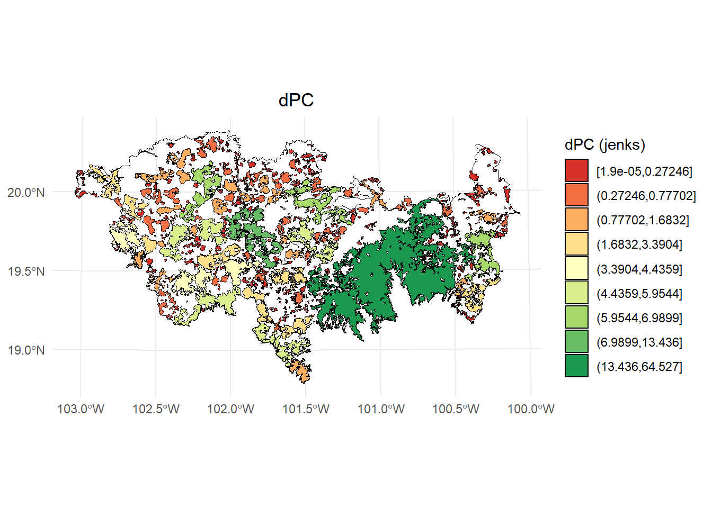

-   dPCIntra


``` r
# Calcular los intervalos de Jenks para strength
breaks <- classInt::classIntervals(PC$dPCintra, n = 9, style = "jenks")

# Crear una nueva variable categórica con los intervalos
PC <- PC %>%
  mutate(dPC_q = cut(dPCintra,
                      breaks = breaks$brks,
                      include.lowest = TRUE,
                      dig.lab = 5))  

# Graficar en ggplot2 usando las clases Jenks
ggplot() +  
  geom_sf(data = paisaje, fill = NA, color = "black") +
  geom_sf(data = PC, aes(fill = dPC_q), color = "black", size = 0.1) +
  scale_fill_brewer(palette = "RdYlGn", direction = 1, name = "dPCIntra (jenks)") +
  theme_minimal() +
  labs(
    title = "dPCIntra",
    fill = "dPCIntra"
  ) +
  theme(
    legend.position = "right",
    plot.title = element_text(hjust = 0.5)
  )
```

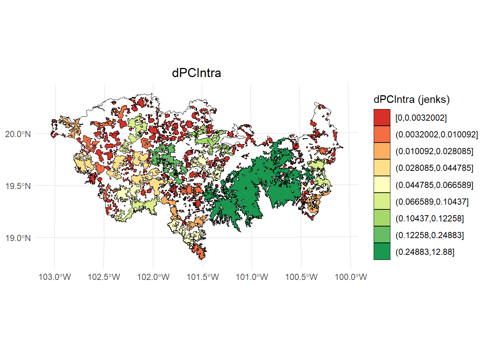

-   dPCflux


``` r
# Calcular los intervalos de Jenks para strength
breaks <- classInt::classIntervals(PC$dPCflux, n = 9, style = "jenks")

# Crear una nueva variable categórica con los intervalos
PC <- PC %>%
  mutate(dPC_q = cut(dPCflux,
                      breaks = breaks$brks,
                      include.lowest = TRUE,
                      dig.lab = 5))  

# Graficar en ggplot2 usando las clases Jenks
ggplot() +  
  geom_sf(data = paisaje, fill = NA, color = "black") +
  geom_sf(data = PC, aes(fill = dPC_q), color = "black", size = 0.1) +
  scale_fill_brewer(palette = "RdYlGn", direction = 1, name = "dPCFlux (jenks)") +
  theme_minimal() +
  labs(
    title = "dPCFlux",
    fill = "dPCFlux"
  ) +
  theme(
    legend.position = "right",
    plot.title = element_text(hjust = 0.5)
  )
```

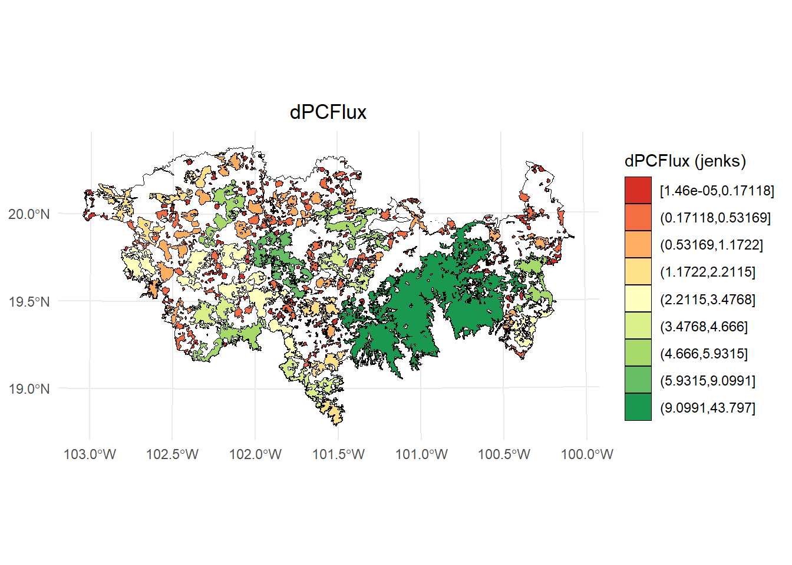

-   dPCconnector


``` r
# Calcular los intervalos de Jenks para strength
breaks <- classInt::classIntervals(PC$dPCconnector, n = 9, style = "jenks")

# Crear una nueva variable categórica con los intervalos
PC <- PC %>%
  mutate(dPC_q = cut(dPCconnector,
                     breaks = breaks$brks,
                     include.lowest = TRUE,
                     dig.lab = 5))  

# Graficar en ggplot2 usando las clases Jenks
ggplot() +  
  geom_sf(data = paisaje, fill = NA, color = "black") +
  geom_sf(data = PC, aes(fill = dPC_q), color = "black", size = 0.1) +
  scale_fill_brewer(palette = "RdYlGn", direction = 1, name = "dPCConnector (jenks)") +
  theme_minimal() +
  labs(
    title = "dPCConnector",
    fill = "dPCConnector"
  ) +
  theme(
    legend.position = "right",
    plot.title = element_text(hjust = 0.5)
  )
```

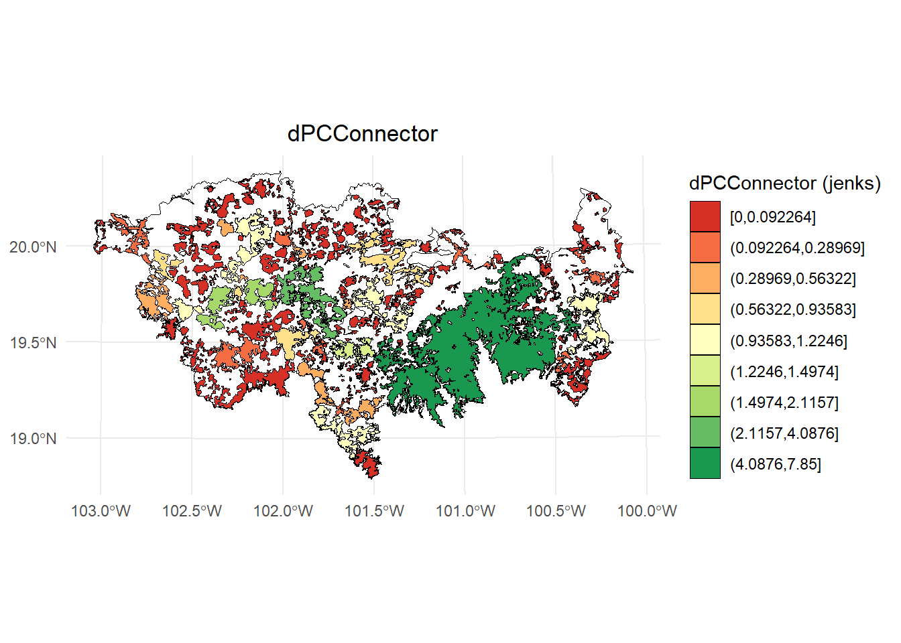

## Ejemplo 4. Distancia euclidiana: fracciones y overall

-   **sin usar attribute**
-   **10 km de mediana de dispersión con una probabilidad de 0.5**
-   **Unidad de área en ha**


``` r
area_paisaje <- st_area(paisaje) 
area_paisaje <- unit_convert(area_paisaje, "m2", "ha") 

PC <- MK_dPCIIC(nodes = habitat_nodes,
                attribute = NULL,
                area_unit = "ha",
                distance = list(type = "edge", keep = 0.1),
                LA = area_paisaje,
                overall = TRUE,
                onlyoverall = FALSE,
                metric = "PC",
                probability = 0.5,
                distance_thresholds = 10000,
                intern = TRUE) #10 km
#> Estimating PC index. This may take several minutes depending on the number of nodes
#>  ■■                                 3% |  ETA:  1m
#>  ■■■                                5% |  ETA:  2m
#>  ■■■■                               8% |  ETA:  2m
#>  ■■■■                              12% |  ETA:  1m
#>  ■■■■■■                            15% |  ETA:  1m
#>  ■■■■■■                            18% |  ETA:  1m
#>  ■■■■■■■                           22% |  ETA:  1m
#>  ■■■■■■■■■                         25% |  ETA:  1m
#>  ■■■■■■■■■                         27% |  ETA:  1m
#>  ■■■■■■■■■■                        30% |  ETA:  1m
#>  ■■■■■■■■■■■                       33% |  ETA:  1m
#>  ■■■■■■■■■■■■                      37% |  ETA:  1m
#>  ■■■■■■■■■■■■■                     40% |  ETA:  1m
#>  ■■■■■■■■■■■■■■                    43% |  ETA:  1m
#>  ■■■■■■■■■■■■■■■                   47% |  ETA:  1m
#>  ■■■■■■■■■■■■■■■■                  50% |  ETA: 48s
#>  ■■■■■■■■■■■■■■■■                  51% |  ETA: 48s
#>  ■■■■■■■■■■■■■■■■■                 55% |  ETA: 44s
#>  ■■■■■■■■■■■■■■■■■■                58% |  ETA: 41s
#>  ■■■■■■■■■■■■■■■■■■■               61% |  ETA: 38s
#>  ■■■■■■■■■■■■■■■■■■■■              64% |  ETA: 35s
#>  ■■■■■■■■■■■■■■■■■■■■■             68% |  ETA: 32s
#>  ■■■■■■■■■■■■■■■■■■■■■■            71% |  ETA: 28s
#>  ■■■■■■■■■■■■■■■■■■■■■■■           74% |  ETA: 26s
#>  ■■■■■■■■■■■■■■■■■■■■■■■■          76% |  ETA: 24s
#>  ■■■■■■■■■■■■■■■■■■■■■■■■■         79% |  ETA: 20s
#>  ■■■■■■■■■■■■■■■■■■■■■■■■■■        82% |  ETA: 17s
#>  ■■■■■■■■■■■■■■■■■■■■■■■■■■■       85% |  ETA: 14s
#>  ■■■■■■■■■■■■■■■■■■■■■■■■■■■■      88% |  ETA: 11s
#>  ■■■■■■■■■■■■■■■■■■■■■■■■■■■■      92% |  ETA:  8s
#>  ■■■■■■■■■■■■■■■■■■■■■■■■■■■■■     95% |  ETA:  5s
#>  ■■■■■■■■■■■■■■■■■■■■■■■■■■■■■■    98% |  ETA:  2s
#>  ■■■■■■■■■■■■■■■■■■■■■■■■■■■■■■■  100% |  ETA:  0s
#> 
#> Done!
PC
#> $node_importances_d10000
#> Simple feature collection with 404 features and 5 fields
#> Geometry type: POLYGON
#> Dimension:     XY
#> Bounding box:  xmin: -108954 ymin: 2025032 xmax: 202330.2 ymax: 2198936
#> Projected CRS: NAD_1927_Albers
#> First 10 features:
#>    Id       dPC  dPCintra   dPCflux dPCconnector
#> 1   1 0.0128564 0.0000006 0.0128558 0.000000e+00
#> 2   2 0.0332059 0.0000037 0.0332022 0.000000e+00
#> 3   3 1.6831849 0.0093299 1.6665804 7.274621e-03
#> 4   4 0.0184037 0.0000011 0.0184026 0.000000e+00
#> 5   5 0.0285162 0.0000026 0.0285136 0.000000e+00
#> 6   6 0.0040938 0.0000001 0.0040937 5.309968e-08
#> 7   7 0.0069481 0.0000001 0.0068704 7.758334e-05
#> 8   8 0.0088543 0.0000003 0.0088540 0.000000e+00
#> 9   9 0.0369150 0.0000032 0.0331109 3.800919e-03
#> 10 10 5.5556530 0.0665892 4.4246468 1.064417e+00
#>                          geometry
#> 1  POLYGON ((54911.05 2035815,...
#> 2  POLYGON ((44591.28 2042209,...
#> 3  POLYGON ((46491.11 2042467,...
#> 4  POLYGON ((54944.49 2048163,...
#> 5  POLYGON ((80094.28 2064140,...
#> 6  POLYGON ((69205.24 2066394,...
#> 7  POLYGON ((68554.2 2066632, ...
#> 8  POLYGON ((69995.53 2066880,...
#> 9  POLYGON ((79368.68 2067324,...
#> 10 POLYGON ((23378.32 2067554,...
#> 
#> $overall_d10000
#>         Index        Value
#> 1       PCnum 1.301622e+12
#> 2      EC(PC) 1.140887e+06
#> 3          PC 1.707004e-01
#> 4  PCintra(%) 1.412328e+01
#> 5 PCdirect(%) 1.991759e+01
#> 6   PCstep(%) 6.595913e+01
```

## Ejemplo 5. Distancia euclidiana: paralelizar

-   **sin usar attribute**
-   **10 km de mediana de dispersión con una probabilidad de 0.5**
-   **Unidad de área en ha**

El argumento parallel solo se activa si tienes más de 2000 parches. Si tienes menos de 4000 parches utiliza `parallel_mode = 1`.


``` r
PC <- MK_dPCIIC(nodes = habitat_nodes,
                attribute = NULL,
                area_unit = "ha",
                distance = list(type = "edge", keep = 0.1),
                LA = area_paisaje,
                onlyoverall = FALSE,
                metric = "PC",
                probability = 0.5,
                distance_thresholds = 10000,
                parallel = 4,
                parallel_mode = 1,
                intern = TRUE) #10 km
PC
```

Siempre utiliza la mitad de tus cores disponibles en tu máquina, es decir si son 12 los cores totales utiliza 6. También puedes restar uno o dos cores del total, es decir, si son 12 los totales utiliza 11 o 10.


``` r
# Conocer numero de Cores de tu maquina
library(parallel)
parallel::detectCores()
#> [1] 22
```

## Ejemplo 6. Distancia costo

-   **sin usar attribute**
-   **10 km de mediana de dispersión con una probabilidad de 0.5**
-   **Unidad de área en ha**
-   **Usa un raster con valores de resistencia al movimiento**
-   **Para este ejemplo solo estimaremos los valores a nivel de parche**

La resistencia del paisaje a la dispersión se estimó con una resolución de 100 metros utilizando un índice espacial de huella humana, intensidad del uso del suelo, tiempo de intervención humana en el paisaje, vulnerabilidad biofísica, fragmentación y pérdida de hábitat (Correa Ayram et al., 2017, <https://doi.org/10.1016/j.ecolind.2016.09.007>). El raster se agregó usando un factor de 5 para cambiar su resolución original de 100 m a 500 m.


``` r
library(terra)
#> terra 1.9.11
#> 
#> Adjuntando el paquete: 'terra'
#> The following objects are masked from 'package:igraph':
#> 
#>     blocks, compare
data("resistance_matrix", package = "Makurhini")

raster_map <- as(resistance_matrix, "SpatialPixelsDataFrame")
raster_map <- as.data.frame(raster_map)
colnames(raster_map) <- c("value", "x", "y")
ggplot() +  
  geom_tile(data = raster_map, aes(x = x, y = y, fill = value), alpha = 0.8) + 
  geom_sf(data = paisaje, aes(color = "Study area"), fill = NA, color = "black") +
  geom_sf(data = habitat_nodes, aes(color = "Habitat nodes"), fill = "forestgreen", linewidth = 0.5) +
  scale_fill_gradientn(colors = c("#000004FF", "#1B0C42FF", "#4B0C6BFF", "#781C6DFF",
                                  "#A52C60FF", "#CF4446FF", "#ED6925FF", "#FB9A06FF",
                                  "#F7D03CFF", "#FCFFA4FF"))+
  scale_color_manual(name = "", values = "black")+
  theme_minimal() +
  theme(axis.title.x = element_blank(),
        axis.title.y = element_blank())
```

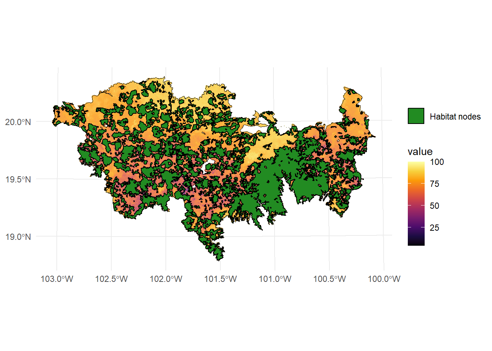

Estamos utilizando un raster de resistencia que esta incluido en el paquete Makurhini. Para cargar un raster de resistencia para tu estudio puedes utilizar la función `raster()` del paquete `raster` o la función `rast()` del paquete `terra`.


``` r
library(raster)
resistance_matrix <- raster("direccion/nombre.tif") #puedes usar otras extensiones raster

library(terra)
resistance_matrix <- rast("direccion/nombre.tif") 
```

Se utiliza el tipo de distancia de menor costo `type = "least-cost"` y al usar una distancia de resistencia se tiene que usar el otro argumento resistance, es decir, `resistance =` resistance_matrix.


``` r
PC <- MK_dPCIIC(nodes = habitat_nodes,
                attribute = NULL,
                distance = list(type = "least-cost",
                                resistance = resistance_matrix),
                metric = "PC", probability = 0.5,
                overall = FALSE,
                distance_thresholds = 10000) # 10 km
#> Estimating distances. This may take several minutes depending on the number of nodes and raster resolution
#> Estimating PC index. This may take several minutes depending on the number of nodes
#>  ■■                                 4% |  ETA: 35s
#>  ■■■■                               9% |  ETA: 44s
#>  ■■■■■■■■■                         26% |  ETA: 20s
#>  ■■■■■■■■■■■                       35% |  ETA: 19s
#>  ■■■■■■■■■■■■■                     41% |  ETA: 19s
#>  ■■■■■■■■■■■■■■■                   48% |  ETA: 18s
#>  ■■■■■■■■■■■■■■■■■                 54% |  ETA: 16s
#>  ■■■■■■■■■■■■■■■■■■                58% |  ETA: 16s
#>  ■■■■■■■■■■■■■■■■■■■■              64% |  ETA: 14s
#>  ■■■■■■■■■■■■■■■■■■■■■■            71% |  ETA: 12s
#>  ■■■■■■■■■■■■■■■■■■■■■■■■          77% |  ETA:  9s
#>  ■■■■■■■■■■■■■■■■■■■■■■■■■■        83% |  ETA:  7s
#>  ■■■■■■■■■■■■■■■■■■■■■■■■■■■■      90% |  ETA:  4s
#>  ■■■■■■■■■■■■■■■■■■■■■■■■■■■■■■    96% |  ETA:  2s
#> 
#> Done!
PC
#> Simple feature collection with 404 features and 5 fields
#> Geometry type: POLYGON
#> Dimension:     XY
#> Bounding box:  xmin: -108954 ymin: 2025032 xmax: 202330.2 ymax: 2198936
#> Projected CRS: NAD_1927_Albers
#> First 10 features:
#>    Id       dPC  dPCintra   dPCflux dPCconnector
#> 1   1 0.0000039 0.0000039 0.0000000 1.032689e-14
#> 2   2 0.0000259 0.0000259 0.0000000 0.000000e+00
#> 3   3 0.0648967 0.0648967 0.0000000 9.256480e-15
#> 4   4 0.0000078 0.0000078 0.0000000 1.169875e-14
#> 5   5 0.0000182 0.0000182 0.0000000 1.197705e-14
#> 6   6 0.0000270 0.0000004 0.0000266 0.000000e+00
#> 7   7 0.0000459 0.0000010 0.0000449 0.000000e+00
#> 8   8 0.0000580 0.0000018 0.0000563 7.487090e-15
#> 9   9 0.0001458 0.0000221 0.0001237 0.000000e+00
#> 10 10 0.4854453 0.4631809 0.0222643 1.133815e-14
#>                          geometry
#> 1  POLYGON ((54911.05 2035815,...
#> 2  POLYGON ((44591.28 2042209,...
#> 3  POLYGON ((46491.11 2042467,...
#> 4  POLYGON ((54944.49 2048163,...
#> 5  POLYGON ((80094.28 2064140,...
#> 6  POLYGON ((69205.24 2066394,...
#> 7  POLYGON ((68554.2 2066632, ...
#> 8  POLYGON ((69995.53 2066880,...
#> 9  POLYGON ((79368.68 2067324,...
#> 10 POLYGON ((23378.32 2067554,...
```


``` r
library(classInt)
library(dplyr)

# Calcular los intervalos de Jenks para strength
breaks <- classInt::classIntervals(PC$dPC, n = 9, style = "jenks")

# Crear una nueva variable categórica con los intervalos
PC <- PC %>%
  mutate(dPC_q = cut(dPC,
                          breaks = breaks$brks,
                          include.lowest = TRUE,
                          dig.lab = 5))  

# Graficar en ggplot2 usando las clases Jenks
ggplot() +  
  geom_sf(data = paisaje, fill = NA, color = "black") +
  geom_sf(data = PC, aes(fill = dPC_q), color = "black", size = 0.1) +
  scale_fill_brewer(palette = "RdYlGn", direction = 1, name = "dPC (jenks)") +
  theme_minimal() +
  labs(
    title = "dPC",
    fill = "dPC"
  ) +
  theme(
    legend.position = "right",
    plot.title = element_text(hjust = 0.5)
  )
```

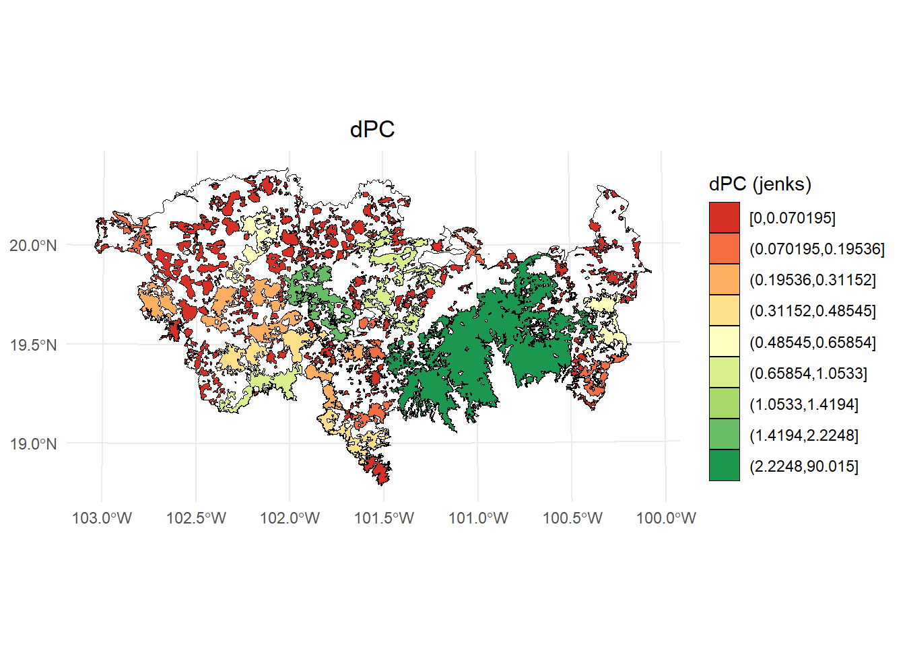

-   dPCIntra


``` r
# Calcular los intervalos de Jenks para strength
breaks <- classInt::classIntervals(PC$dPCintra, n = 9, style = "jenks")

# Crear una nueva variable categórica con los intervalos
PC <- PC %>%
  mutate(dPC_q = cut(dPCintra,
                      breaks = breaks$brks,
                      include.lowest = TRUE,
                      dig.lab = 5))  

# Graficar en ggplot2 usando las clases Jenks
ggplot() +  
  geom_sf(data = paisaje, fill = NA, color = "black") +
  geom_sf(data = PC, aes(fill = dPC_q), color = "black", size = 0.1) +
  scale_fill_brewer(palette = "RdYlGn", direction = 1, name = "dPCIntra (jenks)") +
  theme_minimal() +
  labs(
    title = "dPCIntra",
    fill = "dPCIntra"
  ) +
  theme(
    legend.position = "right",
    plot.title = element_text(hjust = 0.5)
  )
```

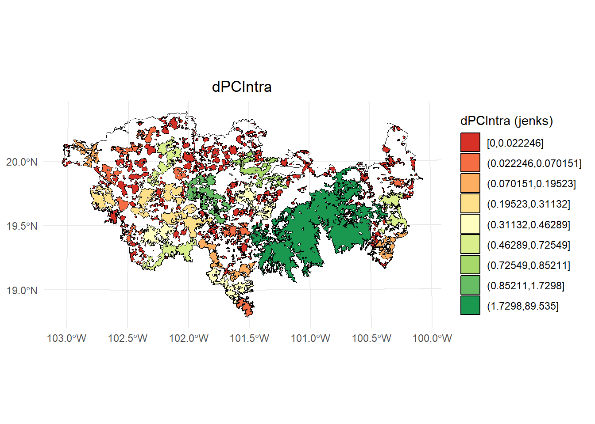

-   dPCflux


``` r
# Calcular los intervalos de Jenks para strength
breaks <- classInt::classIntervals(PC$dPCflux, n = 9, style = "jenks")

# Crear una nueva variable categórica con los intervalos
PC <- PC %>%
  mutate(dPC_q = cut(dPCflux,
                      breaks = breaks$brks,
                      include.lowest = TRUE,
                      dig.lab = 5))  

# Graficar en ggplot2 usando las clases Jenks
ggplot() +  
  geom_sf(data = paisaje, fill = NA, color = "black") +
  geom_sf(data = PC, aes(fill = dPC_q), color = "black", size = 0.1) +
  scale_fill_brewer(palette = "RdYlGn", direction = 1, name = "dPCFlux (jenks)") +
  theme_minimal() +
  labs(
    title = "dPCFlux",
    fill = "dPCFlux"
  ) +
  theme(
    legend.position = "right",
    plot.title = element_text(hjust = 0.5)
  )
```

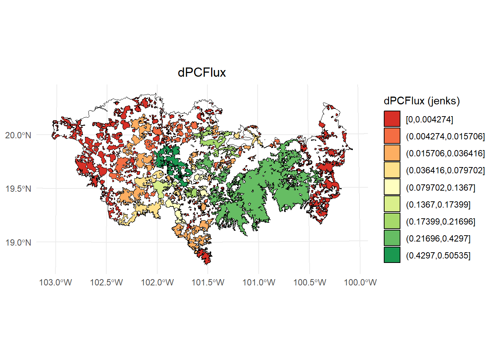

-   dPCconnector


``` r
# Calcular los intervalos de Jenks para strength
breaks <- classInt::classIntervals(PC$dPCconnector, n = 9, style = "jenks")

# Crear una nueva variable categórica con los intervalos
PC <- PC %>%
  mutate(dPC_q = cut(dPCconnector,
                     breaks = breaks$brks,
                     include.lowest = TRUE,
                     dig.lab = 5))  

# Graficar en ggplot2 usando las clases Jenks
ggplot() +  
  geom_sf(data = paisaje, fill = NA, color = "black") +
  geom_sf(data = PC, aes(fill = dPC_q), color = "black", size = 0.1) +
  scale_fill_brewer(palette = "RdYlGn", direction = 1, name = "dPCConnector (jenks)") +
  theme_minimal() +
  labs(
    title = "dPCConnector",
    fill = "dPCConnector"
  ) +
  theme(
    legend.position = "right",
    plot.title = element_text(hjust = 0.5)
  )
```

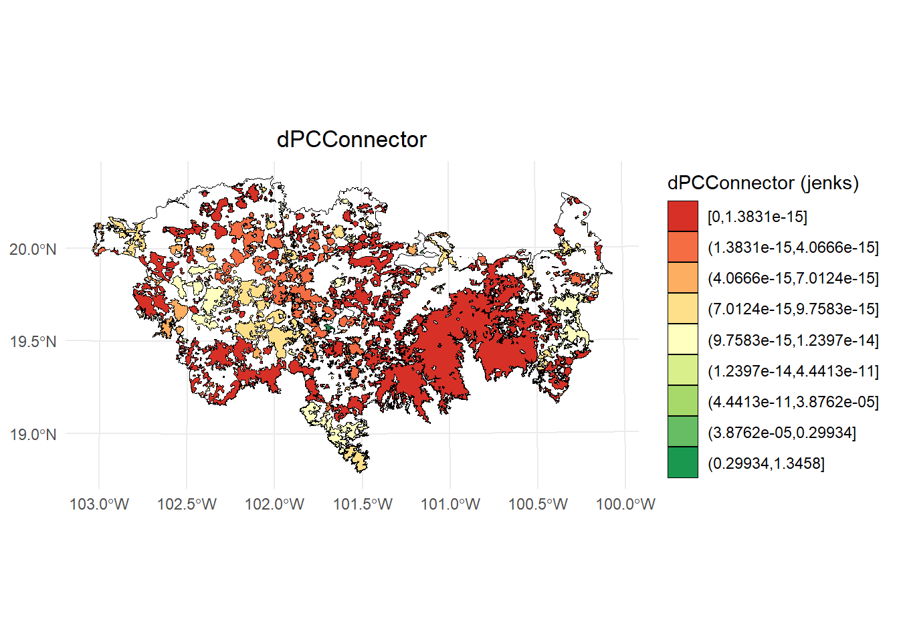

## Ejemplo 7. Distancia costo en Java

Se utiliza el tipo de distancia de menor costo `type = "least-cost"` y al usar una distancia de resistencia se tiene que usar el otro argumento resistance. Sin embargo, la resistencia tiene que tener solo valores enteros y no decimales. Se debe utilizar el argumento `least_cost.java = TRUE`. Además puedes usar `cores.java` = numero de cores para paralelizar el proceso y `ram.java` = memoria ram para estimar las distancias.


``` r
#Convertimos la resistencia a valores enteros
resist2 <- resistance_matrix
resist2 <- round(resistance_matrix)


PC <- MK_dPCIIC(nodes = habitat_nodes,
                attribute = NULL,
                distance = list(type = "least-cost",
                                resistance = resist2,
                                least_cost.java = TRUE,
                                cores.java = 2,
                                ram.java = NULL),
                metric = "PC", probability = 0.5,
                overall = TRUE,
                distance_thresholds = 40000) # 40 km
PC

```

## Ejemplo 8. Usando nodos en formato raster


``` r
data("habitat_nodes_raster", package = "Makurhini")
plot(habitat_nodes_raster)
```

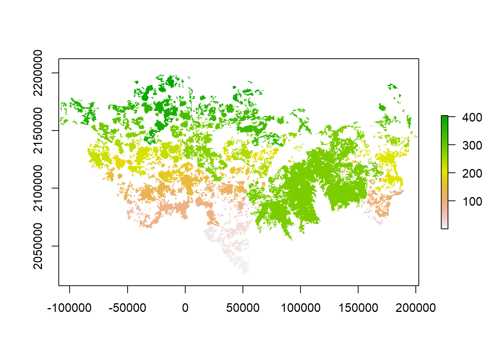

Estamos utilizando un raster de nodos que esta incluido en el paquete Makurhini. Para cargar un raster de nodos para tu estudio puedes utilizar la función `raster()` del paquete `raster` o la función `rast()` del paquete `terra`.


``` r
library(raster)
habitat_nodes_raster <- raster("direccion/nombre.tif") #puedes usar otras extensiones raster

library(terra)
habitat_nodes_raster <- rast("direccion/nombre.tif") 
```


``` r
PC <- MK_dPCIIC(nodes = habitat_nodes_raster,
                attribute = NULL,
                distance = list(type = "centroid"),
                metric = "PC", probability = 0.5,
                overall = TRUE,
                distance_thresholds = 40000) # 40 km
#> Estimating PC index. This may take several minutes depending on the number of nodes
#>  ■■                                 2% |  ETA: 50s
#>  ■■■                                6% |  ETA:  1m
#>  ■■■■                              10% |  ETA:  1m
#>  ■■■■■                             14% |  ETA:  1m
#>  ■■■■■■■                           18% |  ETA:  1m
#>  ■■■■■■■■                          23% |  ETA:  1m
#>  ■■■■■■■■■                         27% |  ETA:  1m
#>  ■■■■■■■■■■                        31% |  ETA: 49s
#>  ■■■■■■■■■■■                       33% |  ETA:  1m
#>  ■■■■■■■■■■■■                      37% |  ETA: 47s
#>  ■■■■■■■■■■■■■■                    42% |  ETA: 43s
#>  ■■■■■■■■■■■■■■■                   46% |  ETA: 40s
#>  ■■■■■■■■■■■■■■■■                  50% |  ETA: 37s
#>  ■■■■■■■■■■■■■■■■■                 54% |  ETA: 34s
#>  ■■■■■■■■■■■■■■■■■■                58% |  ETA: 31s
#>  ■■■■■■■■■■■■■■■■■■■■              62% |  ETA: 28s
#>  ■■■■■■■■■■■■■■■■■■■■■             66% |  ETA: 25s
#>  ■■■■■■■■■■■■■■■■■■■■■■            70% |  ETA: 22s
#>  ■■■■■■■■■■■■■■■■■■■■■■■           75% |  ETA: 19s
#>  ■■■■■■■■■■■■■■■■■■■■■■■■■         79% |  ETA: 16s
#>  ■■■■■■■■■■■■■■■■■■■■■■■■■■        83% |  ETA: 13s
#>  ■■■■■■■■■■■■■■■■■■■■■■■■■■■       87% |  ETA: 10s
#>  ■■■■■■■■■■■■■■■■■■■■■■■■■■■■      91% |  ETA:  7s
#>  ■■■■■■■■■■■■■■■■■■■■■■■■■■■■■     95% |  ETA:  4s
#>  ■■■■■■■■■■■■■■■■■■■■■■■■■■■■■■■   99% |  ETA:  1s
#> 
#> Done!
PC$overall_d40000
#>         Index        Value
#> 1       PCnum 5.116326e+19
#> 2      EC(PC) 7.152850e+09
#> 3  PCintra(%) 3.592011e+01
#> 4 PCdirect(%) 6.407342e+01
#> 5   PCstep(%) 6.470000e-03
PC$node_importances_d40000
#> class      : RasterStack 
#> dimensions : 357, 624, 222768, 5  (nrow, ncol, ncell, nlayers)
#> resolution : 500, 500  (x, y)
#> extent     : -109586.4, 202413.6, 2024737, 2203237  (xmin, xmax, ymin, ymax)
#> crs        : +proj=aea +lat_0=0 +lon_0=-102 +lat_1=17.5 +lat_2=29.5 +x_0=0 +y_0=0 +datum=NAD27 +units=m +no_defs 
#> names      :           Id,          dPC,     dPCintra,      dPCflux, dPCconnector 
#> min values :    1.0000000,    0.0020195,    0.0000001,    0.0020194,    0.0000000 
#> max values : 4.040000e+02, 5.778878e+01, 3.274351e+01, 2.504527e+01, 4.272404e-08
plot(PC$node_importances_d40000)
```

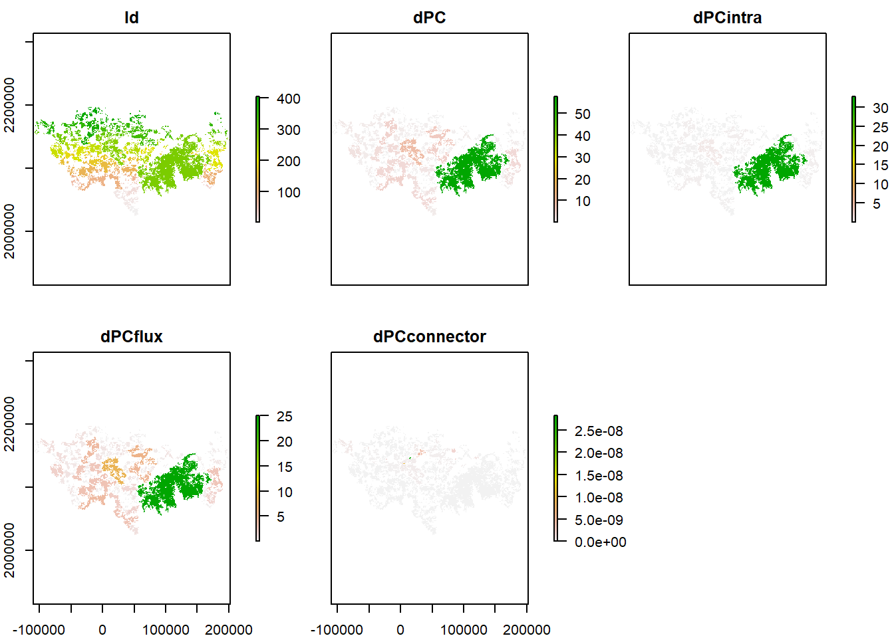

## Guardar IIC o PC

Para guardar puedes usar el argumento `write` que necesita la ruta de la carpeta y un prefijo sin la extensión, e.g., `C:/Carpeta/nombreprefijo`


``` r
IIC <- MK_dPCIIC(nodes = habitat_nodes,
                 attribute = NULL,
                 area_unit = "ha",  
                 distance = list(type = "edge", keep = 0.1),
                 LA = area_paisaje, 
                 overall = FALSE,  
                 onlyoverall = FALSE,
                 metric = "IIC",
                 distance_thresholds = 10000,
                 write = "C:/Users/tapir",
                 intern = TRUE) #10 km}
```

Todos los resultados se guardaran en la carpeta **Users** y tendran el nombre **tapir**

Otra forma de exportar los resultados es hacer uso de la función `write_sf()` del paquete `sf`


``` r
IIC <- MK_dPCIIC(nodes = habitat_nodes,
                 attribute = NULL,
                 area_unit = "ha",  
                 distance = list(type = "edge", keep = 0.1),
                 LA = area_paisaje, 
                 overall = FALSE,  
                 onlyoverall = FALSE,
                 metric = "IIC",
                 distance_thresholds = 10000,
                 intern = TRUE) #10 km}

write_sf(IIC, "C:/Users/tapir.shp")

```

Si estimas además el `overall` puedes usar la función `write.csv()` para exportar la tabla


``` r
IIC <- MK_dPCIIC(nodes = habitat_nodes,
                 attribute = NULL,
                 area_unit = "ha",  
                 distance = list(type = "edge", keep = 0.1),
                 LA = area_paisaje, 
                 overall = TRUE,  
                 onlyoverall = FALSE,
                 metric = "IIC",
                 distance_thresholds = 10000,
                 intern = TRUE) #10 km}

write_sf(IIC$node_importances_d10000, "C:/Users/tapir.shp")

write.csv(IIC$overall_d10000, "C:/Users/tapir.csv")

```

Si estimas el índice con más de un umbral de distancia


``` r
IIC <- MK_dPCIIC(nodes = habitat_nodes,
                 attribute = NULL,
                 area_unit = "ha",  
                 distance = list(type = "edge", keep = 0.1),
                 LA = area_paisaje, 
                 overall = TRUE,  
                 onlyoverall = FALSE,
                 metric = "IIC",
                 distance_thresholds = c(10000, 20000),
                 intern = TRUE) #10 km}

write_sf(IIC$d10000$node_importances_d10000, "C:/Users/tapir10.shp")
write_sf(IIC$d20000$node_importances_d20000, "C:/Users/tapir20.shp")

write.csv(IIC$d10000$overall_d10000, "C:/Users/tapir10.csv")
write.csv(IIC$d20000$overall_d20000, "C:/Users/tapir20.csv")
```
