# Prioridades de Restauración con MK_dPCIIC()

Con la función `MK_dPCIIC()` podemos obtener la contribución potencial de un parche que será restaurado. Usaremos los argumentos:

-   `restoration = NULL`. Vector o nombre de columna que **indica si cada nodo es existente (1) o propuesto para restauración (0)**. Si es `NULL`, se considera que todos los nodos existen.
-   `onlyrestor = FALSE.` Lógico. Si `TRUE`, solo se calcularán métricas relacionadas con restauración.

Continuamos trabajando con el vector con 404 parches/nodos en el eje Neovolcánico de México. Para generar un escenario hipotético de restauración, seleccionaremos aleatoriamente **100 parches** para restaurar.


``` r
library(ggplot2)
library(sf)
library(terra)
library(raster)
library(Makurhini)
library(RColorBrewer)


habitat_nodes <- read_sf("C:/.../habitat_nodes.shp")
nrow(habitat_nodes)
paisaje <- read_sf("C:/.../paisaje.shp")

```


```
#> [1] 404
```


``` r
ggplot() +  
  geom_sf(data = paisaje, aes(color = "Study area"), fill = NA, color = "black") +
  geom_sf(data = habitat_nodes, aes(color = "Parches"), fill = "forestgreen", linewidth = 0.5) +
  scale_color_manual(name = "", values = "black")+
  theme_minimal() +
  theme(axis.title.x = element_blank(),
        axis.title.y = element_blank())
```


``` r
set.seed(10) #Para que seleccionen los mismos parches que yo 
```


``` r
#Seleccionar de forma aleatoria a 100 de estos parches para restaurar
parches_restauracion <- sample(1:nrow(habitat_nodes), 100)

parches_restauracion
#>   [1] 137 330 368  72 211 344 271 143 403  24  13 351 392
#>  [14] 110 263 231 155 342 338 285 385 377  92  50 365 154
#>  [27] 101  33 135 379 158 324  93 114  88 307 182 242 288
#>  [40] 267 335 382 347  42 334 394 217 200 144  26 345 209
#>  [53]  48 151  15 395 317 132 227 270  35 266  74  58 167
#>  [66] 398  31 378 337 109  39 118  89  18 361 254 192 249
#>  [79]  90 234 251 328   4  63  20 321 224 241 176  94 148
#>  [92] 402 346  27  80 404 207 298 119 401
```

Creamos un nuevo campo llamado **restauracion** (puede ser cualquier nombre) con valores de 1 que representan parches que existen en el paisaje:


``` r
habitat_nodes$restauracion <- 1
```

Asignamos un valor de 0 a los parches seleccionados para restaurar (no existen en el paisaje inicialmente y serán restaurados.


``` r
habitat_nodes$restauracion[parches_restauracion] <- 0
```

Aplicamos la función `MK_dPCIIC()`. En este ejemplo usaremos el índice PC y una probabbilidad de 0.5 bajo un umbral de distancia de 10 km.


``` r
PCrestauracion <- MK_dPCIIC(nodes = habitat_nodes,
                attribute = NULL,
                area_unit = "ha",
                distance = list(type = "edge", keep = 0.1),
                LA = NULL,
                restoration = "restauracion",
                onlyrestor = TRUE,
                metric = "PC",
                probability = 0.5,
                distance_thresholds = 10000,
                intern = TRUE) #10 km
#> Estimating PC index. This may take several minutes depending on the number of nodes
#> 
  |                                                        
  |                                                  |   0%
  |                                                        
  |==================================================| 100%
#>  ■■■■■■■■■■■■■                     39% |  ETA:  5s
#>  ■■■■■■■■■■■■■■■■■■■■■■■           74% |  ETA:  2s
#> 
#> Done!
PCrestauracion
#> Simple feature collection with 404 features and 3 fields
#> Geometry type: POLYGON
#> Dimension:     XY
#> Bounding box:  xmin: -108954 ymin: 2025032 xmax: 202330.2 ymax: 2198936
#> Projected CRS: NAD_1927_Albers
#> First 10 features:
#>    Id restauracion    dPCres                       geometry
#> 1   1            1   0.00000 POLYGON ((54911.05 2035815,...
#> 2   2            1   0.00000 POLYGON ((44591.28 2042209,...
#> 3   3            1   0.00000 POLYGON ((46491.11 2042467,...
#> 4   4            0 -36.02491 POLYGON ((54944.49 2048163,...
#> 5   5            1   0.00000 POLYGON ((80094.28 2064140,...
#> 6   6            1   0.00000 POLYGON ((69205.24 2066394,...
#> 7   7            1   0.00000 POLYGON ((68554.2 2066632, ...
#> 8   8            1   0.00000 POLYGON ((69995.53 2066880,...
#> 9   9            1   0.00000 POLYGON ((79368.68 2067324,...
#> 10 10            1   0.00000 POLYGON ((23378.32 2067554,...
```

Se crea la columna `dPCres` con la importancia relativa del parche para mejorar la conectividad del paisaje al aparecer cuando es restaurado. Los valores van de -100 a 100, debido a que su contribución puede incluso ser negativa, es decir, disminuye la conectividad global al restaurarlo.


``` r
ggplot() +  
  geom_sf(data = paisaje, aes(color = "Study area"), fill = NA, color = "black") +
  geom_sf(data = PCrestauracion, aes(fill = dPCres), color = "black", size = 0.1) +
  scale_fill_distiller(
    palette = "RdYlBu",
    direction = -1, 
    name = "% dPCres"
  ) +
  theme_minimal() +
  labs(
    title = "Restauración",
    fill = "% dPCres"
  ) +
  theme(
    legend.position = "right",
    plot.title = element_text(hjust = 0.5)
  )
```

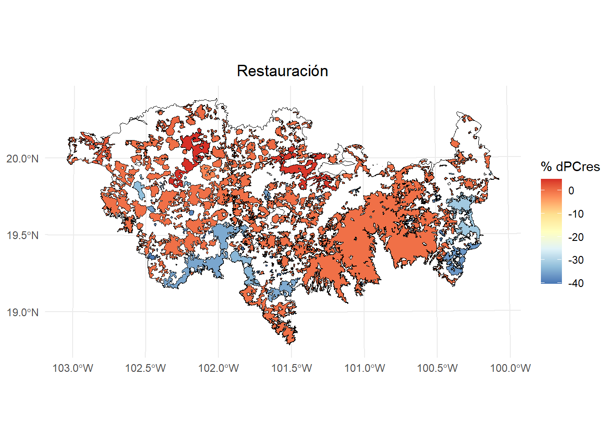

Veamos solo los parches de restauración


``` r

PCrestauracion2 <- PCrestauracion[PCrestauracion$restauracion == 0,]

ggplot() +  
  geom_sf(data = paisaje, aes(color = "Study area"), fill = NA, color = "black") +
  geom_sf(data = habitat_nodes, aes(color = "Patches"), fill = NA, color = "black") +
  geom_sf(data = PCrestauracion2, aes(fill = dPCres), color = "black", size = 0.1) +
  scale_fill_distiller(
    palette = "RdYlBu",
    direction = -1, 
    name = "% dPCres"
  ) +
  theme_minimal() +
  labs(
    title = "Restauración",
    fill = "% dPCres"
  ) +
  theme(
    legend.position = "right",
    plot.title = element_text(hjust = 0.5)
  )
```

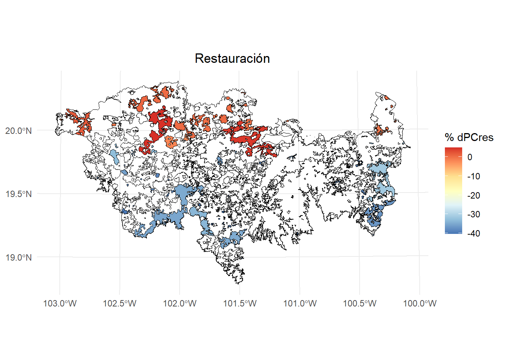

Si desactivamos `onlyrestor` entonces estima los otros valores delíndice de conectividad (i.e., dPC, intra, flux y connector).


``` r
PCrestauracion <- MK_dPCIIC(nodes = habitat_nodes,
                attribute = NULL,
                area_unit = "ha",
                distance = list(type = "edge", keep = 0.1),
                LA = NULL,
                restoration = "restauracion",
                onlyrestor = FALSE,
                metric = "PC",
                probability = 0.5,
                distance_thresholds = 10000,
                intern = FALSE) #10 km
PCrestauracion
#> Simple feature collection with 404 features and 7 fields
#> Geometry type: POLYGON
#> Dimension:     XY
#> Bounding box:  xmin: -108954 ymin: 2025032 xmax: 202330.2 ymax: 2198936
#> Projected CRS: NAD_1927_Albers
#> First 10 features:
#>    Id restauracion       dPC  dPCintra   dPCflux
#> 1   1            1 0.0128564 0.0000006 0.0128558
#> 2   2            1 0.0332059 0.0000037 0.0332022
#> 3   3            1 1.6831849 0.0093299 1.6665804
#> 4   4            0 0.0184037 0.0000011 0.0184026
#> 5   5            1 0.0285162 0.0000026 0.0285136
#> 6   6            1 0.0040938 0.0000001 0.0040937
#> 7   7            1 0.0069481 0.0000001 0.0068704
#> 8   8            1 0.0088543 0.0000003 0.0088540
#> 9   9            1 0.0369150 0.0000032 0.0331109
#> 10 10            1 5.5556530 0.0665892 4.4246468
#>    dPCconnector    dPCres                       geometry
#> 1  0.000000e+00   0.00000 POLYGON ((54911.05 2035815,...
#> 2  0.000000e+00   0.00000 POLYGON ((44591.28 2042209,...
#> 3  7.274621e-03   0.00000 POLYGON ((46491.11 2042467,...
#> 4  0.000000e+00 -36.02491 POLYGON ((54944.49 2048163,...
#> 5  0.000000e+00   0.00000 POLYGON ((80094.28 2064140,...
#> 6  5.309968e-08   0.00000 POLYGON ((69205.24 2066394,...
#> 7  7.758334e-05   0.00000 POLYGON ((68554.2 2066632, ...
#> 8  0.000000e+00   0.00000 POLYGON ((69995.53 2066880,...
#> 9  3.800919e-03   0.00000 POLYGON ((79368.68 2067324,...
#> 10 1.064417e+00   0.00000 POLYGON ((23378.32 2067554,...
```

# Prioridades de conservación y restauración con MK_Focal_nodes()

Esta función permite calcular el Índice Integral de Conectividad focal (IIC<sub>f</sub>) o la Probabilidad de Conectividad focal (PC<sub>f</sub>) bajo uno o más umbrales de distancia. Además, esta función estima el Índice de Conectividad Compuesto (CCI<sub>f</sub>; para más detalles, véase Latorre-Cárdenas et al., 2023. Land 2023, 12(3), 631; <https://doi.org/10.3390/land12030631>).


| **Argumento**         | **Descripción** |
|-----------------------|-----------------------------|
| `nodes`               | Objeto espacial (`sf`, `SpatVector`, `SpatialPolygonsDataFrame`) que contiene los nodos (por ejemplo, fragmentos o hábitats) a analizar. Debe estar en un sistema de coordenadas proyectado. |
| `id`                  | Nombre de la columna con el ID de los nodos. |
| `attribute`           | Nombre de la columna o vector. Si es `NULL`, se usará el área del nodo como atributo. Se puede definir la unidad del área con `area_unit`. Para usar un atributo alternativo, considera el tipo de clase del objeto en `nodes`. |
| `raster_attribute`    | Objeto raster usado para asignar valores de atributo a cada nodo, usando la función definida en `fun_attribute`. |
| `fun_attribute`       | Función usada para extraer los valores del raster por nodo (ej. `mean`, `sum`, `modal`, `min`, `max`). Por defecto = `mean`. |
| `weighted`            | Lógico. Si es `TRUE` junto con `raster_attribute`, se multiplica el valor del atributo por el área del nodo, obteniendo un índice ponderado. |
| `area_unit`           | Unidad del área cuando `attribute = NULL`. Puede ser `"m2"` (por defecto), `"km2"`, `"cm2"` o `"ha"`. |
| `distance`            | Lista de parámetros para calcular la distancia entre pares de nodos. Puede ser distancia euclidiana o efectiva (por resistencia). Debe incluir al menos `type` (ej. `"centroid"`, `"edge"`, `"least-cost"`, `"commute-time"`) y, si aplica, `resistance`. |
| `metric`              | Métrica de conectividad a usar: `"PC"` (por defecto y recomendada) o `"IIC"`. |
| `probability`         | Valor numérico de la probabilidad asociada a la `distance_threshold`. Por ejemplo, 0.5 si es una distancia mediana de dispersión. Por defecto = 0.5. Solo para `metric = "PC"`. |
| `distance_thresholds` | Distancia(s) de dispersión (en metros). Si es `NULL`, se estima como la distancia mediana entre nodos. Puede usarse `dispersal_distance`. |
| `search_buffer`       | Distancia(s) en metros para generar un buffer alrededor del nodo focal y seleccionar nodos vecinos. Puede variar según cada distancia de dispersión. |
| `simplify_shape`      | Valor numérico para simplificar la geometría del nodo focal y facilitar el análisis espacial (ver `st_simplify`). |
| `fragmentation`       | Lógico. Si es `TRUE`, estima estadísticos de fragmentación con `MK_Fragmentation`. Requiere `edge_distance` y `min_node_area`. |
| `edge_distance`       | Distancia al borde (en metros). Por defecto = 500 m. Se usa en `MK_Fragmentation`. |
| `min_node_area`       | Área mínima del nodo (ej. 100 km² por defecto). Se usa para calcular cuántos nodos tienen menor área. Depende de `area_unit`. |
| `parallel`            | Número de núcleos para paralelizar el análisis de índices. Útil con >1000 nodos. Por defecto no se paraleliza. |
| `write`               | Ruta y prefijo del archivo a guardar, por ejemplo `"C:/ejemplo/test_focal_"`. Por defecto no se guarda nada. El archivo guardado es un geopackage. |
| `save_subfiles`       | Lógico o carácter. Si `TRUE`, guarda resultados por nodo en una carpeta en formato `.rds`. Útil para reanudar análisis en caso de error. Si es carácter, especifica la ruta de la carpeta. |
| `intern`              | Lógico. Muestra el progreso del proceso (`TRUE` por defecto). El avance puede no alcanzar el 100% si la operación es muy rápida. |


Se ejecuta un ciclo en el que se selecciona cada uno de los nodos. En cada iteración, ocurre lo siguiente:

1.  Cuando se selecciona el nodo *i*, este se convierte en el nodo focal (*f*).

2.  Luego, se genera un búfer con la distancia especificada en el parámetro `search_buffer`, por ejemplo, el doble de la distancia de dispersión especificada en el parámetro `distance_thresholds`. Este búfer se denomina *paisaje local* y se utiliza para identificar nodos vecinos, llamados *nodos transfronterizos* (*th*).

3.  A continuación, se estima el índice IIC o PC según la métrica seleccionada, utilizando el nodo focal y los nodos transfronterizos. Este resultado se denomina *IIC*<sub>f</sub> o *PC*<sub>f</sub>. El valor del índice varía entre 0 y 1, donde 1 representa la mayor conectividad posible dentro del paisaje local para el nodo focal.

4.  Posteriormente, se estima el delta *dIIC* o *dPC* para el nodo focal, junto con sus componentes *intra*, *flux* y *connector*.

5.  La función calcula el *Índice Compuesto de Conectividad* (*CCI*<sub>f</sub>) como una herramienta de priorización de nodos focales. Este índice se basa en la contribución individual del nodo, ponderada por la conectividad de su paisaje local:

    -   *CCI*<sub>f</sub> = IIC<sub>f</sub> × dIIC<sub>f</sub>
    -   *CCI*<sub>f</sub> = PC<sub>f</sub> × dPC<sub>f</sub>

    Los nodos con valores más altos de *CCI*<sub>f</sub> se encuentran en paisajes locales bien conectados, lo que los convierte en contribuyentes valiosos para la conectividad del paisaje inmediato. Esto los hace candidatos ideales para esfuerzos de conservación. Por el contrario, los valores bajos de *CCI*<sub>f</sub> pueden indicar la necesidad de acciones de restauración y conservación.

6.  En el paso final, si el parámetro `fragmentation` está definido como `TRUE`, se estiman estadísticas de fragmentación para el paisaje local.

Este proceso se repite para cada nodo y se almacena en un objeto de clase `sf`.


``` r
test <- MK_Focal_nodes(nodes = habitat_nodes,
                       id = "Id",
                       attribute = NULL,
                       raster_attribute = NULL,
                       fun_attribute = NULL,
                       distance = list(type = "edge", keep = 0.1),
                       metric = "PC",
                       probability = 0.5,
                       distance_thresholds = 10000,
                       search_buffer = 20000,
                       fragmentation = FALSE,
                       parallel = 4,
                       intern = FALSE)
```

Índice PC en paisajes focales:


``` r
library(classInt)
library(dplyr)
#> 
#> Adjuntando el paquete: 'dplyr'
#> The following objects are masked from 'package:igraph':
#> 
#>     as_data_frame, groups, union
#> The following objects are masked from 'package:raster':
#> 
#>     intersect, select, union
#> The following objects are masked from 'package:terra':
#> 
#>     intersect, union
#> The following objects are masked from 'package:stats':
#> 
#>     filter, lag
#> The following objects are masked from 'package:base':
#> 
#>     intersect, setdiff, setequal, union

# Calcular los intervalos de Jenks para strength
breaks <- classInt::classIntervals(test$PC, n = 9, style = "jenks")

# Crear una nueva variable categórica con los intervalos
PC <- test %>%
  mutate(dPC_q = cut(PC,
                     breaks = breaks$brks,
                     include.lowest = TRUE,
                     dig.lab = 5))  

# Graficar en ggplot2 usando las clases Jenks
ggplot() +  
  geom_sf(data = paisaje, fill = NA, color = "black") +
  geom_sf(data = PC, aes(fill = dPC_q), color = "black", size = 0.1) +
  scale_fill_brewer(palette = "RdYlGn", direction = 1, name = "PC (jenks)") +
  theme_minimal() +
  labs(
    title = "PC en paisajes focales",
    fill = "PC"
  ) +
  theme(
    legend.position = "right",
    plot.title = element_text(hjust = 0.5)
  )
```

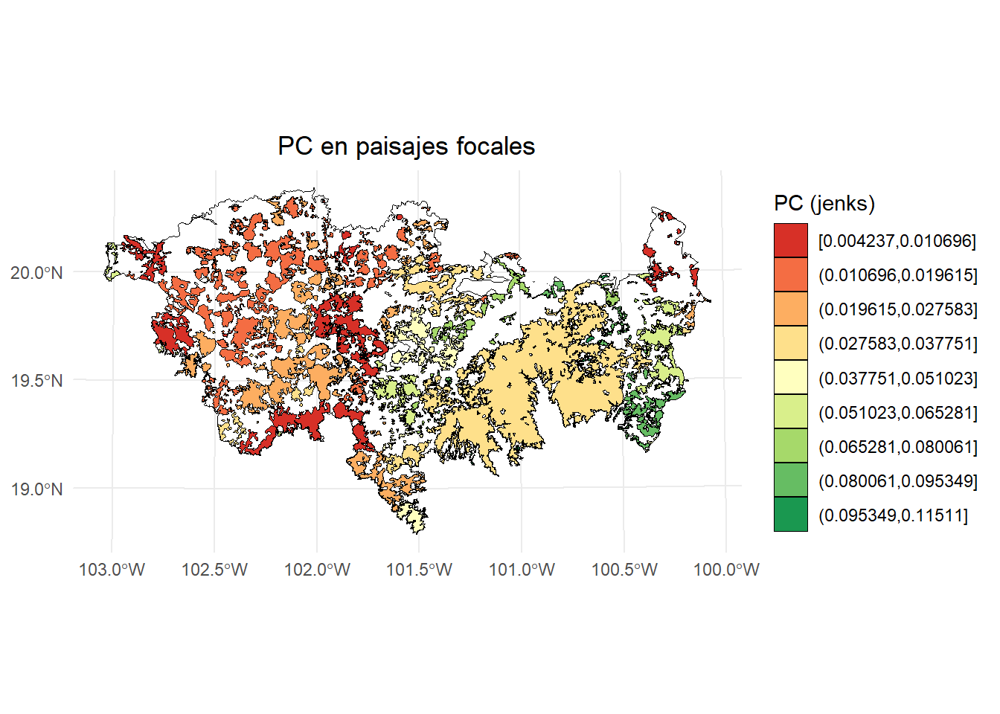

Índice dPC focal:


``` r
# Calcular los intervalos de Jenks para strength
breaks <- classInt::classIntervals(test$dPC, n = 9, style = "jenks")

# Crear una nueva variable categórica con los intervalos
PC <- test %>%
  mutate(dPC_q = cut(dPC,
                     breaks = breaks$brks,
                     include.lowest = TRUE,
                     dig.lab = 5))  

# Graficar en ggplot2 usando las clases Jenks
ggplot() +  
  geom_sf(data = paisaje, fill = NA, color = "black") +
  geom_sf(data = PC, aes(fill = dPC_q), color = "black", size = 0.1) +
  scale_fill_brewer(palette = "RdYlGn", direction = 1, name = "dPC (jenks)") +
  theme_minimal() +
  labs(
    title = "dPC",
    fill = "dPC"
  ) +
  theme(
    legend.position = "right",
    plot.title = element_text(hjust = 0.5)
  )
```

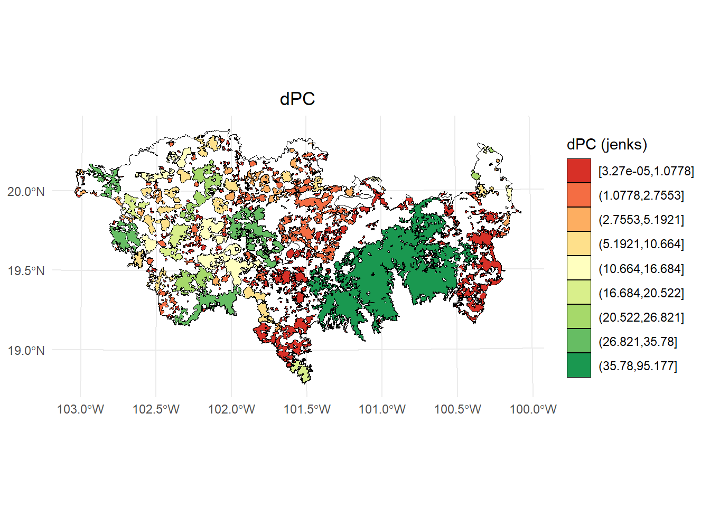

Fracción intra:


``` r
# Calcular los intervalos de Jenks para strength
breaks <- classInt::classIntervals(test$dPCintra, n = 9, style = "jenks")

# Crear una nueva variable categórica con los intervalos
PC <- test %>%
  mutate(dPC_q = cut(dPCintra,
                     breaks = breaks$brks,
                     include.lowest = TRUE,
                     dig.lab = 5))  

# Graficar en ggplot2 usando las clases Jenks
ggplot() +  
  geom_sf(data = paisaje, fill = NA, color = "black") +
  geom_sf(data = PC, aes(fill = dPC_q), color = "black", size = 0.1) +
  scale_fill_brewer(palette = "RdYlGn", direction = 1, name = "dPCintra (jenks)") +
  theme_minimal() +
  labs(
    title = "dPCintra",
    fill = "dPCintra"
  ) +
  theme(
    legend.position = "right",
    plot.title = element_text(hjust = 0.5)
  )
```

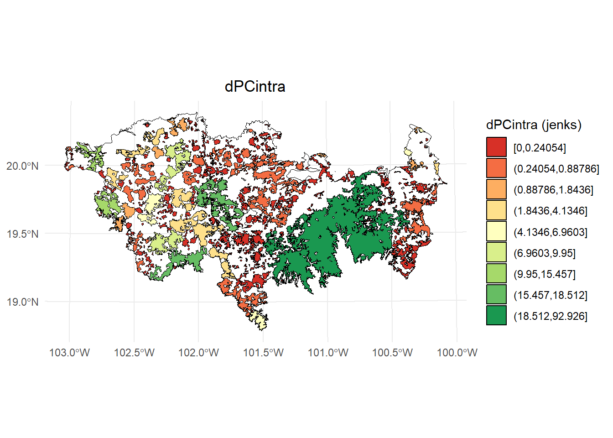

Fracción flux:


``` r
# Calcular los intervalos de Jenks para strength
breaks <- classInt::classIntervals(test$dPCflux, n = 9, style = "jenks")

# Crear una nueva variable categórica con los intervalos
PC <- test %>%
  mutate(dPC_q = cut(dPCflux,
                     breaks = breaks$brks,
                     include.lowest = TRUE,
                     dig.lab = 5))  

# Graficar en ggplot2 usando las clases Jenks
ggplot() +  
  geom_sf(data = paisaje, fill = NA, color = "black") +
  geom_sf(data = PC, aes(fill = dPC_q), color = "black", size = 0.1) +
  scale_fill_brewer(palette = "RdYlGn", direction = 1, name = "dPCflux (jenks)") +
  theme_minimal() +
  labs(
    title = "dPCflux",
    fill = "dPCflux"
  ) +
  theme(
    legend.position = "right",
    plot.title = element_text(hjust = 0.5)
  )
```

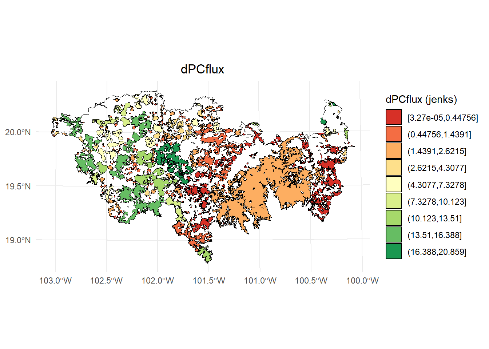

Fracción connector:


``` r
# Calcular los intervalos de Jenks para strength
breaks <- classInt::classIntervals(test$dPCconnector, n = 9, style = "jenks")

# Crear una nueva variable categórica con los intervalos
PC <- test %>%
  mutate(dPC_q = cut(dPCconnector,
                     breaks = breaks$brks,
                     include.lowest = TRUE,
                     dig.lab = 5))  

# Graficar en ggplot2 usando las clases Jenks
ggplot() +  
  geom_sf(data = paisaje, fill = NA, color = "black") +
  geom_sf(data = PC, aes(fill = dPC_q), color = "black", size = 0.1) +
  scale_fill_brewer(palette = "RdYlGn", direction = 1, name = "dPCconnector (jenks)") +
  theme_minimal() +
  labs(
    title = "dPCconnector",
    fill = "dPCconnector"
  ) +
  theme(
    legend.position = "right",
    plot.title = element_text(hjust = 0.5)
  )
```

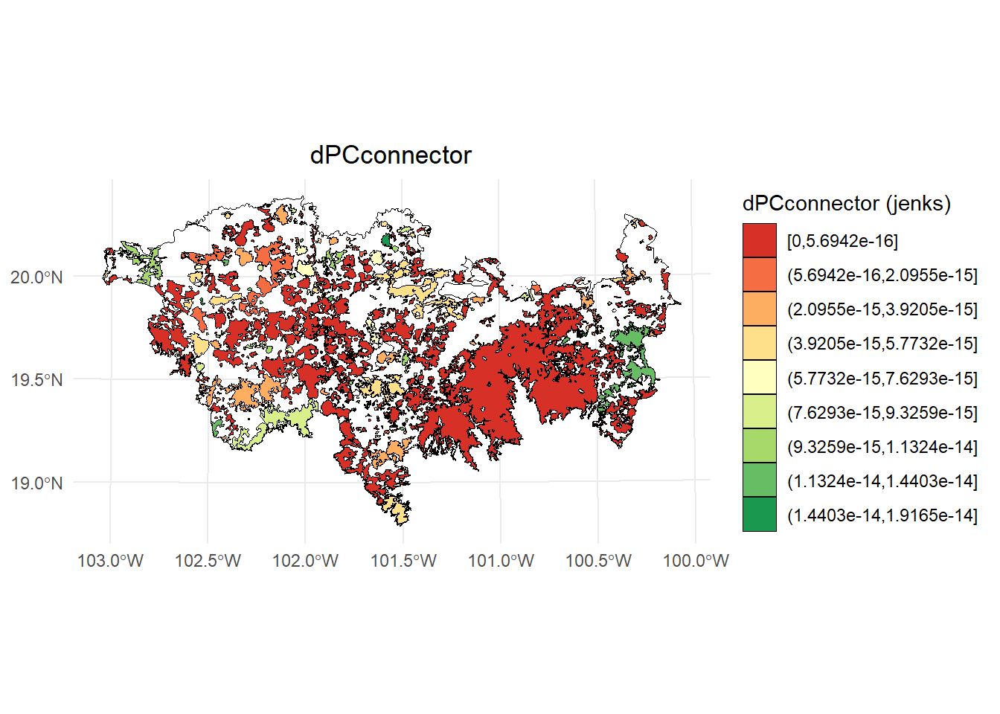

**Índice de Conectividad Compuesto (CCI~f~).**

No olvidemos que es una herramienta para priorizar cada parche focal en función de su contribución individual a la conectividad en la red de parches f y thp (dPC~f~) y la conectividad del paisaje de toda la red (PC~f~). En ese sentido, los parches con valores CCI más altos se encuentran en un paisaje bien conectado y su contribución a la conectividad se considera importante:


``` r
# Calcular los intervalos de Jenks para strength
breaks <- classInt::classIntervals(test$IComp, n = 9, style = "jenks")

# Crear una nueva variable categórica con los intervalos
PC <- test %>%
  mutate(dPC_q = cut(IComp,
                     breaks = breaks$brks,
                     include.lowest = TRUE,
                     dig.lab = 5))  

# Graficar en ggplot2 usando las clases Jenks
ggplot() +  
  geom_sf(data = paisaje, fill = NA, color = "black") +
  geom_sf(data = PC, aes(fill = dPC_q), color = "black", size = 0.1) +
  scale_fill_brewer(palette = "RdYlGn", direction = 1, name = "IComp (jenks)") +
  theme_minimal() +
  labs(
    title = "Índice de Conectividad Compuesto",
    fill = "IComp"
  ) +
  theme(
    legend.position = "right",
    plot.title = element_text(hjust = 0.5)
  )
```

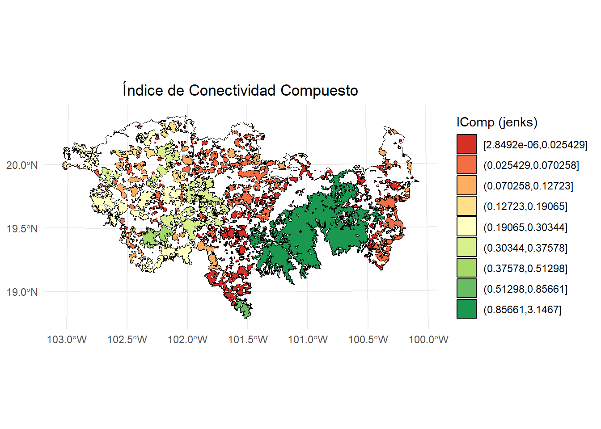


# Prioridad de enlaces con MK_dPCIIC_links()

Esta función calcula el índice dPC o dIIC para estimar la importancia de los enlaces para la conservación y la restauración. Calcula la contribución de cada enlace individual para mantener (modo: eliminación de enlaces) o mejorar (modo: cambio de enlaces) la conectividad general bajo uno o varios umbrales de distancia.


Estos son los argumentos:


                                                                                     
| **Argumento**        | **Descripción**                                                                                                                                                                                                                                                                                                                                                                                                                                    |
|----------------------|---------------------------------------------------------------------------------------------------------------------------------------------------------------------------------------------------------------------------------------------------------------------------------------------------------------------------------------------------------------------------------------------------------------------------------------------------------------|
| `nodes`              | Objeto que contiene la información de los nodos (por ejemplo, fragmentos o parches de hábitat). Puede ser: <br> - `data.frame` con al menos dos columnas: la primera para los ID de los nodos y la segunda para los atributos. <br> - Datos espaciales vectoriales (`sf`, `SpatVector`, `SpatialPolygonsDataFrame`) en un sistema de coordenadas proyectado. <br> - Ráster (`RasterLayer`, `SpatRaster`) con valores enteros representando el ID de cada nodo y áreas no hábitat como `NA`. |
| `attribute`          | Caracter o vector. Si es `NULL` (solo válido cuando `nodes` es espacial vectorial o ráster), se usará el área del nodo como atributo. Para usar otro atributo: <br> - Si `nodes` es vector espacial o `data.frame`, indicar el nombre de la columna. <br> - Si `nodes` es ráster, debe ser un vector numérico con el atributo por nodo. Si `weighted = TRUE`, se multiplica por el área de cada nodo para obtener un índice ponderado.                                              |
| `LA`                 | Numérico. (opcional, por defecto = `NULL`). Valor máximo del atributo del paisaje. No afecta la importancia relativa de los nodos, solo se usa para calcular la conectividad total del paisaje. Si se omite y `overall = TRUE`, solo se calcula el numerador del índice global.                                                                                                                                        |
| `area_unit`          | Caracter. Unidad del área cuando `attribute = NULL`. Opciones: `"m2"` (por defecto), `"km2"`, `"cm2"` o `"ha"`.                                                                                                                                                                                                                                                                                                                                               |
| `distance`           | Matriz o lista que establece las distancias entre pares de nodos. Puede ser: <br> - Matriz cuadrada con distancias (euclidianas o efectivas). <br> - Lista de parámetros (por ejemplo: `type = "least-cost", resistance = raster_resistance`). Tipos posibles: `"centroid"`, `"edge"`, `"least-cost"`, `"commute-time"`.                                                                                                  |
| `metric`             | Caracter indicando el índice de conectividad a usar: `"PC"` (por defecto y recomendado) o `"IIC"`.                                                                                                                                                                                                                                                                                                                                                            |
| `probability`        | Valor numérico de la probabilidad asociada al umbral de distancia (`distance_thresholds`). Por ejemplo, si es distancia mediana de dispersión usar `0.5`. Para distancias máximas, usar `0.05` o `0.01`. Solo se usa si `metric = "PC"`. Si es `NULL`, se usa `0.5`.                                                                                                                                                                                           |
| `distance_thresholds`| Valor numérico (o vector) que indica la(s) distancia(s) de dispersión en metros. Si es `NULL`, se estima como la mediana de las distancias entre nodos. Alternativamente, puede usarse la función `dispersal_distance`.                                                                                                                                                                                                                                       |
| `threshold`          | Numérico. Se excluyen los pares de nodos con una distancia mayor al umbral, acelerando el procesamiento.                                                                                                                                                                                                                                                                                                                                                      |
| `removal`            | Lógico. Si es `TRUE` (por defecto), se calcula la importancia de los enlaces usando el modo de eliminación de enlaces.                                                                                                                                                                                                                                                                                                                                       |
| `change`             | (opcional, por defecto `NULL`). Numérico que indica las nuevas distancias para calcular la importancia de los enlaces bajo el modo de cambio de enlace.                                                                                                                                                                                                                                                                                                     |
| `overall`            | Lógico. Si es `TRUE`, se añade el índice EC global al resultado, el cual se convierte en una lista. Por defecto es `FALSE`.                                                                                                                                                                                                                                                                                                                                  |
| `parallel`           | (opcional, por defecto = `NULL`). Numérico que indica el número de núcleos para paralelizar el cálculo de los índices. Recomendado si se tienen más de 1000 nodos.                                                                                                                                                                                                                                                                                          |
| `parallel_mode`      | (opcional, por defecto = `1`). Numérico que indica el modo de paralelización: <br> - Modo 1 (por defecto): paraleliza el cálculo de deltas de conectividad. <br> - Modo 2: paraleliza el cálculo de rutas de menor costo. Recomendado para >1000 nodos.                                                                                                                                                                                                     |
| `write`              | Caracter que indica la ruta y prefijo para guardar los resultados, por ejemplo `"C:/ejemplo"`. Por defecto no se guarda nada. Los archivos generados incluyen: <br> - Importancia de cada enlace (formato CSV). <br> - Tabla de conectividad global del paisaje si `overall = TRUE` (formato CSV).                                                                                                                  |
| `intern`             | Lógico. Si es `TRUE` (por defecto), muestra el progreso del proceso. Puede que no llegue a 100% si las operaciones son muy rápidas.                                                                                                                                                                                                                                                                                                                          |                                                                                     
                                                                                     
                                                                                                                                                  
## Rutas de menor costo (corredores potenciales)

Para realizar un ejemplo, estimaremos los corredores potenciales entre 20 de nuestros parches utilizando el raster de resistencia que usamos en ejemplos previos.


``` r
set.seed(2) #para seleccionar siempre los mismos de forma aleatoria
parches_ejemplo <- habitat_nodes[sample(1:nrow(habitat_nodes), 20),]
parches_ejemplo$Id <- 1:20 #Asignamos un nuevo id
```


``` r
library(terra)
data("resistance_matrix", package = "Makurhini")

raster_map <- as(resistance_matrix, "SpatialPixelsDataFrame")
raster_map <- as.data.frame(raster_map)
colnames(raster_map) <- c("value", "x", "y")
ggplot() +  
  geom_tile(data = raster_map, aes(x = x, y = y, fill = value), alpha = 0.8) + 
  geom_sf(data = paisaje, aes(color = "Study area"), fill = NA, color = "black") +
  geom_sf(data = parches_ejemplo, aes(color = "Habitat nodes"), fill = "forestgreen", linewidth = 0.5) +
  scale_fill_gradientn(colors = c("#000004FF", "#1B0C42FF", "#4B0C6BFF", "#781C6DFF",
                                  "#A52C60FF", "#CF4446FF", "#ED6925FF", "#FB9A06FF",
                                  "#F7D03CFF", "#FCFFA4FF"))+
  scale_color_manual(name = "", values = "black")+
  theme_minimal() +
  theme(axis.title.x = element_blank(),
        axis.title.y = element_blank())
```

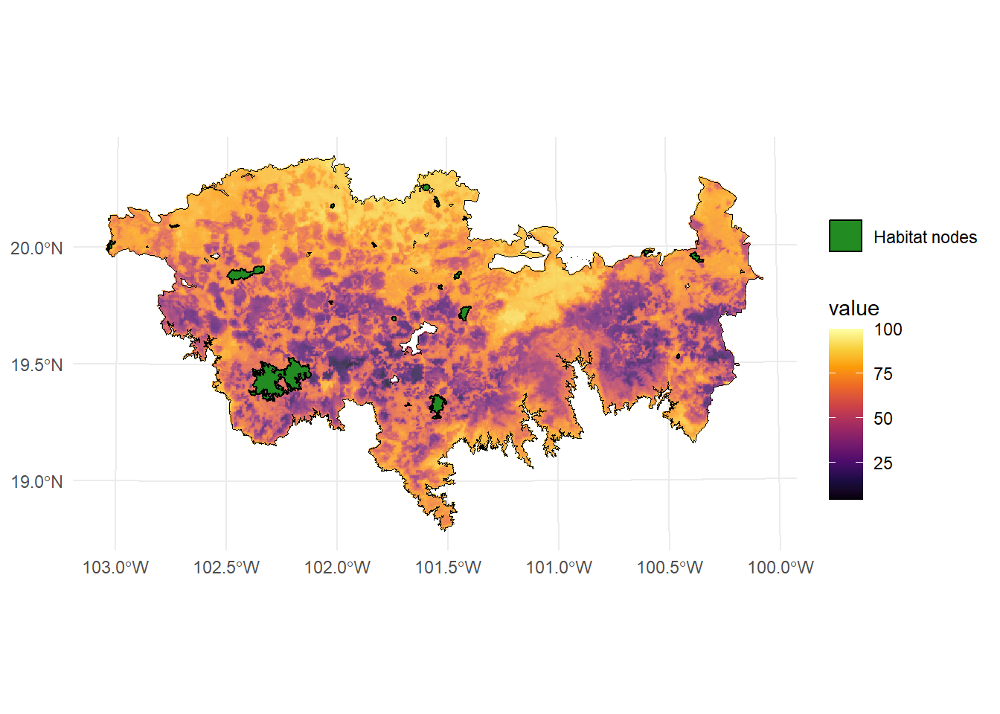


Estamos utilizando un raster de resistencia que esta incluido en el paquete Makurhini. Para cargar un raster de resistencia para tu estudio puedes utilizar la función `raster()` del paquete `raster` o la función `rast()` del paquete `terra`.


``` r
library(raster)
resistance_matrix <- raster("direccion/nombre.tif") #puedes usar otras extensiones raster

library(terra)
resistance_matrix <- rast("direccion/nombre.tif") 
```


## Eliminación de enlaces (Link removal)

Si `removal = TRUE`, la función elimina uno por uno cada uno de los enlaces existentes en la red del paisaje y calcula el impacto de esa pérdida de enlace en la conectividad del paisaje con las métricas dPC o dIIC. Este modo es útil para identificar los enlaces prioritarios que se deben conservar: aquellos con la mayor contribución a la conectividad general del paisaje (valor dPC o dIIC más alto).

En este ejemplo, estimaremos algunas rutas de menor costo entre pares de parches, estas rutas representan corredores potenciales.


``` r
library(purrr)
library(gdistance)
#A los valores NA les asignamos un alto valor para evitar que pasen por ahí
resistance_matrix[is.na(resistance_matrix)] <- 1000

#Estimamos la matriz de transición
tr <- transition(resistance_matrix, function(x) 1/mean(x), 8)
#Hacemos una corrección para los movimientos en diagonal
tr <- geoCorrection(tr, type = "c") 

#Estimamos el centroide de nuestros parches
centroides <- st_centroid(parches_ejemplo, of_largest_polygon = TRUE)
centroides <- st_coordinates(centroides)

#Loop para estimar corredores entre parches
rutas_list <- list()
counter <- 1
for (i in 1:(nrow(centroides) - 1)) {
  #cat(paste0(i, " de ", nrow(centroides), "\r"))
  counter <- 1
  rutas <- map_dfr((i + 1):nrow(centroides), function(j){
    if(counter <= nrow(centroides)){
      ruta <- shortestPath(tr, centroides[i,], centroides[j,], output = "SpatialLines")
      ruta <- st_as_sf(ruta); st_crs(ruta) <- st_crs(habitat_nodes)
      ruta$from <-i ; ruta$to <- j
      return(ruta)
    }
  })
  rutas_list[[i]] <- rutas
}

rutas_mc <- do.call(rbind, rutas_list)

```


``` r
ggplot() +  
  geom_sf(data = paisaje, fill = NA, color = "black") +
  geom_sf(data = rutas_mc, aes(color = "corredores"), color = "black", linewidth = 0.5) +
  geom_sf(data = parches_ejemplo, aes(color = "Habitat nodes"), 
          fill = "forestgreen", color = NA, linewidth = 0.5) +
  theme_minimal() +
  labs(
    title = "Corredores potenciales"
  ) +
  theme(
    plot.title = element_text(hjust = 0.5)
  )
```

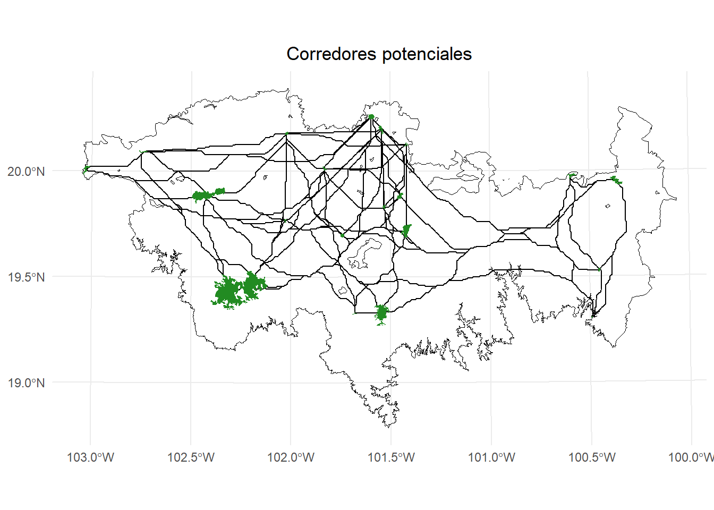

Ahora aplicamos la función `MK_dPCIIC_links()`, pero antes exploremos una nueva variante de estimar el umbral de distancia cuando usamos una resistencia.

Estimaremos la distancia efectiva promedio: media de la resistencia x dispersión 
De esta forma obtenemos una distancia costo.


``` r
#Distancia efectiva promedio como umbral de distancia
Effec_mean <- mean(resistance_matrix[], na.rm = TRUE) * 10000 # 10km

#Aplicamos la función
delta <- MK_dPCIIC_links(nodes = parches_ejemplo,
                         attribute = NULL,
                         area_unit = "ha",
                         distance = list(type = "least-cost", 
                                         resistance = resistance_matrix),
                         removal = TRUE,
                         metric = "PC",
                         probability = 0.5,
                         distance_thresholds = round(Effec_mean),
                         parallel = NULL,
                         parallel_mode = 0,
                         intern = TRUE)
#> Estimating distances. This may take several minutes depending on the number of nodes and raster resolution
#> Estimating PC link index. This may take several minutes depending on the number of nodes
#> 
#> Done!
head(delta)
#>   Id Source Destination dPC_removal
#> 1  1      2           1   0.0004151
#> 2  2      3           1   0.0001186
#> 3  3      4           1   0.0001053
#> 4  4      5           1   0.0502042
#> 5  5      6           1   0.0000061
#> 6  6      7           1   0.0000350
```


Unir valores con mis corredores de interes:


``` r
#Existen otras formas, pero crearé un nuevo ID
delta$ID_nuevo <- paste0(delta$Destination, "_", delta$Source)

#Guardo las rutas en un objeto nuevo para tener de respaldo mi vector original
rutas_mc2 <- rutas_mc
rutas_mc2$ID_nuevo <- paste0(rutas_mc2$from, "_", rutas_mc$to)

#Aplicar merge
rutas_mc2 <- merge(rutas_mc2, delta, by = "ID_nuevo")

rutas_mc2
#> Simple feature collection with 190 features and 7 fields
#> Geometry type: LINESTRING
#> Dimension:     XY
#> Bounding box:  xmin: -107336.4 ymin: 2082987 xmax: 176163.6 ymax: 2187987
#> Projected CRS: NAD_1927_Albers
#> First 10 features:
#>    ID_nuevo from to Id Source Destination dPC_removal
#> 1      1_10    1 10  9     10           1   0.0000827
#> 2      1_11    1 11 10     11           1   0.0019437
#> 3      1_12    1 12 11     12           1   0.0273787
#> 4      1_13    1 13 12     13           1   0.0000367
#> 5      1_14    1 14 13     14           1   0.0003651
#> 6      1_15    1 15 14     15           1   0.0061334
#> 7      1_16    1 16 15     16           1   0.0000411
#> 8      1_17    1 17 16     17           1   0.0000410
#> 9      1_18    1 18 17     18           1   0.0000514
#> 10     1_19    1 19 18     19           1   0.0002504
#>                              geom
#> 1  LINESTRING (-77336.39 21694...
#> 2  LINESTRING (-77336.39 21694...
#> 3  LINESTRING (-77336.39 21694...
#> 4  LINESTRING (-77336.39 21694...
#> 5  LINESTRING (-77336.39 21694...
#> 6  LINESTRING (-77336.39 21694...
#> 7  LINESTRING (-77336.39 21694...
#> 8  LINESTRING (-77336.39 21694...
#> 9  LINESTRING (-77336.39 21694...
#> 10 LINESTRING (-77336.39 21694...
```

Ejemplo de visualización:


``` r
library(ggplot2)
library(classInt)
library(dplyr)

# Calcular los intervalos de Jenks para strength
breaks <- classInt::classIntervals(rutas_mc2$dPC_removal, n = 5, style = "quantile")

# Crear una nueva variable categórica con los intervalos
rutas_mc2 <- rutas_mc2 %>%
  mutate(dPC_q = cut(dPC_removal,
                     breaks = breaks$brks,
                     include.lowest = TRUE,
                     dig.lab = 5))  

# Graficar usando ggplot2 y colores de ColorBrewer
ggplot() +  
  geom_sf(data = paisaje, fill = NA, color = "black") +
  geom_sf(data = rutas_mc2, aes(color = dPC_q), size = 0.5, linewidth = 1) +
  scale_color_brewer(palette = "RdYlBu", direction = -1, name = "dPC remove (Q)") +
  geom_sf(data = parches_ejemplo, aes(color = "Habitat nodes"), 
          fill = "forestgreen", color = NA, linewidth = 0.5) +
  theme_minimal() +
  labs(
    title = "Priorización de enlaces (remove)",
    fill = "dPC"
  ) +
  theme(
    legend.position = "right",
    plot.title = element_text(hjust = 0.5)
  )
```

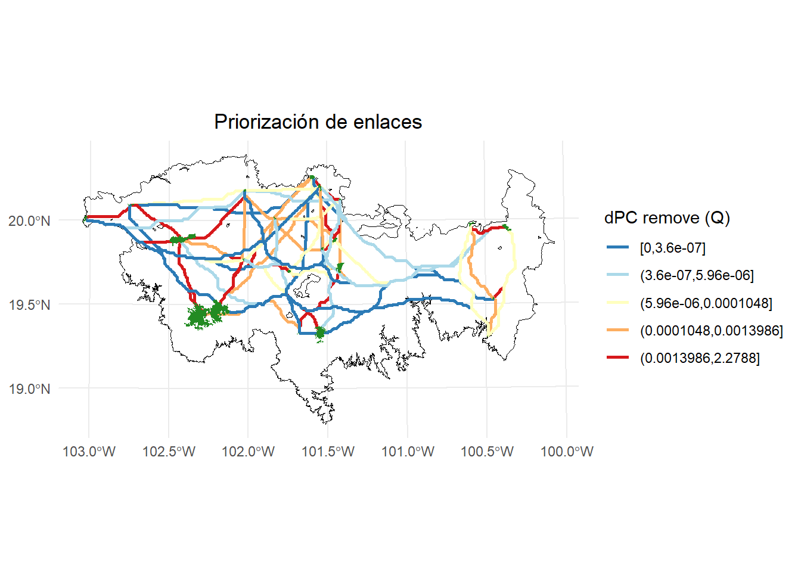

## Cambio de enlaces (Link change)

Si `change != NULL`, la función sustituye uno por uno cada uno de los enlaces existentes en la red del paisaje y calcula el impacto de ese cambio de enlace en la conectividad del paisaje con las métricas dPC o dIIC. Este modo es útil para identificar los enlaces prioritarios tanto para conservar como para restaurar. Los valores positivos de dPC o dIIC corresponden a pérdidas o degradación de enlaces, y los enlaces prioritarios para conservar corresponden a aquellos con los valores positivos más altos. Los valores negativos de dPC o dIIC corresponden a mejoras en los enlaces, y los enlaces prioritarios para restaurar son aquellos con los valores negativos más pequeños.

Este modo requiere información adicional, **una matriz de distancias con los nuevos valores de distancia entre todos los pares de nodos.** Estos nuevos valores de distancia serán, en general, diferentes a los del parámetro de distancia. Una distancia menor corresponde a un aumento en la calidad o la fuerza del enlace entre dos parches en un escenario de cambio o restauración determinado. Una distancia mayor significa que la conexión entre esos dos parches se debilita, lo que corresponde a un escenario de degradación. Son posibles todo tipo de combinaciones y diferentes tipos de cambios para cada uno de los enlaces. Por ejemplo, algunas conexiones pueden mejorar, otras pueden disminuir su calidad o incluso desaparecer por completo (es decir, nueva distancia = NA), y otros enlaces pueden no sufrir ningún cambio en el mismo análisis, dependiendo de los nuevos valores de distancia particulares para cada enlace.

Para este ejemplo primero estimaremos las distancias de menor costo entre los parches.


``` r
distancias <- distancefile(parches_ejemplo, 
                           id = "Id", 
                           type = "least-cost",
                           resistance = resistance_matrix,
                           pairwise = FALSE)
```

Enseguida imaginaremos el siguiente escenario donde despues de restaurar disminuyo un 40% la resistencia y aumento la permiabilidad en 30 enlaces que tomaremos de forma aleatoria.


``` r
#No de enlaces
n <- 30
# Numero total de elementos
total_elements <- length(distancias)

# seleccion aleatoria
set.seed(4)
rand_idx <- sample(1:total_elements, n)

# obtener posiciones en la matriz de distancias
rand_positions <- arrayInd(rand_idx, .dim = dim(distancias))

# A esos enlaces les reduciremos un 40% de su valor
distancias_restauracion <- distancias
reduccion <- (40*distancias_restauracion[rand_positions])/100
distancias_restauracion[rand_positions] <- distancias_restauracion[rand_positions] - reduccion
```

Valor de distancia costo inicial:


``` r
distancias[rand_positions]
#>  [1] 10529640  2318903  9008346  6086036  7415533  6186777
#>  [7]  3782229  3633854  3943299  1997412  4520460  3027740
#> [13]  1171964  5673392  9838126  6790792  7521077  5639993
#> [19]  7644104 10060651  2760338  6173235  5595429  2857423
#> [25] 13339827  6044401  4218765  6716738  9700048  5077371
```

Valor de distancia costo después de reducir el valor de resistencia:


``` r
distancias_restauracion[rand_positions]
#>  [1] 6317784.0 1391341.7 5405007.7 3651621.6 4449319.8
#>  [6] 3712066.3 2269337.4 2180312.6 2365979.3 1198447.2
#> [11] 2712276.3 1816644.0  703178.2 3404035.3 5902875.6
#> [16] 4074475.0 4512646.4 3383995.9 4586462.4 6036390.6
#> [21] 1656202.7 3703941.1 3357257.1 1714454.1 8003896.5
#> [26] 3626640.4 2531258.9 4030042.6 5820028.6 3046422.5
```

Aplicamos la función:


``` r
#Distancia efectiva promedio como umbral de distancia
Effec_mean <- mean(resistance_matrix[], na.rm = TRUE) * 10000 # 10km
#[1] 5229259

#Aplicamos la función
delta <- MK_dPCIIC_links(nodes = parches_ejemplo,
                         attribute = NULL,
                         area_unit = "ha",
                         distance = distancias,
                         removal = TRUE,
                         change = distancias_restauracion,
                         metric = "PC",
                         probability = 0.5,
                         distance_thresholds = round(Effec_mean),
                         parallel = NULL,
                         parallel_mode = 0,
                         intern = TRUE)
#> Estimating PC link index. This may take several minutes depending on the number of nodes
#> 
#> Done!
names(delta)
#> [1] "Link_removal_importances_d5229259"
#> [2] "Link_change_importances_d5229259"
```


Vemos el resultado. Es importante recordar que los nombres de los elementos de las listas cambian dependiendo del umbral de distancia que uses (e.g., _d5229259, _d10000, _d200)


``` r
head(delta$Link_change_importances_d5229259)
#>   Id Source Destination dPC_change
#> 1  1      2           1          0
#> 2  2      3           1          0
#> 3  3      4           1          0
#> 4  4      5           1          0
#> 5  5      6           1          0
#> 6  6      7           1          0
```

Lo unimos a nuestro vector con los corredores:


``` r
change_corr <- delta$Link_change_importances_d5229259
change_corr$ID_nuevo <- paste0(change_corr$Destination, "_", change_corr$Source)

#Por precaución guardamos los corredores en otro objeto y generamos el ID
rutas_mc3 <- rutas_mc
rutas_mc3$ID_nuevo <- paste0(rutas_mc3$from, "_", rutas_mc3$to)
#Unimos
rutas_mc3 <- merge(rutas_mc3, change_corr, by = "ID_nuevo")
rutas_mc3
#> Simple feature collection with 190 features and 7 fields
#> Geometry type: LINESTRING
#> Dimension:     XY
#> Bounding box:  xmin: -107336.4 ymin: 2082987 xmax: 176163.6 ymax: 2187987
#> Projected CRS: NAD_1927_Albers
#> First 10 features:
#>    ID_nuevo from to Id Source Destination dPC_change
#> 1      1_10    1 10  9     10           1          0
#> 2      1_11    1 11 10     11           1          0
#> 3      1_12    1 12 11     12           1          0
#> 4      1_13    1 13 12     13           1          0
#> 5      1_14    1 14 13     14           1          0
#> 6      1_15    1 15 14     15           1          0
#> 7      1_16    1 16 15     16           1          0
#> 8      1_17    1 17 16     17           1          0
#> 9      1_18    1 18 17     18           1          0
#> 10     1_19    1 19 18     19           1          0
#>                              geom
#> 1  LINESTRING (-77336.39 21694...
#> 2  LINESTRING (-77336.39 21694...
#> 3  LINESTRING (-77336.39 21694...
#> 4  LINESTRING (-77336.39 21694...
#> 5  LINESTRING (-77336.39 21694...
#> 6  LINESTRING (-77336.39 21694...
#> 7  LINESTRING (-77336.39 21694...
#> 8  LINESTRING (-77336.39 21694...
#> 9  LINESTRING (-77336.39 21694...
#> 10 LINESTRING (-77336.39 21694...
```


Podemos viasualizar el resultado:


``` r
# Calcular los intervalos de Jenks para strength
breaks <- classInt::classIntervals(rutas_mc3$dPC_change, n = 5, style = "jenks")

# Crear una nueva variable categórica con los intervalos
rutas_mc3 <- rutas_mc3 %>%
  mutate(dPC_q = cut(dPC_change,
                     breaks = breaks$brks,
                     include.lowest = TRUE,
                     dig.lab = 5))  

# Graficar usando ggplot2 y colores de ColorBrewer
ggplot() +  
  geom_sf(data = paisaje, fill = NA, color = "black") +
  geom_sf(data = rutas_mc3, aes(color = dPC_q), size = 0.5, linewidth = 1) +
  scale_color_brewer(palette = "RdYlBu", direction = 1, name = "dPC change (jenks)") +
  geom_sf(data = parches_ejemplo, aes(color = "Habitat nodes"), 
          fill = "forestgreen", color = NA, linewidth = 0.5) +
  theme_minimal() +
  labs(
    title = "Priorización de enlaces (change)",
    fill = "dPC"
  ) +
  theme(
    legend.position = "right",
    plot.title = element_text(hjust = 0.5)
  )
```

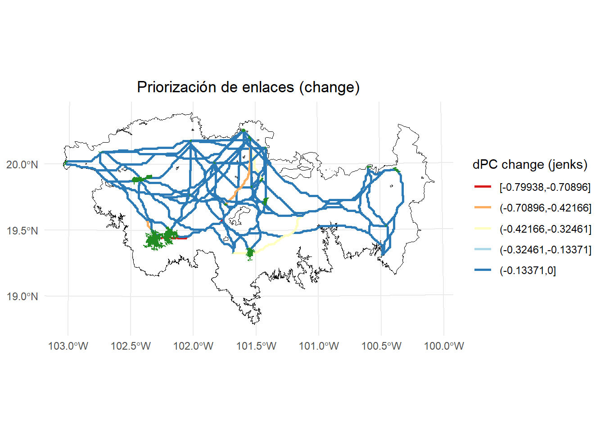

Podemos visualizar solo los corredores que sufriedon cambio después de mejorar los corredores:


``` r
rutas_mc4 <- rutas_mc3[rutas_mc3$dPC_change != 0, ] 
# Calcular los intervalos de Jenks para strength
breaks <- classInt::classIntervals(rutas_mc4$dPC_change, n = 5, style = "jenks")

# Crear una nueva variable categórica con los intervalos
rutas_mc4 <- rutas_mc4 %>%
  mutate(dPC_q = cut(dPC_change,
                     breaks = breaks$brks,
                     include.lowest = TRUE,
                     dig.lab = 5))  

# Graficar usando ggplot2 y colores de ColorBrewer
ggplot() +  
  geom_sf(data = paisaje, fill = NA, color = "black") +
  geom_sf(data = rutas_mc4, aes(color = dPC_q), size = 0.5, linewidth = 1) +
  scale_color_brewer(palette = "RdYlBu", direction = 1, name = "dPC change (Jenks)") +
  geom_sf(data = parches_ejemplo, aes(color = "Habitat nodes"), 
          fill = "forestgreen", color = NA, linewidth = 0.5) +
  theme_minimal() +
  labs(
    title = "Priorización de enlaces (change)",
    fill = "dPC"
  ) +
  theme(
    legend.position = "right",
    plot.title = element_text(hjust = 0.5)
  )
```

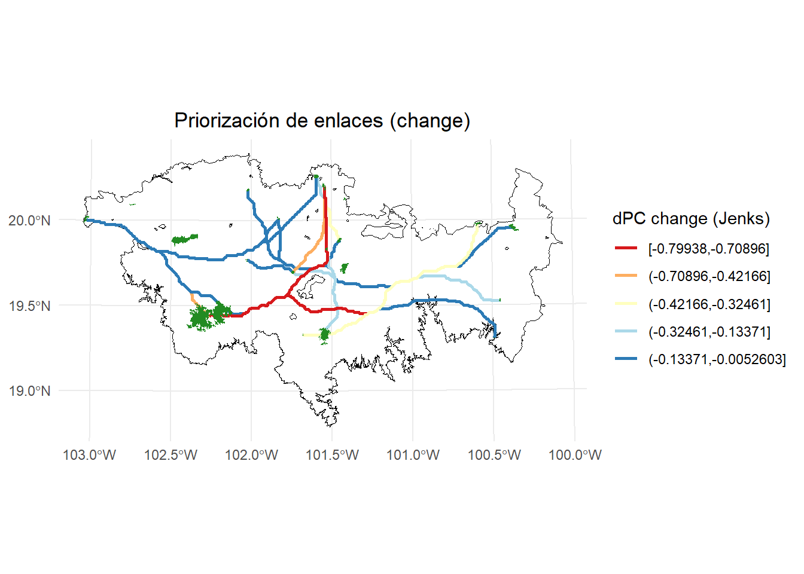


