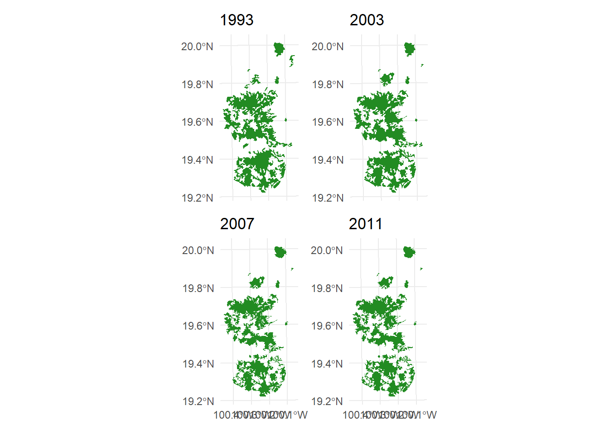
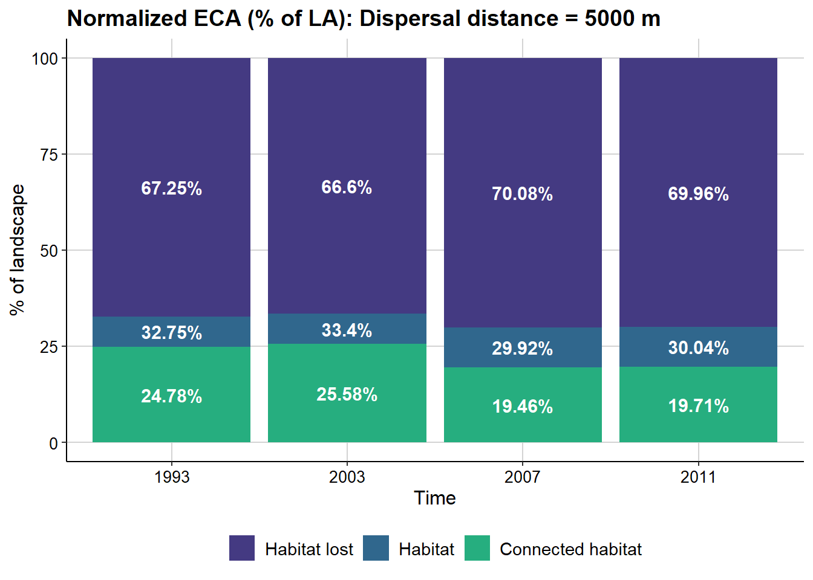
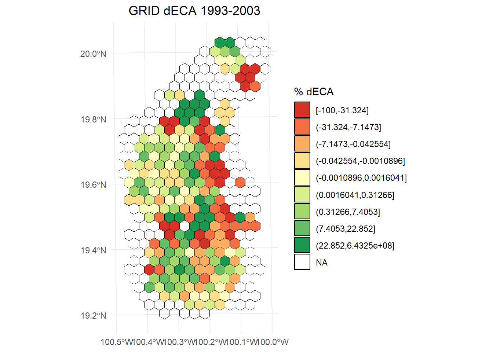
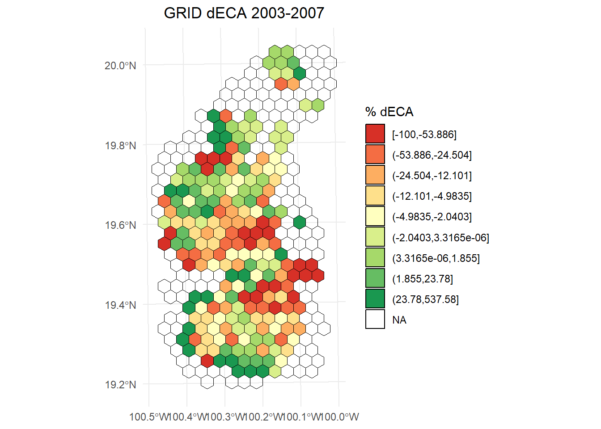
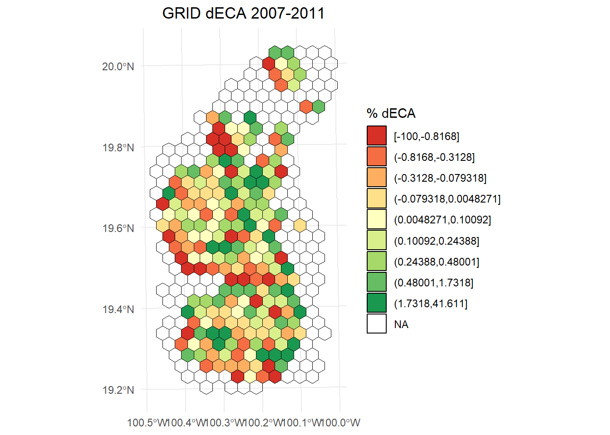
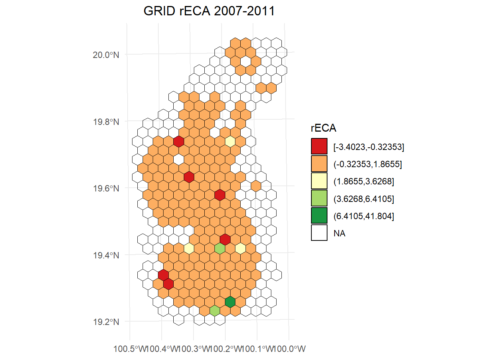
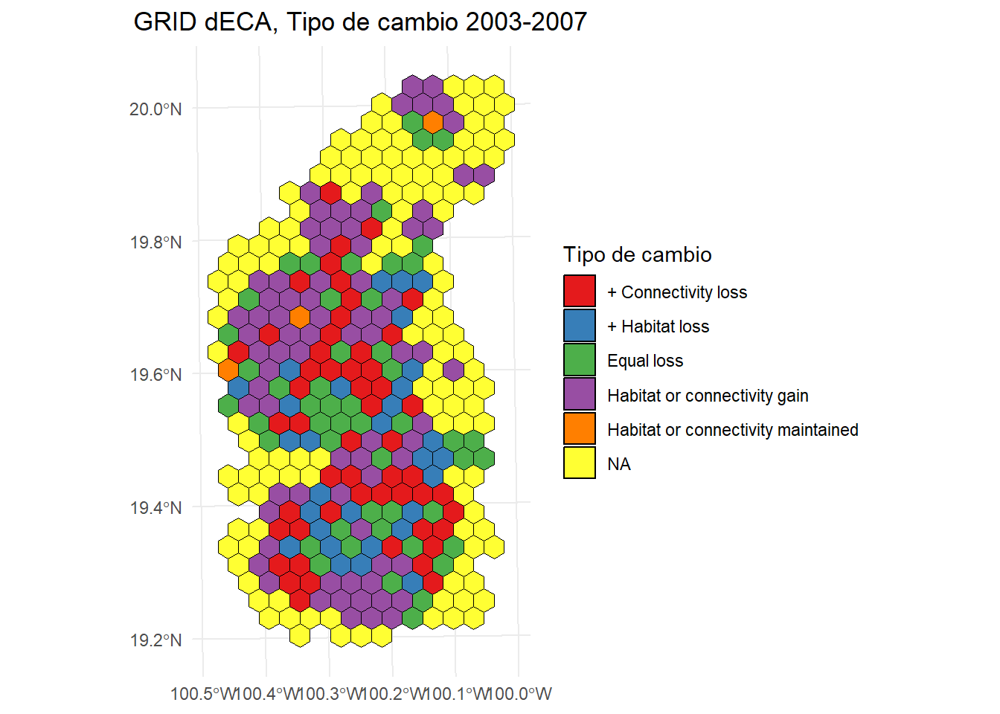

# Conectividad dinámica con MK_dECA()

## Índice ECA con MK_dPCIIC()

Continuamos trabajando con el vector con 404 parches/nodos en el eje Neovolcánico de México.


``` r
library(ggplot2)
library(sf)
library(terra)
library(raster)
library(Makurhini)
library(RColorBrewer)


habitat_nodes <- read_sf("C:/.../habitat_nodes.shp")
nrow(habitat_nodes)
paisaje <- read_sf("C:/.../paisaje.shp")

```


```
#> [1] 404
```


``` r
ggplot() +  
  geom_sf(data = paisaje, aes(color = "Study area"), fill = NA, color = "black") +
  geom_sf(data = habitat_nodes, aes(color = "Parches"), fill = "forestgreen", linewidth = 0.5) +
  scale_color_manual(name = "", values = "black")+
  theme_minimal() +
  theme(axis.title.x = element_blank(),
        axis.title.y = element_blank())
```


Estimaremos el índice ECA usando el argumento overall o onlyoverall de la función MK_dPCIIC:


``` r
ECA1 <- MK_dPCIIC(nodes = habitat_nodes,
                attribute = NULL,
                area_unit = "ha",
                distance = list(type = "edge", keep = 0.1),
                LA = NULL,
                metric = "PC",
                probability = 0.5,
                onlyoverall = TRUE,
                distance_thresholds = 10000,
                intern = FALSE) #10 km
ECA1
#>    Index        Value
#> 1  PCnum 1.301622e+12
#> 2 EC(PC) 1.140887e+06

#Valor del ECA
ECA1[2,2]
#> [1] 1140887
```

Lo que obtenemos es el índice ECA o EC el cual tiene unidades de área. En nuestro ejemplo estamos trabajando con hectareas, es decir: **1,140,887 ha** **de bosque potencialmente conectado bajo una mediana de dispersión de 10 km**.

Podemos expresarlo en porcentage ya que conocemos el área del paisaje y el área de bosque, a esto se le llama ECA relativo o ECA Normalizado:


``` r
ECA2 <- ECA1[2,2]

paisaje_area <- st_area(paisaje)
paisaje_area <- unit_convert(paisaje_area, "m2", "ha")

#ECA normalizado respecto al área del paisaje
(ECA2*100)/paisaje_area
#> [1] 41.31591
```


``` r
bosque_area <- st_area(habitat_nodes)
bosque_area <- unit_convert(bosque_area,  "m2", "ha")
bosque_area <- sum(bosque_area)

#ECA normalizado respecto al área del bosque
(ECA2*100)/bosque_area
#> [1] 89.58149
```

## Función MK_dECA()

La función sirve para calcular la conectividad total de un paisaje, ya sea en distintos momentos o bajo diferentes configuraciones espaciales, usando el **índice de Área de Conectividad Equivalente** (**ECA**, por sus siglas en inglés; Saura et al., 2011). Este índice se puede calcular a partir de los valores de IIC o PC.

Para usar `MK_dECA()`, necesitas darle una lista en la que cada elemento representa un conjunto de nodos para distintos escenarios del paisaje. La función calcula el valor de ECA para cada escenario y después compara los escenarios entre sí mediante el cambio en el índice ECA (es decir, el delta de ECA o dECA) (Herrera et al., 2017; Saura et al., 2011).

Además, la función también genera otras medidas de conectividad, como el **ECA relativizado (rECA)**, que muestra cómo cambia la conectividad en relación con los cambios en el área de hábitat disponible (Dilts et al., 2016; Liang et al., 2021). Si el valor de rECA es mayor que 1, eso quiere decir que los cambios en el hábitat afectaron fuertemente la conectividad, impactando zonas clave para mantenerla. Si el valor es menor que 1, significa que los cambios afectaron sobre todo zonas periféricas, aisladas o con poca importancia para la conectividad (Saura et al., 2011; Liang et al., 2021).

## Ejemplo. Cambios en la conectividad del paisaje en la Reserva de la Biosfera Mariposa Monarca.

La Reserva de la Biosfera Mariposa Monarca es mundialmente conocida por ser cada otoño una zona de migración, invernada y reproducción para millones de mariposas monarca (*Danaus plexippus*). Sin embargo, la reserva ha sufrido una gran pérdida de cobertura forestal (López-García y Alcántara-Ayala, 2012). En este ejemplo, analizamos los cambios en la conectividad del bosque templado entre los años 1993, 2002, 2007 y 2011 en la reserva y una zona de influencia de 10 km aplicando la función `MK_dECA()`. Como distancia de dispersión utilizamos la estimada para *Pinus pseudostrobus* y *P. montezumae* de 5 km (Molina et al. 2019). Los parches de bosque se obtuvieron de las coberturas de uso del suelo del Instituto Nacional de Estadística y Geografía (INEGI 2001, 2003, 2007, 2014). Los parches son fragmentos de bosque templado primario (pino y encino). El INEGI define la vegetación primaria como aquella en la que la vegetación no presenta alteraciones significativas o la degradación no es tan manifiesta.


``` r

#Sustituir ruta de los .shp
T_1993 <- read_sf("G:/Mi unidad/RedBioma/Clase3/Clase_insumos/dECA/parches_T1.shp")
T_2003 <- read_sf("G:/Mi unidad/RedBioma/Clase3/Clase_insumos/dECA/parches_T2.shp")
T_2007 <- read_sf("G:/Mi unidad/RedBioma/Clase3/Clase_insumos/dECA/parches_T3.shp")
T_2011 <- read_sf("G:/Mi unidad/RedBioma/Clase3/Clase_insumos/dECA/parches_T4.shp")

#Creamos una lista, puedes cambiar los nombres, etc.
lista_parches <- list("1993" = T_1993, 
                      "2003" = T_2003, 
                      "2007" = T_2007, 
                      "2011" = T_2011)
length(lista_parches)
#> [1] 4
names(lista_parches)
#> [1] "1993" "2003" "2007" "2011"
```


``` r
library(ggplot2)     
library(patchwork)   
#> 
#> Adjuntando el paquete: 'patchwork'
#> The following object is masked from 'package:raster':
#> 
#>     area
#> The following object is masked from 'package:terra':
#> 
#>     area

p1 <- ggplot() +
  geom_sf(data = T_1993, fill = "forestgreen", color = NA) +
  ggtitle("1993") +
  theme_minimal() +
  theme(axis.text.x = element_blank(),  # Ocultar etiquetas del eje X
        axis.ticks.x = element_blank()) # Ocultar marcas del eje X

p2 <- ggplot() +
  geom_sf(data = T_2003, fill = "forestgreen", color = NA) +
  ggtitle("2003") +
  theme_minimal() +
  theme(axis.text.x = element_blank(),  # Ocultar etiquetas del eje X
        axis.ticks.x = element_blank()) # Ocultar marcas del eje X

p3 <- ggplot() +
  geom_sf(data = T_2007, fill = "forestgreen", color = NA) +
  ggtitle("2007") +
  theme_minimal()

p4 <- ggplot() +
  geom_sf(data = T_2011, fill = "forestgreen", color = NA) +
  ggtitle("2011") +
  theme_minimal()

# Combinar los gráficos en una cuadrícula 2x2 usando patchwork
(p1 + p2) / (p3 + p4)
```



Ahora obtendremos **el valor máximo que puede alcanzar el atributo (conectividad intra parche) de los parches en todo el paisaje**, en este ejemplo, el atributo que usaremos para los parches será el área (mientras más grande sea el parche mayor será su conectividad intra parche) por lo que el valor del atributo máximo en el paisaje será el área de toda el área de estudio.


``` r
area_estudio <- read_sf("G:/Mi unidad/RedBioma/Clase3/Clase_insumos/dECA/area_estudio.shp")
#Atributo máximo 
Max_atributo <- as.numeric(st_area(area_estudio)) * 0.0001 # Hectáreas
Max_atributo
#> [1] 279164.3
```

| **Argumento** | **Tipo** | **Descripción** |
|-------------|-------------|----------------------------------------------|
| `nodes` | `list` | Lista de objetos que contienen los nodos (por ejemplo, fragmentos de hábitat) para cada periodo de análisis. Puede incluir: <br> - `data.frame` con al menos dos columnas: una para el ID y otra para el atributo. <br> - Datos vectoriales (`sf`, `SpatVector`, `SpatialPolygonsDataFrame`) en coordenadas proyectadas. <br> - Ráster (`RasterLayer`, `SpatRaster`) con valores enteros como ID de fragmentos, y `NA` para áreas no hábitat. |
| `attribute` | `character` o `list` | Atributo de los nodos. Si es `NULL` y los nodos son espaciales, se usará el área del nodo. Para usar otro atributo: <br> - Si los nodos son `data.frame` o vectores, indica el nombre de la columna con el atributo. <br> - Si son rásters, proporciona una lista de vectores numéricos (uno por cada periodo) con los atributos de los nodos. Si `weighted = TRUE`, se multiplicará por el área del nodo. |
| `area_unit` | `character` | Unidad del área usada si `attribute = NULL`. Por ejemplo: `"m2"` (por defecto), `"km2"`, `"cm2"`, `"ha"`. |
| `weighted` | `logical` | Si los nodos son rásters, permite ponderar el área estimada del nodo por su atributo. Útil si el atributo tiene valores entre 0 y 1. |
| `distance` | `matrix` o `list` | Distancia entre pares de nodos. <br> - Si es `matrix`, debe tener tantas filas/columnas como nodos. Puede obtenerse con `distancefile()`. <br> - Si es `list`, debe contener los parámetros para calcular la distancia. Por ejemplo: `type = "least-cost"`, `resistance = capa_resistencia`. <br> También puedes poner una lista de resistencias (una por cada tiempo de `nodes`). |
| `threshold` | `numeric` | Umbral máximo de distancia. Las parejas de nodos con distancias mayores serán descartadas (acelera el cálculo). |
| `metric` | `character` | Índice de conectividad a usar: `"PC"` (por defecto y recomendado) o `"IIC"`. |
| `probability` | `numeric` | Probabilidad asociada a la `distance_threshold`. Por ejemplo, si la distancia es la mediana de dispersión, usa `0.5`. Si es la distancia máxima, puedes usar `0.05` o `0.01`. Solo se usa si `metric = "PC"`. Si es `NULL`, se usa `0.5` por defecto. |
| `distance_thresholds` | `numeric` | Distancia(s) de dispersión de la especie (en metros). Si es `NULL`, se estima automáticamente como la mediana entre nodos. También puedes usar `dispersal_distance()` si tienes el home range de la especie. |
| `LA` | `numeric` | Atributo máximo del paisaje (opcional). Solo afecta el valor global del índice, no la importancia de nodos. Si no se indica y `overall = TRUE`, se calculará solo el numerador del índice global. |
| `plot` | `logical` o `character` | Si es `TRUE`, genera una gráfica. También puedes dar los años correspondientes de los periodos analizados, por ejemplo: `c("2011", "2014", "2017")`. |
| `parallel` | `numeric` (opcional) | Número de núcleos a usar para paralelizar el cálculo del índice y sus deltas. Recomendado si hay más de 1000 nodos. Por defecto no se paraleliza. |
| `parallel_mode` | `numeric` (opcional) | Modo de paralelización: <br> - `1` (por defecto): paraleliza la estimación del delta de conectividad. <br> - `2`: paraleliza el cálculo de caminos más cortos. Recomendado si tienes más de 1000 nodos. |
| `write` | `character` | Ruta y nombre del archivo `.csv` de salida. |
| `intern` | `logical` | Muestra el avance del proceso (por defecto = `TRUE`). Puede no llegar al 100% si las operaciones son muy rápidas. |

Se obtiene una tabla con:

-   **Tiempo**: nombre de los periodos de tiempo, nombre del modelo o escenario (se toman del nombre de los elementos de la lista de nodos o del argumento plot).

-   **Atributo máximo del paisaje**: valor máximo del atributo del paisaje.

-   **Área de hábitat**.

-   **Umbral de distancia**: usualmente corresponde al umbral de dispersión asociado a una o varias especies, y es definido por el usuario.

-   **ECA:** Área de Conectividad Equivalente o Conectividad Equivalente.

-   **ECA normalizado**: valor de ECA expresado en relación con el atributo máximo del paisaje y área del hábitat.

-   **dA**: delta de área (cambio porcentual del área de hábitat entre tiempos).

-   **dECA**: delta de ECA (cambio porcentual en conectividad entre tiempos).

-   **rECA**: ECA relativizada (dECA/dA). Según Liang et al. (2021), “un valor de rECA mayor a 1 indica que los cambios en el hábitat resultan en un cambio desproporcionadamente alto en la conectividad del hábitat, mientras que un valor menor a 1 indica que los cambios en conectividad se deben a cambios aleatorios en el hábitat” (Saura et al. 2011; Dilts et al. 2016).

-   **Comparación dA/dECA**: comparación entre los valores de dA y dECA.

Apliquemos la función:


``` r
dECA_test <- MK_dECA(nodes= lista_parches, 
                     attribute = NULL, 
                     area_unit = "ha",
                     distance = list(type= "edge", keep = 0.1), 
                     metric = "PC",
                     probability = 0.05, 
                     distance_thresholds = 5000,
                     LA = Max_atributo, 
                     plot= c("1993", "2003", "2007", "2011"),
                     intern = FALSE)#Puedes cambiar a TRUE para ver el avance
```



``` r
class(dECA_test)
#> [1] "list"
names(dECA_test)
#> [1] "dECA_table" "dECA_plot"
```

Tabla:


``` r
dECA_test$dECA_table
```


<table class="table table-condensed">
 <thead>
  <tr>
   <th style="text-align:left;"> Time </th>
   <th style="text-align:right;"> Max. Landscape attribute (ha) </th>
   <th style="text-align:right;"> Habitat area (ha) </th>
   <th style="text-align:right;"> Distance threshold </th>
   <th style="text-align:right;"> ECA (ha) </th>
   <th style="text-align:right;"> Normalized ECA (% of LA) </th>
   <th style="text-align:right;"> Normalized ECA (% of habitat area) </th>
   <th style="text-align:right;"> dA </th>
   <th style="text-align:right;"> dECA </th>
   <th style="text-align:right;"> rECA </th>
   <th style="text-align:right;"> dA/dECA comparisons </th>
   <th style="text-align:right;"> Type of change </th>
  </tr>
 </thead>
<tbody>
  <tr>
   <td style="text-align:left;"> 1993 </td>
   <td style="text-align:right;"> 279164.3 </td>
   <td style="text-align:right;"> <span style="display: inline-block; direction: rtl; unicode-bidi: plaintext; border-radius: 4px; padding-right: 2px; background-color: #94D8B1; width: 98.07%">91438.11</span> </td>
   <td style="text-align:right;"> 5000 </td>
   <td style="text-align:right;"> <span style="display: block; padding: 0 4px; border-radius: 4px; background-color: #ea9396">69182.45</span> </td>
   <td style="text-align:right;"> <span style="display: block; padding: 0 4px; border-radius: 4px; background-color: #ffae1a">24.78199</span> </td>
   <td style="text-align:right;"> <span style="display: block; padding: 0 4px; border-radius: 4px; background-color: #ffaa10">75.66041</span> </td>
   <td style="text-align:right;"> <span style="color: red">-67.2457675</span> </td>
   <td style="text-align:right;"> <span style="color: red">-75.218012</span> </td>
   <td style="text-align:right;"> <span style="color: #404040">1.118554</span> </td>
   <td style="text-align:right;"> dECA < dA < 0 </td>
   <td style="text-align:right;"> + Connectivity loss </td>
  </tr>
  <tr>
   <td style="text-align:left;"> 2003 </td>
   <td style="text-align:right;"> 279164.3 </td>
   <td style="text-align:right;"> <span style="display: inline-block; direction: rtl; unicode-bidi: plaintext; border-radius: 4px; padding-right: 2px; background-color: #94D8B1; width: 100.00%">93238.91</span> </td>
   <td style="text-align:right;"> 5000 </td>
   <td style="text-align:right;"> <span style="display: block; padding: 0 4px; border-radius: 4px; background-color: #e8878a">71423.71</span> </td>
   <td style="text-align:right;"> <span style="display: block; padding: 0 4px; border-radius: 4px; background-color: #ffa500">25.58483</span> </td>
   <td style="text-align:right;"> <span style="display: block; padding: 0 4px; border-radius: 4px; background-color: #ffa500">76.60289</span> </td>
   <td style="text-align:right;"> <span style="color: forestgreen">1.9694217</span> </td>
   <td style="text-align:right;"> <span style="color: forestgreen">3.239623</span> </td>
   <td style="text-align:right;"> <span style="color: #404040">1.644961</span> </td>
   <td style="text-align:right;"> dECA or dA gain </td>
   <td style="text-align:right;"> Habitat or connectivity gain </td>
  </tr>
  <tr>
   <td style="text-align:left;"> 2007 </td>
   <td style="text-align:right;"> 279164.3 </td>
   <td style="text-align:right;"> <span style="display: inline-block; direction: rtl; unicode-bidi: plaintext; border-radius: 4px; padding-right: 2px; background-color: #94D8B1; width: 89.57%">83517.49</span> </td>
   <td style="text-align:right;"> 5000 </td>
   <td style="text-align:right;"> <span style="display: block; padding: 0 4px; border-radius: 4px; background-color: #fae9ea">54325.56</span> </td>
   <td style="text-align:right;"> <span style="display: block; padding: 0 4px; border-radius: 4px; background-color: #ffedcc">19.46007</span> </td>
   <td style="text-align:right;"> <span style="display: block; padding: 0 4px; border-radius: 4px; background-color: #ffedcc">65.04692</span> </td>
   <td style="text-align:right;"> <span style="color: red">-10.4263650</span> </td>
   <td style="text-align:right;"> <span style="color: red">-23.939041</span> </td>
   <td style="text-align:right;"> <span style="color: #404040">2.296010</span> </td>
   <td style="text-align:right;"> dECA < dA < 0 </td>
   <td style="text-align:right;"> + Connectivity loss </td>
  </tr>
  <tr>
   <td style="text-align:left;"> 2011 </td>
   <td style="text-align:right;"> 279164.3 </td>
   <td style="text-align:right;"> <span style="display: inline-block; direction: rtl; unicode-bidi: plaintext; border-radius: 4px; padding-right: 2px; background-color: #94D8B1; width: 89.94%">83859.71</span> </td>
   <td style="text-align:right;"> 5000 </td>
   <td style="text-align:right;"> <span style="display: block; padding: 0 4px; border-radius: 4px; background-color: #f9e4e6">55031.81</span> </td>
   <td style="text-align:right;"> <span style="display: block; padding: 0 4px; border-radius: 4px; background-color: #ffeac3">19.71306</span> </td>
   <td style="text-align:right;"> <span style="display: block; padding: 0 4px; border-radius: 4px; background-color: #ffe9c1">65.62366</span> </td>
   <td style="text-align:right;"> <span style="color: forestgreen">0.4097637</span> </td>
   <td style="text-align:right;"> <span style="color: forestgreen">1.300045</span> </td>
   <td style="text-align:right;"> <span style="color: #404040">3.172671</span> </td>
   <td style="text-align:right;"> dECA or dA gain </td>
   <td style="text-align:right;"> Habitat or connectivity gain </td>
  </tr>
</tbody>
</table>


## ECA y dECA sobre un grid

La función `MK_dECA_grid()` ayuda a estimar el ECA y dECA sobre un grid de hexagonos o cuadrados. Los argumentos distintos son:

| Parámetro | Descripción |
|---------------------------------|---------------------------------------|
| **region** | Objeto de clase `sf` o `SpatialPolygonsDataFrame`. Polígono que delimita la región o área de estudio. Debe estar en un sistema de coordenadas proyectado. |
| **grid** | Lista u objeto de clase `sf` o `SpatialPolygonsDataFrame`. Utiliza este parámetro para generar una cuadrícula indicando sus características en una lista (ver `get_grid`) o introduce el nombre de un objeto de clase `sf` o `SpatialPolygonsDataFrame` con la cuadrícula, cuyo sistema de coordenadas debe ser el mismo que el de los nodos. Ejemplo para generar hexágonos de 100 km²:\_ |

Regresa una lista con objetos `sf` correspondientes a los hexágonos y cada transición entre escenarios o tiempos de nodos, con los siguientes campos:

| Campo | Descripción |
|---------------------------------------------|---------------------------|
| **Time** | Nombre de los periodos de tiempo, modelo o escenario (se toma del nombre de los elementos de la lista de nodos o del argumento `plot`). |
| **ECA.i** | Área Equivalente Conectada (ECA) o Conectividad Equivalente para el tiempo *i* (primer escenario en la comparación). |
| **ECA.j** | Área Equivalente Conectada (ECA) o Conectividad Equivalente para el tiempo *j* (segundo escenario en la comparación). |
| **ECA.i (normalizada)** | ECA normalizada para el tiempo *i*. |
| **ECA.j (normalizada)** | ECA normalizada para el tiempo *j*. |
| **dA** | Cambio porcentual del área de hábitat entre los tiempos comparados (*delta Area*). |
| **dECA** | Cambio porcentual de la ECA entre los tiempos comparados (*delta ECA*). |
| **rECA** | ECA relativizada (*dECA/dA*). Según Liang et al. (2021): “un valor de rECA mayor que 1 indica que los cambios en el hábitat resultan en un cambio desproporcionadamente grande en la conectividad del hábitat, mientras que un valor menor que 1 indica cambios en la conectividad debidos a cambios aleatorios en el hábitat (Saura et al. 2011; Dilts et al. 2016)”. |
| **Comparación dA/dECA** | Comparación entre los valores de *dA* y *dECA*. |
| **Tipo de cambio** | Tipo de cambio determinado mediante `dECAfun()` y la diferencia entre *dA* y *dECA*. |

La función devuelve una lista con elementos correspondientes a los periodos de transición. Por ejemplo, si la lista de nodos contiene tres escenarios o tiempos, la función devolverá una lista con dos elementos:

-   El primer elemento corresponde a la transición entre los escenarios 1 y 2, e incluirá el valor de *dECA* para ese periodo.
-   El segundo elemento corresponde a la transición entre los escenarios 2 y 3, e incluirá el valor de *dECA* para ese periodo.


``` r
hexagons_dECA <- MK_dECA_grid(nodes = lista_parches,
                              nodes_names = c("1993", "2003", "2007", "2011"),
                              region = area_estudio,
                              area_unit = "ha",
                              metric = "PC",
                              distance_threshold = 5000,
                              probability = 0.05,
                              distance = list(type = "edge", keep = 0.1),
                              grid = list(hexagonal = TRUE,
                                          cellsize = unit_convert(10, "km2", "m2")),
                              parallel = 6,
                              intern = FALSE)#Puedes cambiar a TRUE para ver el avance
names(hexagons_dECA)
```


**dECA 1993-2003:**


``` r
library(classInt)
library(dplyr)

# Calcular los intervalos
dECA_plot <- hexagons_dECA$result_1993.2003
breaks <- classInt::classIntervals(dECA_plot$dECA, n = 9, style = "quantile")

# Crear una nueva variable categórica con los intervalos
dECA_plot <- dECA_plot %>%
  mutate(dECA_q = cut(dECA,
                     breaks = breaks$brks,
                     include.lowest = TRUE,
                     dig.lab = 5))  
ggplot() +  
  geom_sf(data = dECA_plot, aes(fill = dECA_q), color = "black", size = 0.1) +
  scale_fill_brewer(
    palette = "RdYlGn",
    direction = 1, 
    name = "% dECA"
  ) +
  theme_minimal() +
  labs(
    title = "GRID dECA 1993-2003",
    fill = "% dECA"
  ) +
  theme(
    legend.position = "right",
    plot.title = element_text(hjust = 0.5)
  )
```



**dECA 2003-2007**


``` r
# Calcular los intervalos 
dECA_plot <- hexagons_dECA$result_2003.2007
breaks <- classInt::classIntervals(dECA_plot$dECA, n = 9, style = "quantile")

# Crear una nueva variable categórica con los intervalos
dECA_plot <- dECA_plot %>%
  mutate(dECA_q = cut(dECA,
                     breaks = breaks$brks,
                     include.lowest = TRUE,
                     dig.lab = 5))  
ggplot() +  
  geom_sf(data = dECA_plot, aes(fill = dECA_q), color = "black", size = 0.1) +
  scale_fill_brewer(
    palette = "RdYlGn",
    direction = 1, 
    name = "% dECA"
  ) +
  theme_minimal() +
  labs(
    title = "GRID dECA 2003-2007",
    fill = "% dECA"
  ) +
  theme(
    legend.position = "right",
    plot.title = element_text(hjust = 0.5)
  )
```



**dECA 2007-2011**


``` r
# Calcular los intervalos
dECA_plot <- hexagons_dECA$result_2007.2011
breaks <- classInt::classIntervals(dECA_plot$dECA, n = 9, style = "quantile")

# Crear una nueva variable categórica con los intervalos
dECA_plot <- dECA_plot %>%
  mutate(dECA_q = cut(dECA,
                     breaks = breaks$brks,
                     include.lowest = TRUE,
                     dig.lab = 5))  
ggplot() +  
  geom_sf(data = dECA_plot, aes(fill = dECA_q), color = "black", size = 0.1) +
  scale_fill_brewer(
    palette = "RdYlGn",
    direction = 1, 
    name = "% dECA"
  ) +
  theme_minimal() +
  labs(
    title = "GRID dECA 2007-2011",
    fill = "% dECA"
  ) +
  theme(
    legend.position = "right",
    plot.title = element_text(hjust = 0.5)
  )
```



**rECA 2007-2011**


``` r
# Calcular los intervalos de Jenks
dECA_plot <- hexagons_dECA$result_2007.2011
breaks <- classInt::classIntervals(dECA_plot$rECA, n = 5, style = "jenks")

# Crear una nueva variable categórica con los intervalos
dECA_plot <- dECA_plot %>%
  mutate(rECA_q = cut(rECA,
                     breaks = breaks$brks,
                     include.lowest = TRUE,
                     dig.lab = 5))  
ggplot() +  
  geom_sf(data = dECA_plot, aes(fill = rECA_q), color = "black", size = 0.1) +
  scale_fill_brewer(
    palette = "RdYlGn",
    direction = 1, 
    name = "rECA"
  ) +
  theme_minimal() +
  labs(
    title = "GRID rECA 2007-2011",
    fill = "rECA"
  ) +
  theme(
    legend.position = "right",
    plot.title = element_text(hjust = 0.5)
  )
```



**Tipo de cambio entre 2003-2007**


``` r
ggplot() +  
  geom_sf(data = area_estudio, aes(color = "Study area"), fill = NA, color = "black") +
  geom_sf(data = hexagons_dECA$result_2003.2007, aes(fill = Type.Change), color = "black", size = 0.1) +
  scale_fill_brewer(
    palette = "Set1",
    name = "Tipo de cambio"
  ) +
  theme_minimal() +
  labs(
    title = "GRID dECA, Tipo de cambio 2003-2007"
  ) +
  theme(
    legend.position = "right",
    plot.title = element_text(hjust = 0.5)
  )
```



## Referencias

Dilts, T.E., Weisberg, P.J., Leitner, P., Matocq, M.D., Inman, R.D., Nussear, K.E., & Esque, T.C., 2016. Multiscale connectivity and graph theory highlight critical areas for conservation under climate change. Ecological Applications, 26(4), 1223-1237. <https://doi.org/10.1890/15-0925>

Herrera, L.P., Sabatino, M.C., Jaimes, F.R., & Saura, S., 2017. Landscape connectivity and the role of small habitat patches as stepping stones: An assessment of the grassland biome in South America. Biodiversity and Conservation, 26(14), 3465-3479. <https://doi.org/10.1007/s10531-017-1416-7>

Liang, J., Ding, Z., Jiang, Z., Yang, X., Xiao, R., Singh, P. B., Hu, Y., Guo, K., Zhang, Z., & Hu, H., 2021. Climate change, habitat connectivity, and conservation gaps: A case study of four ungulate species endemic to the Tibetan Plateau. Landscape Ecology, 36(4), 1071-1087. <https://doi.org/10.1007/s10980-021-01202-0>

Saura, S., Estreguil, C., Mouton, C., & Rodríguez-Freire, M., 2011. Network analysis to assess landscape connectivity trends: Application to European forests (1990–2000). Ecological Indicators, 11(2), 407-416. <https://doi.org/10.1016/j.ecolind.2010.06.011>
