# Protected Connected indicator (ProtConn)

ProtConn es un índice que ayuda a medir qué tan bien conectadas están las áreas protegidas, como parques nacionales o reservas, a nivel local, regional o mundial. Este indicador, creado por Saura y otros (2017, 2018), se usa mucho para evaluar el progreso en metas globales, como la del Marco Mundial de Biodiversidad de Kunming-Montreal (objetivo 3). Este objetivo dice que para 2030, al menos el 30 % de las tierras y mares deben estar protegidos y gestionados de manera efectiva, con áreas que representen bien los ecosistemas, estén bien conectadas entre sí y se manejen de forma justa.

| Índice / Fracción | Descripción |
|------------------------------------------|------------------------------|
| **ECA** | *Equivalent Connected Area*. Área equivalente de hábitat que estaría disponible si el paisaje fuera completamente contiguo, manteniendo el mismo nivel de conectividad observado. Expresado en unidades de superficie. |
| **Prot** | Porcentaje de la superficie de la región que está cubierta por áreas protegidas, sin considerar conectividad. |
| **ProtConn** | Porcentaje del paisaje que está protegido **y conectado** dentro de la región de estudio. |
| **ProtUnconn** | Porcentaje del paisaje que está protegido pero **aislado** (sin conectividad funcional con otras áreas protegidas). |
| **RelConn** | Conectividad relativa: relación entre **ProtConn** y **Prot**. Indica la proporción de la superficie protegida que está funcionalmente conectada. |
| **ProtUnConn[design]** | Porción de la superficie protegida que permanece desconectada debido al diseño y localización de las áreas protegidas (dentro de la región). |
| **ProtConn[bound]** | Versión corregida del indicador ProtConn que se centra en la parte de la conectividad sobre la que un país o una región puede influir directamente, excluyendo el aislamiento causado por barreras naturales como mares o territorios extranjeros. |
| **ProtConn[Prot]** | Fracción de ProtConn derivada del área **protegida interna** en sí misma (Within + Contig). |
| **ProtConn[Within]** | Fracción de ProtConn aportada por conexiones **entre áreas protegidas dentro de la región**. |
| **ProtConn[Contig]** | Fracción de ProtConn derivada de áreas protegidas **contiguas** (adyacentes sin distancia entre ellas). |
| **ProtConn[Trans]** | Fracción de ProtConn aportada por conexiones **transfronterizas** con áreas protegidas fuera de la región. |
| **ProtConn[Unprot]** | Fracción de ProtConn derivada de conexiones que incluyen **áreas no protegidas** como corredores funcionales. |
| **ProtConn[Within][land]** | Igual que ProtConn[Within] pero considerando solo la parte terrestre de la región. |
| **ProtConn[Contig][land]** | Igual que ProtConn[Contig] pero considerando únicamente territorio terrestre. |
| **ProtConn[Unprot][land]** | Igual que ProtConn[Unprot] pero restringido a conexiones por tierra. |
| **ProtConn[Trans][land]** | Igual que ProtConn[Trans] pero considerando únicamente conexiones transfronterizas terrestres. |

### Ejemplo

En Colombia, las áreas protegidas (AP) son clave para cuidar la increíble biodiversidad del país. Hay unas 1,733 AP, que incluyen AP nacionales y subnacionales, cubriendo cerca del 17% del territorio (unos 195,000 km²). Pero, aunque hay muchas, el cambio rápido en el uso de la tierra está complicando las cosas. Muchas AP están rodeadas de paisajes alterados, lo que dificulta que las especies se muevan y afecta procesos ecológicos.

En este ejemplo, se analiza cómo están conectadas las AP nacionales y subnacionales en las ecorregiones de Colombia. También consideramos AP fuera de Colombia que pueden ayudar como áreas transfronterizas. La info espacial viene de un estudio sobre la conectividad en la región Andes-Amazonas realizado por Castillo et al., (2020). Usamos una distancia de dispersión de 10 km para los organismos (con una probabilidad de 0.5) y un radio de 50 km para buscar AP transfronterizas. En total, hay 33 ecorregiones y 1,530 polígonos de AP en Colombia. Para conectar las AP, usamos distancias euclidianas, especialmente entre los bordes de las áreas.

1.  Descarga los siguientes datos: <https://drive.google.com/drive/folders/1yBMXd7beA8VOl5KUkdEGUetlWyhDqeL0?usp=sharing>

2.  Carga las paqueterias y los shapefiles *Areas_protegidas.shp* y *Ecorregiones.shp*


``` r
library(ggplot2)
library(sf)
library(terra)
library(raster)
library(Makurhini)
library(RColorBrewer)


APs <- read_sf("C:/.../Areas_protegidas.shp")
nrow(APs)
Ecorreg <- read_sf("C:/.../Ecorregiones.shp")

```


```
#> [1] 1530
```

Seleccionar solo algunas columnas:


``` r
APs <- APs[,c("NAME", "DESIGNACIO", "ESCALA_2")]
Ecorreg <- Ecorreg[,"ECO_NAME"]
```

Lo podemos visualizar:


``` r
library(rmapshaper)
mask_ecorreg <- ms_dissolve(Ecorreg)
APs_nacionales <- ms_clip(APs, mask_ecorreg)

APs_transnacionales <- ms_erase(APs, mask_ecorreg)
APs_transnacionales$Tipo <- "APs en paises vecinos"

APs_subnacionales <- APs_nacionales[APs_nacionales$ESCALA_2 == "Subnacional",]
APs_subnacionales$Tipo <- "APs Subnacionales"

APs_nacionales <- APs_nacionales[APs_nacionales$ESCALA_2 == "Nacional",]
APs_nacionales$Tipo <- "APs Nacionales"
APs_vis <- rbind(APs_nacionales, APs_subnacionales, APs_transnacionales)
APs_vis$Tipo <- factor(APs_vis$Tipo, levels = c("APs Nacionales", "APs Subnacionales", "APs en paises vecinos"))

ggplot() +
  geom_sf(data = Ecorreg, aes(fill = "Ecorregiones"), color = "black") +
  geom_sf(data = APs_vis, aes(fill=Tipo), color = NA) +
  scale_fill_manual(name = "Tipo", values = c("#1DAB80", "#FF00C5", "#E06936", "#8D8BBE"))+
  theme_minimal() 
```

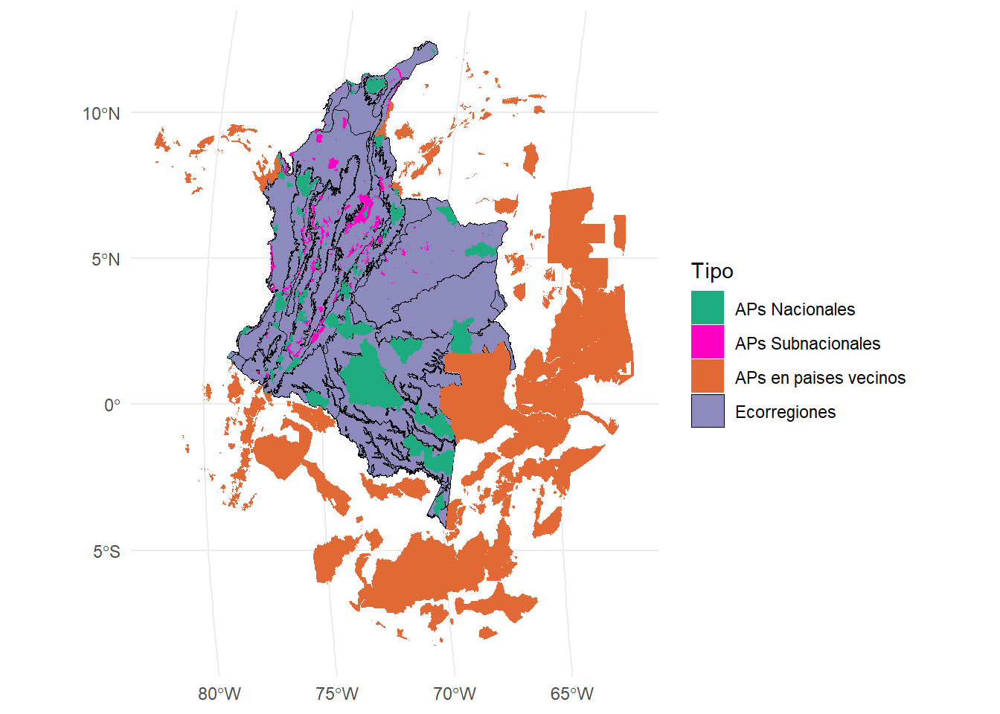

### Función MK_ProtConn()

Esta función calcula el indicador de área protegida y conectada (ProtConn) para una región, sus fracciones y la importancia o contribución de cada área protegida (dProtConn) para mantener la conectividad en la región bajo uno o más umbrales de distancia. Algo muy importante es que el poarametro nodes solo acepta archivos vectoriales.

La función tiene los siguientes argumentos:

| Argumento | Descripción |
|---------------------------------------------|---------------------------|
| **nodes** | `sf, sfc, sfg, SpatVect, spatialPolygonsDataFrame`. El archivo debe tener un sistema de coordenadas proyectado. |
| **region** | Objeto de clase `raster`, `rast`, `sf`, `sfc`, `sfg` o `spatialPolygonsDataFrame`. Polígono que delimita la región o área de estudio. Debe estar en un sistema de coordenadas proyectado. |
| **area_unit** | `character` (opcional, por defecto `"m2"`). Unidades de área cuando `attribute = NULL`. Ejemplos: `"m2"`, `"km2"`, `"cm2"`, `"ha"`. Ver `unit_convert` para más detalles. |
| **distance** | Matriz o lista que define la distancia entre cada par de nodos. Puede ser distancia euclidiana o efectiva (costos de movimiento). <br> - Si es matriz: número de filas y columnas igual al número de nodos (puede generarse con `distancefile`). <br> - Si es lista: debe incluir parámetros como `"type"` (`"centroid"`, `"edge"`, `"least-cost"`, `"commute-time"`) y, en su caso, `"resistance"`. Para más detalles ver `distancefile`. |
| **distance_thresholds** | `numeric`. Distancia(s) de dispersión de la especie en metros. Si es `NULL`, se estima como la distancia de dispersión mediana entre nodos. También se puede calcular con `dispersal_distance`. |
| **probability** | `numeric`. Probabilidad asociada a la distancia en `distance_threshold`. Ej.: mediana de dispersión → `0.5`; máxima dispersión → `0.05` o `0.01`. Usar solo con la métrica `"PC"`. Por defecto = `0.5`. |
| **transboundary** | `numeric`. Búfer para seleccionar polígonos en una segunda ronda (atributo = 0, actuando como stepping stones según Saura et al. 2017). Puede ser un valor único o uno por cada distancia umbral. |
| **transboundary_type** | `character`. Opciones: `"nodes"` (por defecto, límites de los nodos en la región) o `"region"` (límites de la región). |
| **protconn_bound** | `logical`. Si es `TRUE`, estima las fracciones `ProtUnConn[design]` y `ProtConn[bound]`. |
| **delta** | `logical`. Si es `TRUE`, estima la contribución de cada nodo al valor de `ProtConn` en la región. |
| **plot** | `logical`. Si es `TRUE`, grafica los indicadores y fracciones principales de `ProtConn`. Por defecto = `FALSE`. |
| **resample_raster** | `numeric`. Úsalo con rásters pequeños y alta resolución (\<150 m) o regiones muy grandes. Define el valor para remuestrear y acelerar el proceso de selección de nodos transfronterizos. |
| **write** | `character`. Carpeta de salida con nombre de archivo sin extensión. Ej.: `"C:/ProtConn/Protfiles"`. |
| **parallel** | `numeric`. Número de núcleos para procesamiento en paralelo (usando `furrr` y `multiprocess`). Por defecto = `NULL`. |
| **intern** | `logical`. Si es `TRUE`, muestra el progreso. Puede no llegar al 100% si el proceso es muy rápido. |

3.  Estimaremos el índice Protconn solo en una ecorregión:


``` r
Ecorreg_1 <- Ecorreg[1,] #Selecciono la primera fila o primera ecorregion

test <- MK_ProtConn(nodes = APs, 
                    region = Ecorreg_1,
                    area_unit = "ha",
                    distance = list(type= "edge", keep = 0.1),
                    distance_thresholds = 10000,
                    probability = 0.5, 
                    transboundary = 50000,
                    plot = TRUE, 
                    parallel = NULL,
                    protconn_bound = FALSE,
                    delta = FALSE,
                    write = NULL, 
                    intern = TRUE)
#> Step 1. Reviewing parameters
#> Step 2. Processing ProtConn metric
#> Done!
```

Revisamos nuestra tabla:


``` r
test$`Protected Connected (Viewer Panel`
```


<table class="table table-condensed">
 <thead>
  <tr>
   <th style="text-align:left;"> Index </th>
   <th style="text-align:center;"> Value </th>
   <th style="text-align:left;"> ProtConn indicator </th>
   <th style="text-align:center;"> Percentage </th>
  </tr>
 </thead>
<tbody>
  <tr>
   <td style="text-align:left;"> <span style="color: #636363; font-weight: bold">EC(PC)                     </span> </td>
   <td style="text-align:center;"> 4404760.07 </td>
   <td style="text-align:left;"> <span style="color: #636363; font-weight: bold">Prot                </span> </td>
   <td style="text-align:center;"> <span style="display: block; padding: 0 4px; border-radius: 4px; background-color: #ffd17f">36.7627</span> </td>
  </tr>
  <tr>
   <td style="text-align:left;"> <span style="color: #636363; font-weight: bold">PC                         </span> </td>
   <td style="text-align:center;"> 6.5600e-02 </td>
   <td style="text-align:left;"> <span style="color: #636363; font-weight: bold">Unprotected         </span> </td>
   <td style="text-align:center;"> <span style="display: block; padding: 0 4px; border-radius: 4px; background-color: #ffb93a">63.2373</span> </td>
  </tr>
  <tr>
   <td style="text-align:left;"> <span style="color: #636363; font-weight: bold">Maximum landscape attribute</span> </td>
   <td style="text-align:center;"> 17196418.45 </td>
   <td style="text-align:left;"> <span style="color: #636363; font-weight: bold">ProtConn            </span> </td>
   <td style="text-align:center;"> <span style="display: block; padding: 0 4px; border-radius: 4px; background-color: #ffdc9b">25.6144</span> </td>
  </tr>
  <tr>
   <td style="text-align:left;"> <span style="color: #636363; font-weight: bold">Protected surface          </span> </td>
   <td style="text-align:center;"> 6321860.45 </td>
   <td style="text-align:left;"> <span style="color: #636363; font-weight: bold">ProtUnconn          </span> </td>
   <td style="text-align:center;"> <span style="display: block; padding: 0 4px; border-radius: 4px; background-color: #ffe9c1">11.1483</span> </td>
  </tr>
  <tr>
   <td style="text-align:left;"> <span style="color: #636363; font-weight: bold">                           </span> </td>
   <td style="text-align:center;">  </td>
   <td style="text-align:left;"> <span style="color: #636363; font-weight: bold">RelConn             </span> </td>
   <td style="text-align:center;"> <span style="display: block; padding: 0 4px; border-radius: 4px; background-color: #ffb329">69.6751</span> </td>
  </tr>
  <tr>
   <td style="text-align:left;"> <span style="color: #636363; font-weight: bold">                           </span> </td>
   <td style="text-align:center;">  </td>
   <td style="text-align:left;"> <span style="color: #636363; font-weight: bold">ProtConn_Prot       </span> </td>
   <td style="text-align:center;"> <span style="display: block; padding: 0 4px; border-radius: 4px; background-color: #ffa500">85.8463</span> </td>
  </tr>
  <tr>
   <td style="text-align:left;"> <span style="color: #636363; font-weight: bold">                           </span> </td>
   <td style="text-align:center;">  </td>
   <td style="text-align:left;"> <span style="color: #636363; font-weight: bold">ProtConn_Trans      </span> </td>
   <td style="text-align:center;"> <span style="display: block; padding: 0 4px; border-radius: 4px; background-color: #fff1d9">1.8374</span> </td>
  </tr>
  <tr>
   <td style="text-align:left;"> <span style="color: #636363; font-weight: bold">                           </span> </td>
   <td style="text-align:center;">  </td>
   <td style="text-align:left;"> <span style="color: #636363; font-weight: bold">ProtConn_Unprot     </span> </td>
   <td style="text-align:center;"> <span style="display: block; padding: 0 4px; border-radius: 4px; background-color: #ffe8be">12.3163</span> </td>
  </tr>
  <tr>
   <td style="text-align:left;"> <span style="color: #636363; font-weight: bold">                           </span> </td>
   <td style="text-align:center;">  </td>
   <td style="text-align:left;"> <span style="color: #636363; font-weight: bold">ProtConn_Within     </span> </td>
   <td style="text-align:center;"> <span style="display: block; padding: 0 4px; border-radius: 4px; background-color: #ffa500">85.7769</span> </td>
  </tr>
  <tr>
   <td style="text-align:left;"> <span style="color: #636363; font-weight: bold">                           </span> </td>
   <td style="text-align:center;">  </td>
   <td style="text-align:left;"> <span style="color: #636363; font-weight: bold">ProtConn_Contig     </span> </td>
   <td style="text-align:center;"> <span style="display: block; padding: 0 4px; border-radius: 4px; background-color: #ffe6b9">14.2231</span> </td>
  </tr>
  <tr>
   <td style="text-align:left;"> <span style="color: #636363; font-weight: bold">                           </span> </td>
   <td style="text-align:center;">  </td>
   <td style="text-align:left;"> <span style="color: #636363; font-weight: bold">ProtConn_Within_land</span> </td>
   <td style="text-align:center;"> <span style="display: block; padding: 0 4px; border-radius: 4px; background-color: #ffdfa5">21.9712</span> </td>
  </tr>
  <tr>
   <td style="text-align:left;"> <span style="color: #636363; font-weight: bold">                           </span> </td>
   <td style="text-align:center;">  </td>
   <td style="text-align:left;"> <span style="color: #636363; font-weight: bold">ProtConn_Contig_land</span> </td>
   <td style="text-align:center;"> <span style="display: block; padding: 0 4px; border-radius: 4px; background-color: #fff0d4">3.6432</span> </td>
  </tr>
  <tr>
   <td style="text-align:left;"> <span style="color: #636363; font-weight: bold">                           </span> </td>
   <td style="text-align:center;">  </td>
   <td style="text-align:left;"> <span style="color: #636363; font-weight: bold">ProtConn_Unprot_land</span> </td>
   <td style="text-align:center;"> <span style="display: block; padding: 0 4px; border-radius: 4px; background-color: #fff0d6">3.1548</span> </td>
  </tr>
  <tr>
   <td style="text-align:left;"> <span style="color: #636363; font-weight: bold">                           </span> </td>
   <td style="text-align:center;">  </td>
   <td style="text-align:left;"> <span style="color: #636363; font-weight: bold">ProtConn_Trans_land </span> </td>
   <td style="text-align:center;"> <span style="display: block; padding: 0 4px; border-radius: 4px; background-color: #fff3dd">0.4706</span> </td>
  </tr>
</tbody>
</table>


``` r
#Alternativa: test[[1]]
```

Ahora nuestro plot:


``` r
test$`ProtConn Plot`
```

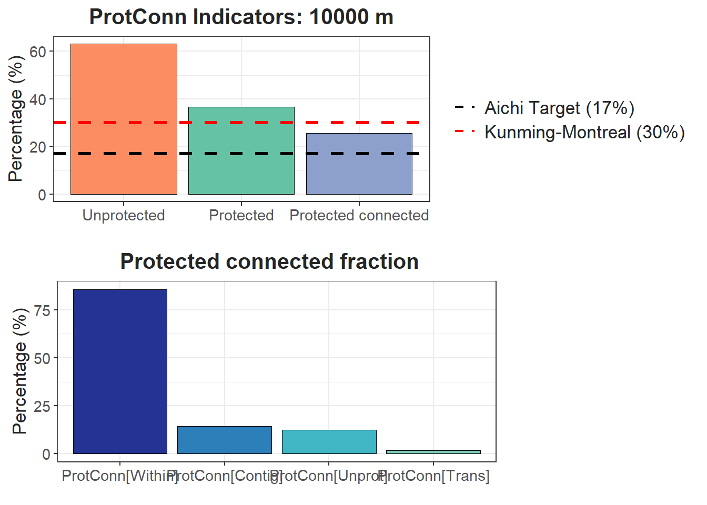

``` r
#Alternativa: test[[2]]
```

Podemos estimar la versión corregida o ProtConn bound:


``` r
test2 <- MK_ProtConn(nodes = APs, 
                    region = Ecorreg_1,
                    area_unit = "ha",
                    distance = list(type= "edge", keep = 0.1),
                    distance_thresholds = 10000,
                    probability = 0.5, 
                    transboundary = 50000,
                    plot = TRUE, 
                    parallel = NULL,
                    protconn_bound = TRUE,
                    delta = FALSE,
                    write = NULL, 
                    intern = TRUE)
#> Step 1. Reviewing parameters
#> Step 2. Processing ProtConn metric
#> Done!
```

Tabla:


``` r
test2$`Protected Connected (Viewer Panel`
```


<table class="table table-condensed">
 <thead>
  <tr>
   <th style="text-align:left;"> Index </th>
   <th style="text-align:center;"> Value </th>
   <th style="text-align:left;"> ProtConn indicator </th>
   <th style="text-align:center;"> Percentage </th>
  </tr>
 </thead>
<tbody>
  <tr>
   <td style="text-align:left;"> <span style="color: #636363; font-weight: bold">EC(PC)                     </span> </td>
   <td style="text-align:center;"> 4404647.33 </td>
   <td style="text-align:left;"> <span style="color: #636363; font-weight: bold">Prot                </span> </td>
   <td style="text-align:center;"> <span style="display: block; padding: 0 4px; border-radius: 4px; background-color: #ffd17f">36.7627</span> </td>
  </tr>
  <tr>
   <td style="text-align:left;"> <span style="color: #636363; font-weight: bold">PC                         </span> </td>
   <td style="text-align:center;"> 6.5600e-02 </td>
   <td style="text-align:left;"> <span style="color: #636363; font-weight: bold">Unprotected         </span> </td>
   <td style="text-align:center;"> <span style="display: block; padding: 0 4px; border-radius: 4px; background-color: #ffb93a">63.2373</span> </td>
  </tr>
  <tr>
   <td style="text-align:left;"> <span style="color: #636363; font-weight: bold">Maximum landscape attribute</span> </td>
   <td style="text-align:center;"> 17196418.45 </td>
   <td style="text-align:left;"> <span style="color: #636363; font-weight: bold">ProtConn            </span> </td>
   <td style="text-align:center;"> <span style="display: block; padding: 0 4px; border-radius: 4px; background-color: #ffdc9b">25.6137</span> </td>
  </tr>
  <tr>
   <td style="text-align:left;"> <span style="color: #636363; font-weight: bold">Protected surface          </span> </td>
   <td style="text-align:center;"> 6321860.45 </td>
   <td style="text-align:left;"> <span style="color: #636363; font-weight: bold">ProtUnconn          </span> </td>
   <td style="text-align:center;"> <span style="display: block; padding: 0 4px; border-radius: 4px; background-color: #ffe9c1">11.1489</span> </td>
  </tr>
  <tr>
   <td style="text-align:left;"> <span style="color: #636363; font-weight: bold">                           </span> </td>
   <td style="text-align:center;">  </td>
   <td style="text-align:left;"> <span style="color: #636363; font-weight: bold">ProtUnconn_Design   </span> </td>
   <td style="text-align:center;"> <span style="display: block; padding: 0 4px; border-radius: 4px; background-color: #ffe9c1">11.1489</span> </td>
  </tr>
  <tr>
   <td style="text-align:left;"> <span style="color: #636363; font-weight: bold">                           </span> </td>
   <td style="text-align:center;">  </td>
   <td style="text-align:left;"> <span style="color: #636363; font-weight: bold">ProtConn_Bound      </span> </td>
   <td style="text-align:center;"> <span style="display: block; padding: 0 4px; border-radius: 4px; background-color: #ffdc9b">25.6137</span> </td>
  </tr>
  <tr>
   <td style="text-align:left;"> <span style="color: #636363; font-weight: bold">                           </span> </td>
   <td style="text-align:center;">  </td>
   <td style="text-align:left;"> <span style="color: #636363; font-weight: bold">RelConn             </span> </td>
   <td style="text-align:center;"> <span style="display: block; padding: 0 4px; border-radius: 4px; background-color: #ffb329">69.6733</span> </td>
  </tr>
  <tr>
   <td style="text-align:left;"> <span style="color: #636363; font-weight: bold">                           </span> </td>
   <td style="text-align:center;">  </td>
   <td style="text-align:left;"> <span style="color: #636363; font-weight: bold">ProtConn_Prot       </span> </td>
   <td style="text-align:center;"> <span style="display: block; padding: 0 4px; border-radius: 4px; background-color: #ffa500">85.8485</span> </td>
  </tr>
  <tr>
   <td style="text-align:left;"> <span style="color: #636363; font-weight: bold">                           </span> </td>
   <td style="text-align:center;">  </td>
   <td style="text-align:left;"> <span style="color: #636363; font-weight: bold">ProtConn_Trans      </span> </td>
   <td style="text-align:center;"> <span style="display: block; padding: 0 4px; border-radius: 4px; background-color: #fff1d9">1.8410</span> </td>
  </tr>
  <tr>
   <td style="text-align:left;"> <span style="color: #636363; font-weight: bold">                           </span> </td>
   <td style="text-align:center;">  </td>
   <td style="text-align:left;"> <span style="color: #636363; font-weight: bold">ProtConn_Unprot     </span> </td>
   <td style="text-align:center;"> <span style="display: block; padding: 0 4px; border-radius: 4px; background-color: #ffe8be">12.3105</span> </td>
  </tr>
  <tr>
   <td style="text-align:left;"> <span style="color: #636363; font-weight: bold">                           </span> </td>
   <td style="text-align:center;">  </td>
   <td style="text-align:left;"> <span style="color: #636363; font-weight: bold">ProtConn_Within     </span> </td>
   <td style="text-align:center;"> <span style="display: block; padding: 0 4px; border-radius: 4px; background-color: #ffa500">85.7791</span> </td>
  </tr>
  <tr>
   <td style="text-align:left;"> <span style="color: #636363; font-weight: bold">                           </span> </td>
   <td style="text-align:center;">  </td>
   <td style="text-align:left;"> <span style="color: #636363; font-weight: bold">ProtConn_Contig     </span> </td>
   <td style="text-align:center;"> <span style="display: block; padding: 0 4px; border-radius: 4px; background-color: #ffe6b9">14.2209</span> </td>
  </tr>
  <tr>
   <td style="text-align:left;"> <span style="color: #636363; font-weight: bold">                           </span> </td>
   <td style="text-align:center;">  </td>
   <td style="text-align:left;"> <span style="color: #636363; font-weight: bold">ProtConn_Within_land</span> </td>
   <td style="text-align:center;"> <span style="display: block; padding: 0 4px; border-radius: 4px; background-color: #ffdfa5">21.9712</span> </td>
  </tr>
  <tr>
   <td style="text-align:left;"> <span style="color: #636363; font-weight: bold">                           </span> </td>
   <td style="text-align:center;">  </td>
   <td style="text-align:left;"> <span style="color: #636363; font-weight: bold">ProtConn_Contig_land</span> </td>
   <td style="text-align:center;"> <span style="display: block; padding: 0 4px; border-radius: 4px; background-color: #fff0d4">3.6425</span> </td>
  </tr>
  <tr>
   <td style="text-align:left;"> <span style="color: #636363; font-weight: bold">                           </span> </td>
   <td style="text-align:center;">  </td>
   <td style="text-align:left;"> <span style="color: #636363; font-weight: bold">ProtConn_Unprot_land</span> </td>
   <td style="text-align:center;"> <span style="display: block; padding: 0 4px; border-radius: 4px; background-color: #fff0d6">3.1532</span> </td>
  </tr>
  <tr>
   <td style="text-align:left;"> <span style="color: #636363; font-weight: bold">                           </span> </td>
   <td style="text-align:center;">  </td>
   <td style="text-align:left;"> <span style="color: #636363; font-weight: bold">ProtConn_Trans_land </span> </td>
   <td style="text-align:center;"> <span style="display: block; padding: 0 4px; border-radius: 4px; background-color: #fff3dd">0.4716</span> </td>
  </tr>
</tbody>
</table>


Podemos estimar la contribución individial de cada AP en la ecorregión:


``` r
test3 <- MK_ProtConn(nodes = APs, 
                    region = Ecorreg_1,
                    area_unit = "ha",
                    distance = list(type= "edge", keep = 0.1),
                    distance_thresholds = 10000,
                    probability = 0.5, 
                    transboundary = 50000,
                    plot = TRUE, 
                    parallel = NULL,
                    protconn_bound = FALSE,
                    delta = TRUE,
                    write = NULL, 
                    intern = TRUE)
#> Step 1. Reviewing parameters
#> Step 2. Processing ProtConn metric
#> Step 3. Processing Delta ProtConn
#> Done!
```


``` r
test3$ProtConn_Delta
#> Simple feature collection with 12 features and 6 fields
#> Geometry type: POLYGON
#> Dimension:     XY
#> Bounding box:  xmin: -7507429 ymin: -219677.7 xmax: -6716030 ymax: 414710.1
#> Projected CRS: World_Mollweide
#> First 10 features:
#>                                 NAME
#> 1                       Rio Apaporis
#> 3                     Alto Rio Negro
#> 5                   Yaigoje Apaporis
#> 6                           Puinawai
#> 8              Sierra de la Macarena
#> 9                            Tinigua
#> 10        Cordillera de los Picachos
#> 11                         Cahuinari
#> 13  Jardin Botanico de la Macarena I
#> 14 Jardin Botanico de la Macarena II
#>                              DESIGNACIO      ESCALA_2
#> 1                                  <NA> Transboundary
#> 3                                  <NA> Transboundary
#> 5               Parque Nacional Natural      Nacional
#> 6                       Reserva Natural      Nacional
#> 8               Parque Nacional Natural      Nacional
#> 9               Parque Nacional Natural      Nacional
#> 10              Parque Nacional Natural      Nacional
#> 11              Parque Nacional Natural      Nacional
#> 13 Reserva Natural de la Sociedad Civil   Subnacional
#> 14 Reserva Natural de la Sociedad Civil   Subnacional
#>           dProt    dProtConn  varProtConn
#> 1  9.172455e-08 3.074408e-08 7.874913e-09
#> 3  2.261837e-05 8.382440e-06 2.147112e-06
#> 5  1.517942e+01 3.328922e+00 8.526837e-01
#> 6  4.013589e-01 1.472522e-01 3.771777e-02
#> 8  5.732189e+00 5.863921e+00 1.502009e+00
#> 9  3.105072e+00 2.331058e+00 5.970867e-01
#> 10 5.654031e-01 4.216302e-01 1.079981e-01
#> 11 6.261682e-02 1.460151e-03 3.740089e-04
#> 13 8.278110e-04 1.574435e-04 4.032822e-05
#> 14 1.156824e-03 2.296548e-04 5.882471e-05
#>                          geometry
#> 1  POLYGON ((-6928552 -125522....
#> 3  POLYGON ((-6893113 -93721.5...
#> 5  POLYGON ((-7113144 -809.770...
#> 6  POLYGON ((-6882762 368339.5...
#> 8  POLYGON ((-7400800 283634.2...
#> 9  POLYGON ((-7419123 338904.9...
#> 10 POLYGON ((-7440367 333009.1...
#> 11 POLYGON ((-7052835 -187080....
#> 13 POLYGON ((-7399114 254319, ...
#> 14 POLYGON ((-7399114 254319, ...
```

Delta protegido:


``` r
library(classInt)
library(dplyr)
#> 
#> Adjuntando el paquete: 'dplyr'
#> The following objects are masked from 'package:igraph':
#> 
#>     as_data_frame, groups, union
#> The following objects are masked from 'package:raster':
#> 
#>     intersect, select, union
#> The following objects are masked from 'package:terra':
#> 
#>     intersect, union
#> The following objects are masked from 'package:stats':
#> 
#>     filter, lag
#> The following objects are masked from 'package:base':
#> 
#>     intersect, setdiff, setequal, union

dProtConn <- test3$ProtConn_Delta
# Calcular los intervalos de Jenks para strength
breaks <- classInt::classIntervals(dProtConn$dProt, n = 5, style = "jenks")

# Crear una nueva variable categórica con los intervalos
dProtConn2 <- dProtConn %>%
  mutate(dProt_q = cut(dProt,
                     breaks = breaks$brks,
                     include.lowest = TRUE,
                     dig.lab = 5))  

# Graficar en ggplot2 usando las clases Jenks
ggplot() +  
  geom_sf(data = Ecorreg_1, fill = NA, color = "black") +
  geom_sf(data = dProtConn2, aes(fill = dProt_q), color = "black", size = 0.1) +
  scale_fill_brewer(palette = "RdYlBu", direction = -1, name = "Delta Protegido(jenks)") +
  theme_minimal() +
  labs(
    title = "Delta Prot",
    fill = "Delta Prot"
  ) +
  theme(
    legend.position = "right",
    plot.title = element_text(hjust = 0.5)
  )
```

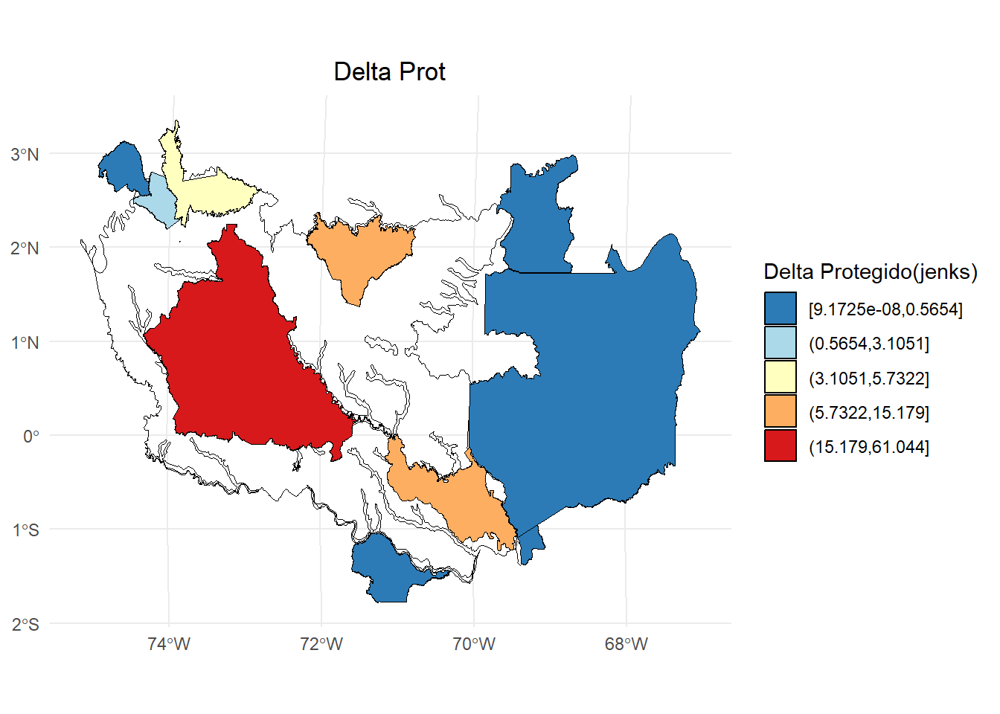

Delta ProtConn:


``` r
dProtConn <- test3$ProtConn_Delta
# Calcular los intervalos de Jenks para strength
breaks <- classInt::classIntervals(dProtConn$dProtConn, n = 5, style = "jenks")

# Crear una nueva variable categórica con los intervalos
dProtConn2 <- dProtConn %>%
  mutate(dProtConn_q = cut(dProtConn,
                     breaks = breaks$brks,
                     include.lowest = TRUE,
                     dig.lab = 5))  

# Graficar en ggplot2 usando las clases Jenks
ggplot() +  
  geom_sf(data = Ecorreg_1, fill = NA, color = "black") +
  geom_sf(data = dProtConn2, aes(fill = dProtConn_q), color = "black", size = 0.1) +
  scale_fill_brewer(palette = "RdYlBu", direction = 1, name = "Delta ProtConn (jenks)") +
  theme_minimal() +
  labs(
    title = "Delta ProtConn",
    fill = "Delta ProtConn"
  ) +
  theme(
    legend.position = "right",
    plot.title = element_text(hjust = 0.5)
  )
```

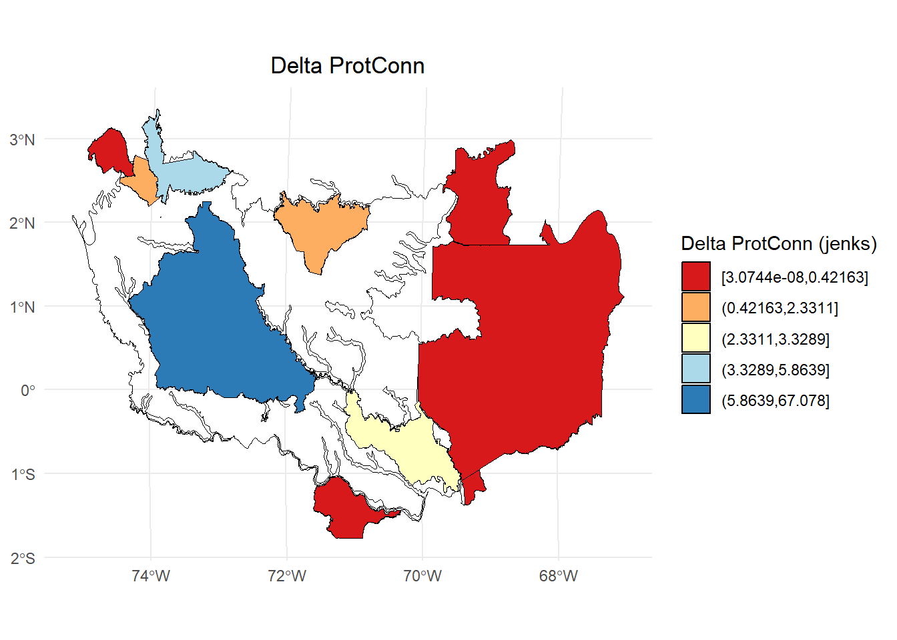

Variación absoluta del ProtConn:


``` r
dProtConn <- test3$ProtConn_Delta
# Calcular los intervalos de Jenks para strength
breaks <- classInt::classIntervals(dProtConn$varProtConn, n = 5, style = "jenks")

# Crear una nueva variable categórica con los intervalos
dProtConn2 <- dProtConn %>%
  mutate(varProtConn_q = cut(varProtConn,
                     breaks = breaks$brks,
                     include.lowest = TRUE,
                     dig.lab = 5))  

# Graficar en ggplot2 usando las clases Jenks
ggplot() +  
  geom_sf(data = Ecorreg_1, fill = NA, color = "black") +
  geom_sf(data = dProtConn2, aes(fill = varProtConn_q), color = "black", size = 0.1) +
  scale_fill_brewer(palette = "PuOr", direction = -1, name = "varProtConn (jenks)") +
  theme_minimal() +
  labs(
    title = "varProtConn",
    fill = "varProtConn"
  ) +
  theme(
    legend.position = "right",
    plot.title = element_text(hjust = 0.5)
  )
```

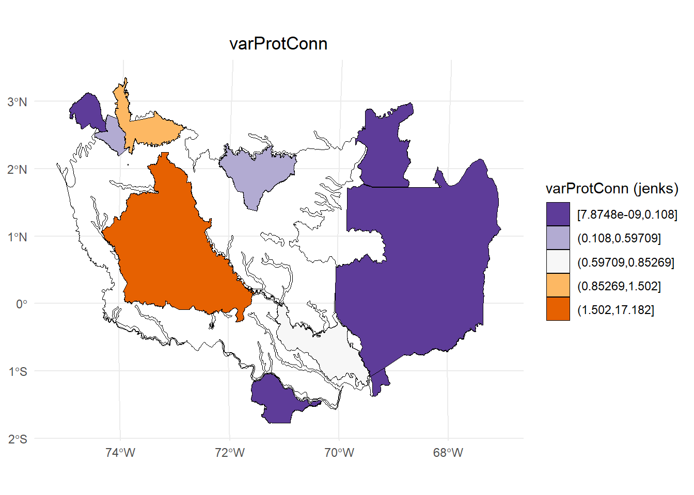

### Función MK_ProtConnMult()

La función estima el índice ProtConn para multiples regiones. El argumento `region` pasa a `regions` y se puede acceder al argumento `CI` para estimar intervalos de confianza.


``` r
test <- MK_ProtConnMult(nodes = APs, 
                        regions = Ecorreg,
                        area_unit = "ha",
                        distance = list(type= "edge", keep = 0.1),
                        distance_thresholds = 10000,
                        probability = 0.5, 
                        transboundary = 50000,
                        plot = TRUE, 
                        parallel = 4,
                        protconn_bound = FALSE,
                        delta = FALSE,
                        CI = "all",
                        write = NULL, 
                        intern = FALSE)
```


Tabla:


``` r
test$ProtConn_10000$ProtConn_overall10000
```


<table class="table table-condensed">
 <thead>
  <tr>
   <th style="text-align:left;">   </th>
   <th style="text-align:left;"> ProtConn indicator </th>
   <th style="text-align:right;"> Values (%) </th>
   <th style="text-align:right;"> SD </th>
   <th style="text-align:right;"> SEM </th>
   <th style="text-align:right;"> normal.lower </th>
   <th style="text-align:right;"> normal.upper </th>
   <th style="text-align:right;"> basic.lower </th>
   <th style="text-align:right;"> basic.upper </th>
   <th style="text-align:right;"> percent.lower </th>
   <th style="text-align:right;"> percent.upper </th>
   <th style="text-align:right;"> bca.lower </th>
   <th style="text-align:right;"> bca.upper </th>
  </tr>
 </thead>
<tbody>
  <tr>
   <td style="text-align:left;"> 3 </td>
   <td style="text-align:left;"> <span style="color: #636363; font-weight: bold">Prot                </span> </td>
   <td style="text-align:right;"> <span style="display: block; padding: 0 4px; border-radius: 4px; background-color: #fde7d0">16.849</span> </td>
   <td style="text-align:right;"> <span style="display: block; padding: 0 4px; border-radius: 4px; background-color: #e3a3c6">20.205</span> </td>
   <td style="text-align:right;"> <span style="display: block; padding: 0 4px; border-radius: 4px; background-color: #faeff5">3.517</span> </td>
   <td style="text-align:right;"> 10.450 </td>
   <td style="text-align:right;"> 23.564 </td>
   <td style="text-align:right;"> 10.143 </td>
   <td style="text-align:right;"> 23.012 </td>
   <td style="text-align:right;"> 10.687 </td>
   <td style="text-align:right;"> 23.555 </td>
   <td style="text-align:right;"> 11.993 </td>
   <td style="text-align:right;"> 26.502 </td>
  </tr>
  <tr>
   <td style="text-align:left;"> 4 </td>
   <td style="text-align:left;"> <span style="color: #636363; font-weight: bold">Unprotected         </span> </td>
   <td style="text-align:right;"> <span style="display: block; padding: 0 4px; border-radius: 4px; background-color: #f88b13">83.151</span> </td>
   <td style="text-align:right;"> <span style="display: block; padding: 0 4px; border-radius: 4px; background-color: #e3a3c6">20.205</span> </td>
   <td style="text-align:right;"> <span style="display: block; padding: 0 4px; border-radius: 4px; background-color: #faeff5">3.517</span> </td>
   <td style="text-align:right;"> 76.436 </td>
   <td style="text-align:right;"> 89.550 </td>
   <td style="text-align:right;"> 76.988 </td>
   <td style="text-align:right;"> 89.857 </td>
   <td style="text-align:right;"> 76.445 </td>
   <td style="text-align:right;"> 89.313 </td>
   <td style="text-align:right;"> 73.498 </td>
   <td style="text-align:right;"> 88.007 </td>
  </tr>
  <tr>
   <td style="text-align:left;"> 5 </td>
   <td style="text-align:left;"> <span style="color: #636363; font-weight: bold">ProtConn            </span> </td>
   <td style="text-align:right;"> <span style="display: block; padding: 0 4px; border-radius: 4px; background-color: #fdeddb">12.783</span> </td>
   <td style="text-align:right;"> <span style="display: block; padding: 0 4px; border-radius: 4px; background-color: #e5a9ca">18.950</span> </td>
   <td style="text-align:right;"> <span style="display: block; padding: 0 4px; border-radius: 4px; background-color: #faf0f6">3.299</span> </td>
   <td style="text-align:right;"> 6.855 </td>
   <td style="text-align:right;"> 19.055 </td>
   <td style="text-align:right;"> 6.558 </td>
   <td style="text-align:right;"> 18.098 </td>
   <td style="text-align:right;"> 7.468 </td>
   <td style="text-align:right;"> 19.008 </td>
   <td style="text-align:right;"> 8.480 </td>
   <td style="text-align:right;"> 22.415 </td>
  </tr>
  <tr>
   <td style="text-align:left;"> 6 </td>
   <td style="text-align:left;"> <span style="color: #636363; font-weight: bold">ProtUnconn          </span> </td>
   <td style="text-align:right;"> <span style="display: block; padding: 0 4px; border-radius: 4px; background-color: #fef9f4">4.066</span> </td>
   <td style="text-align:right;"> <span style="display: block; padding: 0 4px; border-radius: 4px; background-color: #f6e2ed">6.353</span> </td>
   <td style="text-align:right;"> <span style="display: block; padding: 0 4px; border-radius: 4px; background-color: #fdfafc">1.106</span> </td>
   <td style="text-align:right;"> 1.918 </td>
   <td style="text-align:right;"> 6.186 </td>
   <td style="text-align:right;"> 1.762 </td>
   <td style="text-align:right;"> 5.953 </td>
   <td style="text-align:right;"> 2.180 </td>
   <td style="text-align:right;"> 6.371 </td>
   <td style="text-align:right;"> 2.441 </td>
   <td style="text-align:right;"> 6.940 </td>
  </tr>
  <tr>
   <td style="text-align:left;"> 7 </td>
   <td style="text-align:left;"> <span style="color: #636363; font-weight: bold">RelConn             </span> </td>
   <td style="text-align:right;"> <span style="display: block; padding: 0 4px; border-radius: 4px; background-color: #fab160">56.029</span> </td>
   <td style="text-align:right;"> <span style="display: block; padding: 0 4px; border-radius: 4px; background-color: #ce5d9b">35.611</span> </td>
   <td style="text-align:right;"> <span style="display: block; padding: 0 4px; border-radius: 4px; background-color: #f6e3ee">6.199</span> </td>
   <td style="text-align:right;"> 43.969 </td>
   <td style="text-align:right;"> 67.949 </td>
   <td style="text-align:right;"> 43.112 </td>
   <td style="text-align:right;"> 68.040 </td>
   <td style="text-align:right;"> 44.018 </td>
   <td style="text-align:right;"> 68.947 </td>
   <td style="text-align:right;"> 43.586 </td>
   <td style="text-align:right;"> 68.558 </td>
  </tr>
  <tr>
   <td style="text-align:left;"> 8 </td>
   <td style="text-align:left;"> <span style="color: #636363; font-weight: bold">ProtConn_Prot       </span> </td>
   <td style="text-align:right;"> <span style="display: block; padding: 0 4px; border-radius: 4px; background-color: #f8972c">74.147</span> </td>
   <td style="text-align:right;"> <span style="display: block; padding: 0 4px; border-radius: 4px; background-color: #d370a6">31.392</span> </td>
   <td style="text-align:right;"> <span style="display: block; padding: 0 4px; border-radius: 4px; background-color: #f7e6f0">5.465</span> </td>
   <td style="text-align:right;"> 63.505 </td>
   <td style="text-align:right;"> 85.288 </td>
   <td style="text-align:right;"> 63.883 </td>
   <td style="text-align:right;"> 86.362 </td>
   <td style="text-align:right;"> 61.931 </td>
   <td style="text-align:right;"> 84.411 </td>
   <td style="text-align:right;"> 59.951 </td>
   <td style="text-align:right;"> 83.857 </td>
  </tr>
  <tr>
   <td style="text-align:left;"> 9 </td>
   <td style="text-align:left;"> <span style="color: #636363; font-weight: bold">ProtConn_Trans      </span> </td>
   <td style="text-align:right;"> <span style="display: block; padding: 0 4px; border-radius: 4px; background-color: #fef9f3">4.431</span> </td>
   <td style="text-align:right;"> <span style="display: block; padding: 0 4px; border-radius: 4px; background-color: #f3d9e7">8.443</span> </td>
   <td style="text-align:right;"> <span style="display: block; padding: 0 4px; border-radius: 4px; background-color: #fdf9fb">1.470</span> </td>
   <td style="text-align:right;"> 1.592 </td>
   <td style="text-align:right;"> 7.198 </td>
   <td style="text-align:right;"> 1.364 </td>
   <td style="text-align:right;"> 6.973 </td>
   <td style="text-align:right;"> 1.889 </td>
   <td style="text-align:right;"> 7.498 </td>
   <td style="text-align:right;"> 2.280 </td>
   <td style="text-align:right;"> 8.234 </td>
  </tr>
  <tr>
   <td style="text-align:left;"> 10 </td>
   <td style="text-align:left;"> <span style="color: #636363; font-weight: bold">ProtConn_Unprot     </span> </td>
   <td style="text-align:right;"> <span style="display: block; padding: 0 4px; border-radius: 4px; background-color: #fef2e5">9.301</span> </td>
   <td style="text-align:right;"> <span style="display: block; padding: 0 4px; border-radius: 4px; background-color: #f2d4e4">9.507</span> </td>
   <td style="text-align:right;"> <span style="display: block; padding: 0 4px; border-radius: 4px; background-color: #fcf8fa">1.655</span> </td>
   <td style="text-align:right;"> 6.129 </td>
   <td style="text-align:right;"> 12.391 </td>
   <td style="text-align:right;"> 5.988 </td>
   <td style="text-align:right;"> 12.248 </td>
   <td style="text-align:right;"> 6.354 </td>
   <td style="text-align:right;"> 12.614 </td>
   <td style="text-align:right;"> 6.478 </td>
   <td style="text-align:right;"> 12.710 </td>
  </tr>
  <tr>
   <td style="text-align:left;"> 11 </td>
   <td style="text-align:left;"> <span style="color: #636363; font-weight: bold">ProtConn_Within     </span> </td>
   <td style="text-align:right;"> <span style="display: block; padding: 0 4px; border-radius: 4px; background-color: #f99b35">71.120</span> </td>
   <td style="text-align:right;"> <span style="display: block; padding: 0 4px; border-radius: 4px; background-color: #d36ea5">31.781</span> </td>
   <td style="text-align:right;"> <span style="display: block; padding: 0 4px; border-radius: 4px; background-color: #f7e6ef">5.532</span> </td>
   <td style="text-align:right;"> 60.446 </td>
   <td style="text-align:right;"> 82.360 </td>
   <td style="text-align:right;"> 60.953 </td>
   <td style="text-align:right;"> 83.745 </td>
   <td style="text-align:right;"> 58.495 </td>
   <td style="text-align:right;"> 81.286 </td>
   <td style="text-align:right;"> 57.486 </td>
   <td style="text-align:right;"> 80.924 </td>
  </tr>
  <tr>
   <td style="text-align:left;"> 12 </td>
   <td style="text-align:left;"> <span style="color: #636363; font-weight: bold">ProtConn_Contig     </span> </td>
   <td style="text-align:right;"> <span style="display: block; padding: 0 4px; border-radius: 4px; background-color: #fde8d0">16.759</span> </td>
   <td style="text-align:right;"> <span style="display: block; padding: 0 4px; border-radius: 4px; background-color: #e6accc">18.181</span> </td>
   <td style="text-align:right;"> <span style="display: block; padding: 0 4px; border-radius: 4px; background-color: #faf1f6">3.165</span> </td>
   <td style="text-align:right;"> 10.523 </td>
   <td style="text-align:right;"> 22.774 </td>
   <td style="text-align:right;"> 10.187 </td>
   <td style="text-align:right;"> 22.546 </td>
   <td style="text-align:right;"> 10.972 </td>
   <td style="text-align:right;"> 23.331 </td>
   <td style="text-align:right;"> 10.944 </td>
   <td style="text-align:right;"> 23.292 </td>
  </tr>
  <tr>
   <td style="text-align:left;"> 13 </td>
   <td style="text-align:left;"> <span style="color: #636363; font-weight: bold">ProtConn_Within_land</span> </td>
   <td style="text-align:right;"> <span style="display: block; padding: 0 4px; border-radius: 4px; background-color: #fef4e9">7.954</span> </td>
   <td style="text-align:right;"> <span style="display: block; padding: 0 4px; border-radius: 4px; background-color: #f0cee0">10.850</span> </td>
   <td style="text-align:right;"> <span style="display: block; padding: 0 4px; border-radius: 4px; background-color: #fcf7fa">1.889</span> </td>
   <td style="text-align:right;"> 4.231 </td>
   <td style="text-align:right;"> 11.549 </td>
   <td style="text-align:right;"> 3.801 </td>
   <td style="text-align:right;"> 11.277 </td>
   <td style="text-align:right;"> 4.630 </td>
   <td style="text-align:right;"> 12.106 </td>
   <td style="text-align:right;"> 4.939 </td>
   <td style="text-align:right;"> 12.968 </td>
  </tr>
  <tr>
   <td style="text-align:left;"> 14 </td>
   <td style="text-align:left;"> <span style="color: #636363; font-weight: bold">ProtConn_Contig_land</span> </td>
   <td style="text-align:right;"> <span style="display: block; padding: 0 4px; border-radius: 4px; background-color: #fefdfb">1.607</span> </td>
   <td style="text-align:right;"> <span style="display: block; padding: 0 4px; border-radius: 4px; background-color: #fcf5f9">2.254</span> </td>
   <td style="text-align:right;"> <span style="display: block; padding: 0 4px; border-radius: 4px; background-color: #fefefe">0.392</span> </td>
   <td style="text-align:right;"> 0.854 </td>
   <td style="text-align:right;"> 2.347 </td>
   <td style="text-align:right;"> 0.788 </td>
   <td style="text-align:right;"> 2.327 </td>
   <td style="text-align:right;"> 0.887 </td>
   <td style="text-align:right;"> 2.426 </td>
   <td style="text-align:right;"> 0.983 </td>
   <td style="text-align:right;"> 2.531 </td>
  </tr>
  <tr>
   <td style="text-align:left;"> 15 </td>
   <td style="text-align:left;"> <span style="color: #636363; font-weight: bold">ProtConn_Unprot_land</span> </td>
   <td style="text-align:right;"> <span style="display: block; padding: 0 4px; border-radius: 4px; background-color: #fefefd">0.868</span> </td>
   <td style="text-align:right;"> <span style="display: block; padding: 0 4px; border-radius: 4px; background-color: #fdfafc">1.144</span> </td>
   <td style="text-align:right;"> <span style="display: block; padding: 0 4px; border-radius: 4px; background-color: #fefefe">0.199</span> </td>
   <td style="text-align:right;"> 0.483 </td>
   <td style="text-align:right;"> 1.247 </td>
   <td style="text-align:right;"> 0.486 </td>
   <td style="text-align:right;"> 1.219 </td>
   <td style="text-align:right;"> 0.518 </td>
   <td style="text-align:right;"> 1.250 </td>
   <td style="text-align:right;"> 0.534 </td>
   <td style="text-align:right;"> 1.307 </td>
  </tr>
  <tr>
   <td style="text-align:left;"> 16 </td>
   <td style="text-align:left;"> <span style="color: #636363; font-weight: bold">ProtConn_Trans_land </span> </td>
   <td style="text-align:right;"> <span style="display: block; padding: 0 4px; border-radius: 4px; background-color: #ffffff">0.437</span> </td>
   <td style="text-align:right;"> <span style="display: block; padding: 0 4px; border-radius: 4px; background-color: #fdfafc">1.093</span> </td>
   <td style="text-align:right;"> <span style="display: block; padding: 0 4px; border-radius: 4px; background-color: #ffffff">0.190</span> </td>
   <td style="text-align:right;"> 0.069 </td>
   <td style="text-align:right;"> 0.800 </td>
   <td style="text-align:right;"> 0.009 </td>
   <td style="text-align:right;"> 0.722 </td>
   <td style="text-align:right;"> 0.152 </td>
   <td style="text-align:right;"> 0.865 </td>
   <td style="text-align:right;"> 0.197 </td>
   <td style="text-align:right;"> 1.081 </td>
  </tr>
</tbody>
</table>


Plot:


``` r
test$ProtConn_10000$`ProtConn Plot`
```

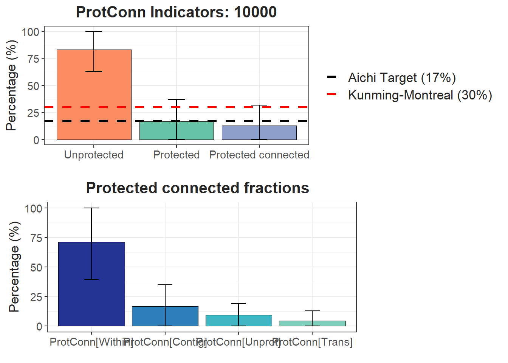

Vector con valores para cada ecorregión:


``` r
test$ProtConn_10000$ProtConn_10000
#> Simple feature collection with 33 features and 17 fields
#> Geometry type: GEOMETRY
#> Dimension:     XY
#> Bounding box:  xmin: -7920394 ymin: -522895.5 xmax: -6700933 ymax: 1536361
#> Projected CRS: World_Mollweide
#> First 10 features:
#>                                      ECO_NAME     EC(PC)
#> 1                       Caqueta Moist Forests 4404760.07
#> 2                     Catatumbo Moist Forests   68241.38
#> 3                Cauca Valley Montane Forests  186461.48
#> 4                  Chocó-Darién Moist Forests  220010.01
#> 5         Cordillera Oriental Montane Forests  632277.37
#> 6     Eastern Cordillera Real Montane Forests  180347.50
#> 7          Eastern Panamanian Montane Forests   34719.54
#> 8  Guianan Piedmont And Lowland Moist Forests         NA
#> 9                              Iquitos Varzeá    2183.64
#> 10        Japurá-Solimoes-Negro Moist Forests  794642.03
#>            PC    Prot Unprotected ProtConn ProtUnconn
#> 1  6.5600e-02 36.7627     63.2373  25.6144    11.1483
#> 2  1.0300e-02 10.1265     89.8735  10.1251     0.0013
#> 3  3.4000e-03 14.0241     85.9759   5.8035     8.2207
#> 4  1.3000e-03  7.0813     92.9187   3.6612     3.4200
#> 5  1.1400e-02 22.8190     77.1810  10.6790    12.1400
#> 6  2.7300e-02 23.1044     76.8956  16.5348     6.5696
#> 7  1.7520e-01 41.8584     58.1416  41.8584     0.0000
#> 8          NA  0.0000    100.0000       NA         NA
#> 9  3.3280e-06  8.5248     91.4752   8.5248     0.0000
#> 10 5.1900e-02 22.7864     77.2136  22.7864     0.0000
#>     RelConn ProtConn_Prot ProtConn_Trans ProtConn_Unprot
#> 1   69.6751       85.8463         1.8374         12.3163
#> 2   99.9868       91.1014         1.0211          7.8776
#> 3   41.3819       63.8517         4.5578         31.5904
#> 4   51.7031       79.8607         5.7964         14.3428
#> 5   46.7986       63.4544        22.4407         14.1050
#> 6   71.5656       78.4244         3.3319         18.2437
#> 7  100.0000       99.9998         0.0002          0.0000
#> 8        NA            NA             NA              NA
#> 9        NA      100.0000             NA              NA
#> 10 100.0000      100.0000         0.0000          0.0000
#>    ProtConn_Within ProtConn_Contig ProtConn_Within_land
#> 1          85.7769         14.2231              21.9712
#> 2          90.7351          9.2649               9.1871
#> 3          43.1852         56.8148               2.5062
#> 4          64.1952         35.8048               2.3503
#> 5          61.4646         38.5354               6.5638
#> 6          61.9677         38.0323              10.2463
#> 7          99.9998          0.0002              41.8583
#> 8               NA              NA                   NA
#> 9         100.0000              NA                   NA
#> 10        100.0000          0.0000              22.7864
#>    ProtConn_Contig_land ProtConn_Unprot_land
#> 1                3.6432               3.1548
#> 2                0.9381               0.7976
#> 3                3.2972               1.8333
#> 4                1.3109               0.5251
#> 5                4.1152               1.5063
#> 6                6.2886               3.0166
#> 7                0.0001               0.0000
#> 8                    NA                   NA
#> 9                    NA                   NA
#> 10               0.0000               0.0000
#>    ProtConn_Trans_land                       geometry
#> 1               0.4706 MULTIPOLYGON (((-7354073 34...
#> 2               0.1034 POLYGON ((-7208574 1001585,...
#> 3               0.2645 MULTIPOLYGON (((-7480526 88...
#> 4               0.2122 MULTIPOLYGON (((-7692447 10...
#> 5               2.3964 POLYGON ((-7154131 1377384,...
#> 6               0.5509 POLYGON ((-7676692 240705.2...
#> 7               0.0001 MULTIPOLYGON (((-7705753 10...
#> 8                   NA MULTIPOLYGON (((-6777542 50...
#> 9                   NA MULTIPOLYGON (((-7008087 -5...
#> 10              0.0000 MULTIPOLYGON (((-6812922 35...
```


``` r
dProtConn <- test$ProtConn_10000$ProtConn_10000
# Calcular los intervalos
breaks <- classInt::classIntervals(dProtConn$ProtConn, n = 5, style = "quantile")

# Crear una nueva variable categórica con los intervalos
dProtConn2 <- dProtConn %>%
  mutate(dProtConn_q = cut(ProtConn,
                     breaks = breaks$brks,
                     include.lowest = TRUE,
                     dig.lab = 5))  

# Graficar en ggplot2 usando las clases Jenks
ggplot() +  
  geom_sf(data = dProtConn2, aes(fill = dProtConn_q), color = "black", size = 0.1) +
  scale_fill_brewer(palette = "RdYlGn", direction = 1, name = "ProtConn") +
  theme_minimal() +
  labs(
    title = "ProtConn",
    fill = "ProtConn"
  ) +
  theme(
    legend.position = "right",
    plot.title = element_text(hjust = 0.5)
  )
```

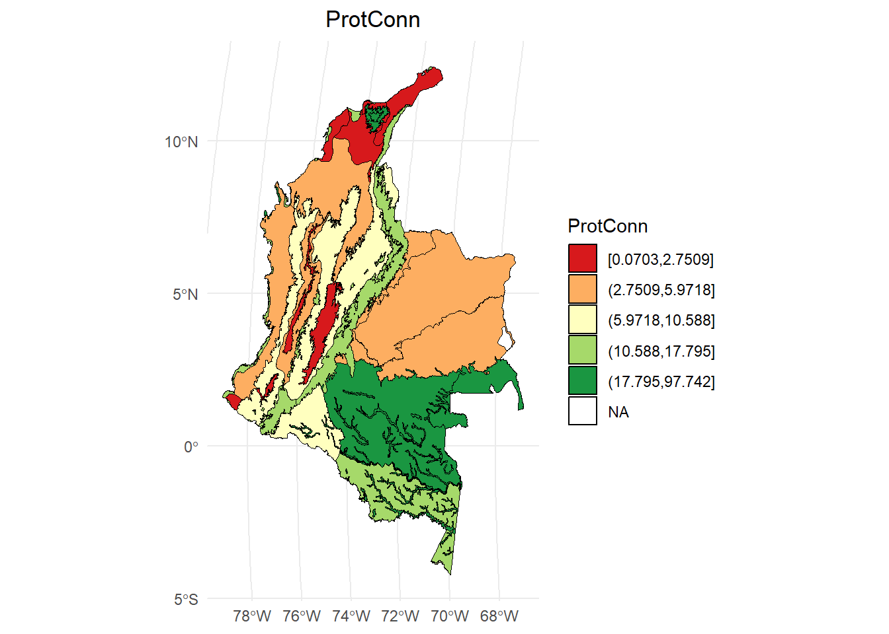


ProtConn_Unprot:


``` r
dProtConn <- test$ProtConn_10000$ProtConn_10000
# Calcular los intervalos
breaks <- classInt::classIntervals(dProtConn$ProtConn_Unprot, n = 5, style = "quantile")

# Crear una nueva variable categórica con los intervalos
dProtConn2 <- dProtConn %>%
  mutate(dProtConn_q = cut(ProtConn_Unprot,
                     breaks = breaks$brks,
                     include.lowest = TRUE,
                     dig.lab = 5))  

# Graficar en ggplot2 usando las clases Jenks
ggplot() +  
  geom_sf(data = dProtConn2, aes(fill = dProtConn_q), color = "black", size = 0.1) +
  scale_fill_brewer(palette = "RdYlGn", direction = 1, name = "ProtConn_Unprot") +
  theme_minimal() +
  labs(
    title = "ProtConn_Unprot",
    fill = "ProtConn_Unprot"
  ) +
  theme(
    legend.position = "right",
    plot.title = element_text(hjust = 0.5)
  )
```

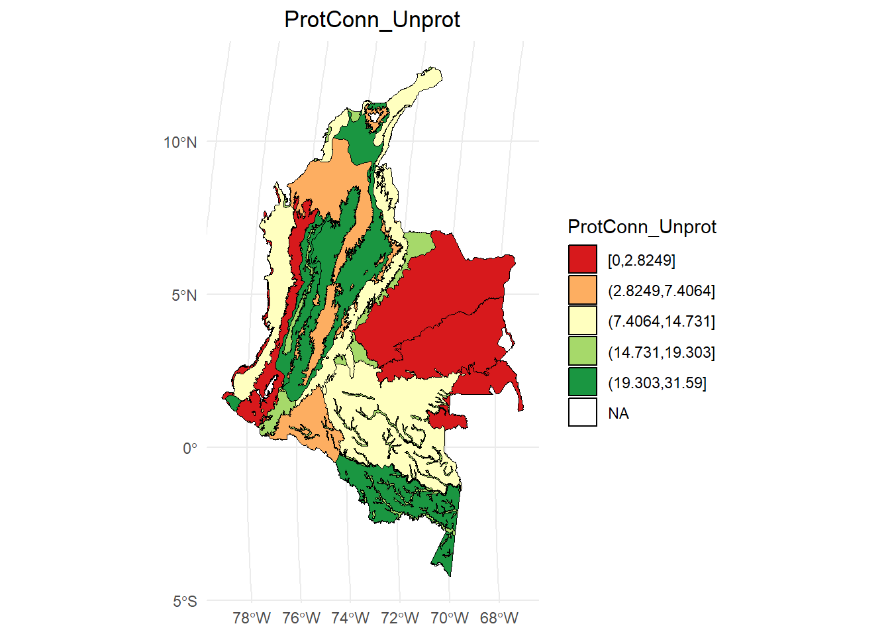

ProtConn_Within:


``` r
dProtConn <- test$ProtConn_10000$ProtConn_10000
# Calcular los intervalos
breaks <- classInt::classIntervals(dProtConn$ProtConn_Within, n = 5, style = "quantile")

# Crear una nueva variable categórica con los intervalos
dProtConn2 <- dProtConn %>%
  mutate(dProtConn_q = cut(ProtConn_Within,
                     breaks = breaks$brks,
                     include.lowest = TRUE,
                     dig.lab = 5))  

# Graficar en ggplot2 usando las clases Jenks
ggplot() +  
  geom_sf(data = dProtConn2, aes(fill = dProtConn_q), color = "black", size = 0.1) +
  scale_fill_brewer(palette = "RdYlGn", direction = 1, name = "ProtConn_Within") +
  theme_minimal() +
  labs(
    title = "ProtConn_Within",
    fill = "ProtConn_Within"
  ) +
  theme(
    legend.position = "right",
    plot.title = element_text(hjust = 0.5)
  )
```

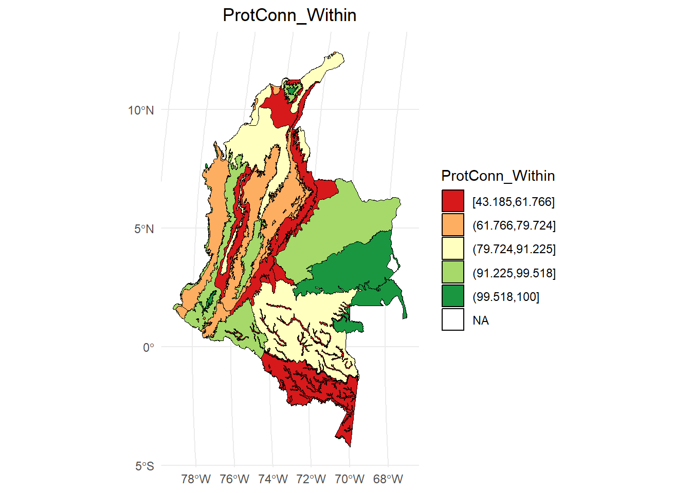

ProtConn_Contig:


``` r
dProtConn <- test$ProtConn_10000$ProtConn_10000
# Calcular los intervalos
breaks <- classInt::classIntervals(dProtConn$ProtConn_Contig, n = 5, style = "quantile")

# Crear una nueva variable categórica con los intervalos
dProtConn2 <- dProtConn %>%
  mutate(dProtConn_q = cut(ProtConn_Contig,
                     breaks = breaks$brks,
                     include.lowest = TRUE,
                     dig.lab = 5))  

# Graficar en ggplot2 usando las clases Jenks
ggplot() +  
  geom_sf(data = dProtConn2, aes(fill = dProtConn_q), color = "black", size = 0.1) +
  scale_fill_brewer(palette = "RdYlGn", direction = 1, name = "ProtConn_Contig") +
  theme_minimal() +
  labs(
    title = "ProtConn_Contig",
    fill = "ProtConn_Contig"
  ) +
  theme(
    legend.position = "right",
    plot.title = element_text(hjust = 0.5)
  )
```

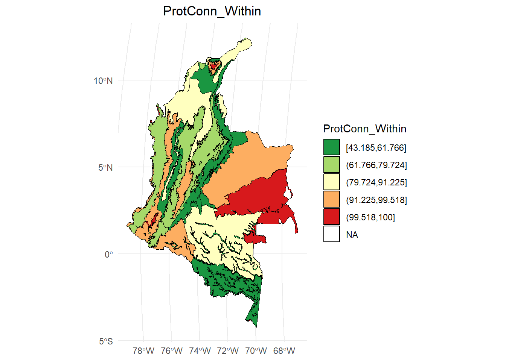


ProtConn_Trans:


``` r
dProtConn <- test$ProtConn_10000$ProtConn_10000
# Calcular los intervalos
breaks <- classInt::classIntervals(dProtConn$ProtConn_Trans, n = 5, style = "quantile")

# Crear una nueva variable categórica con los intervalos
dProtConn2 <- dProtConn %>%
  mutate(dProtConn_q = cut(ProtConn_Trans,
                     breaks = breaks$brks,
                     include.lowest = TRUE,
                     dig.lab = 5))  

# Graficar en ggplot2 usando las clases Jenks
ggplot() +  
  geom_sf(data = dProtConn2, aes(fill = dProtConn_q), color = "black", size = 0.1) +
  scale_fill_brewer(palette = "RdYlGn", direction = 1, name = "ProtConn_Trans") +
  theme_minimal() +
  labs(
    title = "ProtConn_Trans",
    fill = "ProtConn_Trans"
  ) +
  theme(
    legend.position = "right",
    plot.title = element_text(hjust = 0.5)
  )
```

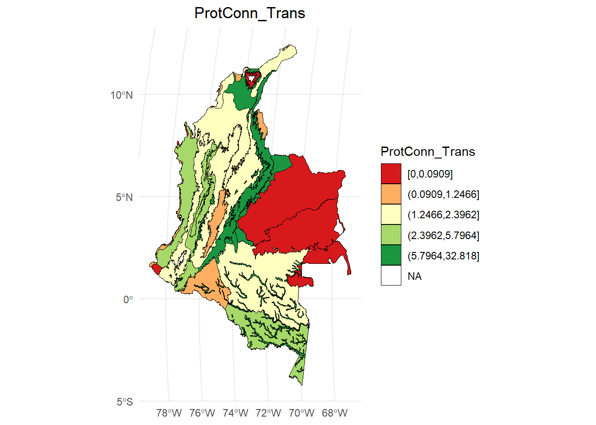


### Función MK_ProtConn_raster()

Estima el índice ProtConn con un raster de nodos. Cada Área Protegida debe tener un id unico (grupos de pixeles con id de cada AP).


``` r
APs_raster <- raster("C:/Users/oscta/OneDrive/Documents/RedBioma/Clase 6/Areas_protegidas_raster.tif")
APs_raster
#> class      : RasterLayer 
#> dimensions : 2536, 2027, 5140472  (nrow, ncol, ncell)
#> resolution : 1000, 1000  (x, y)
#> extent     : -8227460, -6200460, -1021404, 1514596  (xmin, xmax, ymin, ymax)
#> crs        : +proj=moll +lon_0=0 +x_0=0 +y_0=0 +datum=WGS84 +units=m +no_defs 
#> source     : Areas_protegidas_raster.tif 
#> names      : Areas_protegidas_raster 
#> values     : 1, 1530  (min, max)
```


``` r
plot(st_geometry(Ecorreg))
plot(APs_raster, add = TRUE)
```

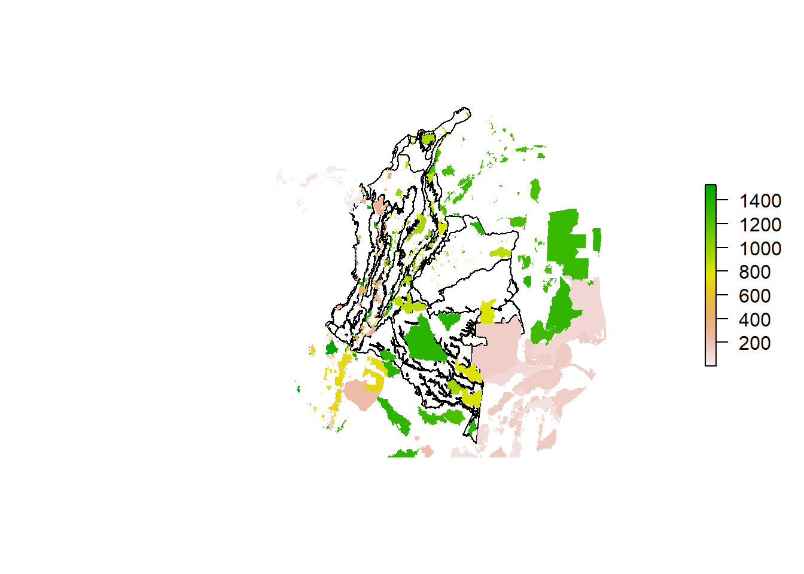


``` r
Ecorreg_prueba <- Ecorreg[2,]
test <- MK_ProtConn_raster(nodes = APs_raster,
                           region = Ecorreg_prueba,
                           area_unit = "ha",
                           distance = list(type= "edge", keep = 0.1),
                           distance_thresholds = 10000,
                           probability = 0.5, 
                           transboundary = 50000,
                           plot = TRUE, 
                           parallel = NULL,
                           write = NULL, 
                           intern = FALSE)
test
#> $`Protected Connected (Viewer Panel)`
#> 
#> $`ProtConn Plot`
```

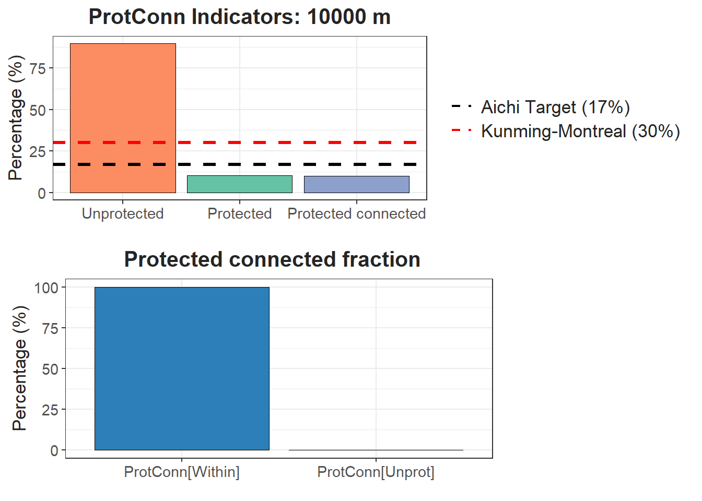


## Función MK_Connect_grid()

Use esta función para estimar los índices ProtConn, EC o ECA, PC e IIC sobre una malla regular de hexágonos o cuadros.

Disolveré las geometrías de las ecorregiones para obtener un único polígono:


``` r
Regiones <- st_union(Ecorreg) |> st_as_sf()
plot(Regiones)
```

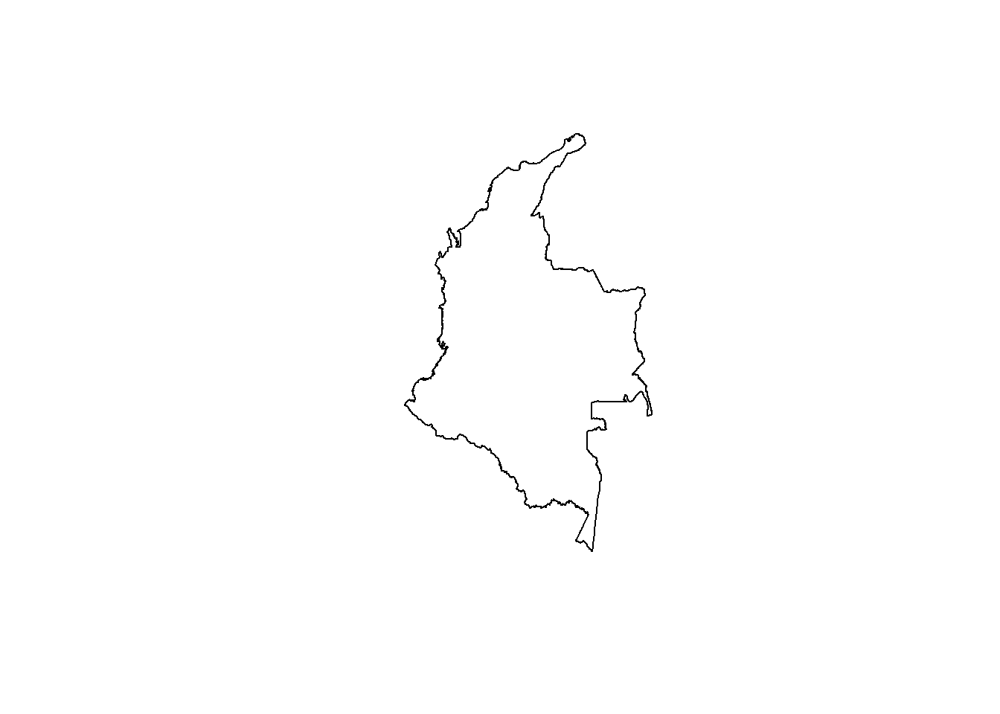


Ahora aplicaré la función MK_Connect_grid()


``` r
hexagons_priority <- MK_Connect_grid(nodes = APs,
                                     region = Regiones,
                                     area_unit = "ha",
                                     grid = list(hexagonal = FALSE,
                                                 cellsize = unit_convert(4000, "km2", "m2"), clip = TRUE),
                                     protconn = TRUE,
                                     distance_threshold = 3000,
                                     probability = 0.5,
                                     transboundary = 6000,
                                     distance = list(type = "edge", keep = 0.1),
                                     intern = TRUE,
                                     parallel = 6)
```


ProtConn:


``` r
# Calcular los intervalos
breaks <- classInt::classIntervals(hexagons_priority$ProtConn, n = 5, style = "quantile")

# Crear una nueva variable categórica con los intervalos
hexagons_priority <- hexagons_priority %>%
  mutate(ProtConn_q = cut(ProtConn,
                           breaks = breaks$brks,
                           include.lowest = TRUE,
                           dig.lab = 5))  

# Graficar en ggplot2 usando las clases Jenks
ggplot() +  
  geom_sf(data = hexagons_priority, aes(fill = ProtConn_q), color = "black", size = 0.1) +
  scale_fill_brewer(palette = "RdYlGn", direction = 1, name = "ProtConn") +
  theme_minimal() +
  labs(
    title = "ProtConn",
    fill = "ProtConn"
  ) +
  theme(
    legend.position = "right",
    plot.title = element_text(hjust = 0.5)
  )
```

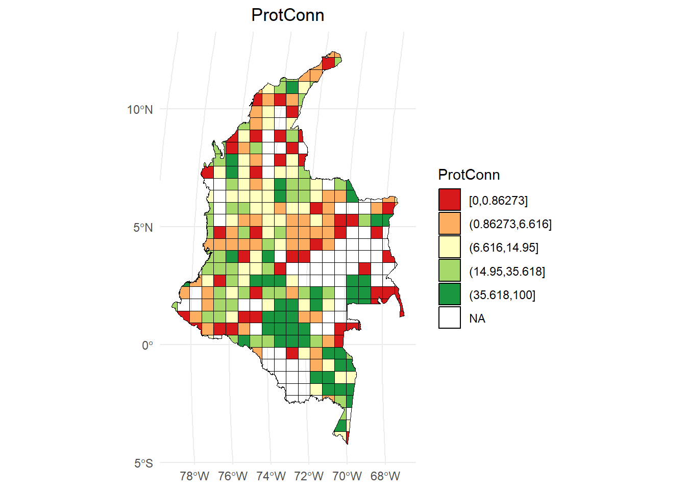


ProtConn[Unprot]:


``` r
# Calcular los intervalos
breaks <- classInt::classIntervals(hexagons_priority$ProtConn_Unprot, n = 5, style = "quantile")

# Crear una nueva variable categórica con los intervalos
hexagons_priority <- hexagons_priority %>%
  mutate(ProtConn_Unprot_q = cut(ProtConn_Unprot,
                           breaks = breaks$brks,
                           include.lowest = TRUE,
                           dig.lab = 5))  

# Graficar en ggplot2 usando las clases Jenks
ggplot() +  
  geom_sf(data = hexagons_priority, aes(fill = ProtConn_Unprot_q), color = "black", size = 0.1) +
  scale_fill_brewer(palette = "RdYlGn", direction = 1, name = "ECA") +
  theme_minimal() +
  labs(
    title = "ProtConn[Unprot]",
    fill = "ProtConn[Unprot]"
  ) +
  theme(
    legend.position = "right",
    plot.title = element_text(hjust = 0.5)
  )
```

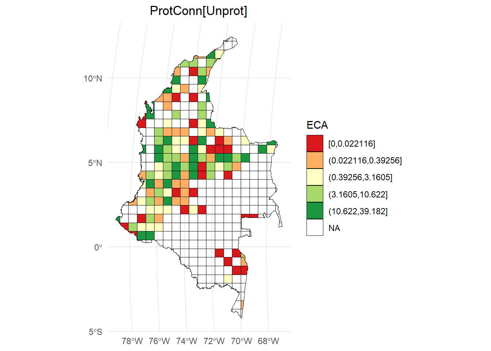

## Referencias

-   Castillo, L. S., Correa Ayram, C. A., Matallana Tobón, C. L., Corzo, G., Areiza, A., González-M., R., Serrano, F., Chalán Briceño, L., Sánchez Puertas, F., More, A., Franco, O., Bloomfield, H., Aguilera Orrury, V. L., Rivadeneira Canedo, C., Morón-Zambrano, V., Yerena, E., Papadakis, J., Cárdenas, J. J., Golden Kroner, R. E., & Godínez-Gómez, O. (2020). Connectivity of Protected Areas: Effect of Human Pressure and Subnational Contributions in the Ecoregions of Tropical Andean Countries. Land, 9(8), Article 8. <https://doi.org/10.3390/land9080239>

-   Saura, S., Bastin, L., Battistella, L., Mandrici, A., & Dubois, G. (2017). Protected areas in the world’s ecoregions: How well connected are they? Ecological Indicators, 76, 144-158. <https://doi.org/10.1016/j.ecolind.2016.12.047>

-   Saura, S., Bertzky, B., Bastin, L., Battistella, L., Mandrici, A., & Dubois, G. (2018). Protected area connectivity: Shortfalls in global targets and country-level priorities. Biological Conservation, 219, 53-67. <https://doi.org/10.1016/j.biocon.2017.12.020>
